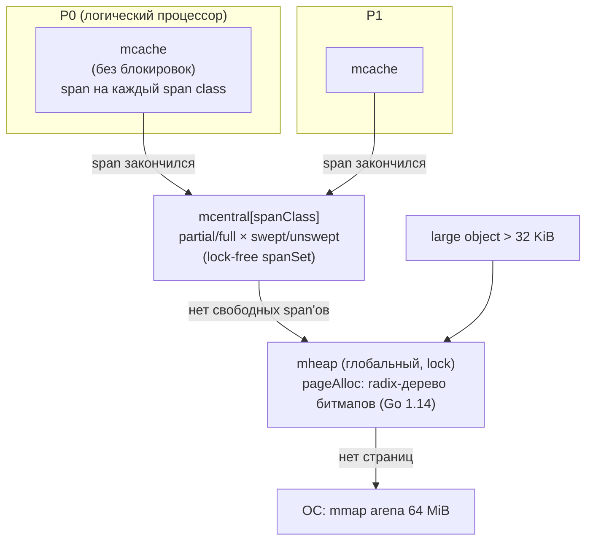
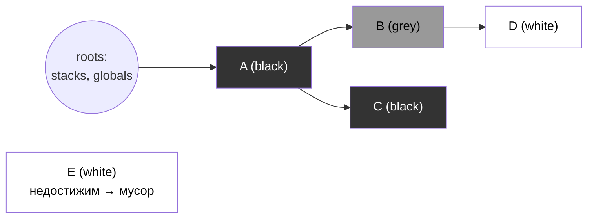
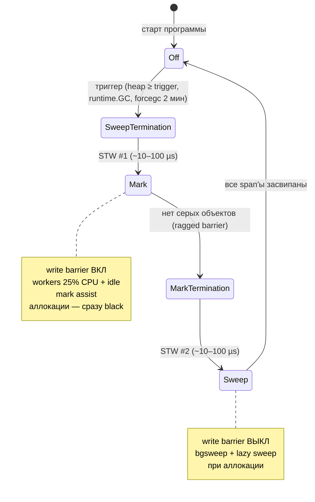
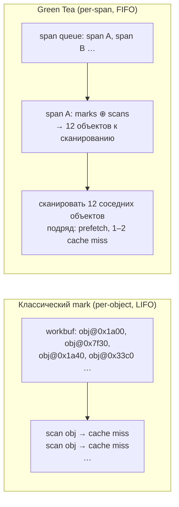
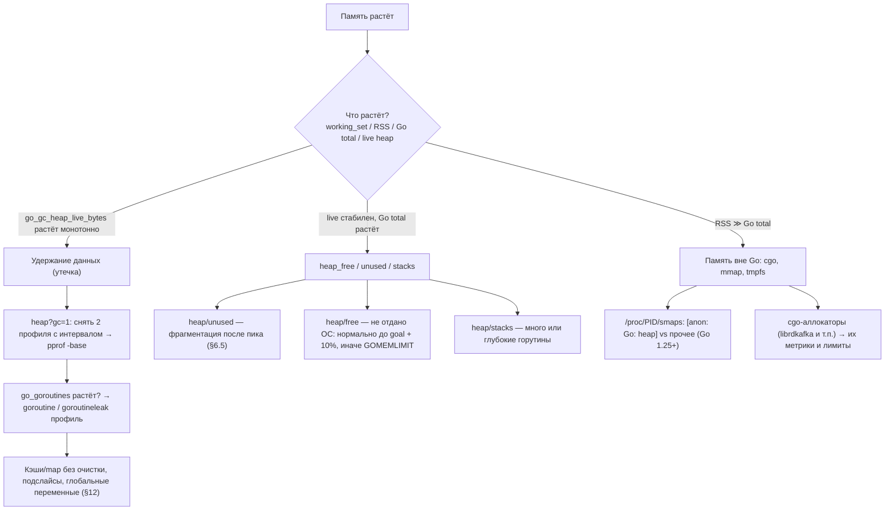

# Go Garbage Collector: Deep Dive для Senior Go-разработчика

> Актуально для **Go 1.27** (go1.27.0 выпущен в августе 2026; последний патч на момент написания — go1.27.1).
> Факты о рантайме сверены с исходниками `release-branch.go1.27` (`src/runtime/*`, `src/internal/buildcfg/exp.go`) и официальными release notes.
> Все бенчмарки и выводы `-gcflags=-m` / `gctrace` в документе — **реальные прогоны** на `go1.27.1 darwin/arm64, Apple M3 Pro, GOMAXPROCS=11`. На вашем железе абсолютные числа будут другими, соотношения — примерно те же.
> Места, где факт не удалось проверить по первоисточнику, помечены **⚠️ не проверено**.

---

## Оглавление

- [TL;DR](#tldr)
- [1. Модель памяти и аллокация](#1-модель-памяти-и-аллокация)
- [2. Алгоритм GC](#2-алгоритм-gc)
- [3. Фазы цикла GC](#3-фазы-цикла-gc)
- [4. Write barriers](#4-write-barriers)
- [5. Pacer и настройки](#5-pacer-и-настройки)
- [6. Scavenger и возврат памяти ОС](#6-scavenger-и-возврат-памяти-ос)
- [7. Новый GC: Green Tea](#7-новый-gc-green-tea)
- [8. Финализаторы, cleanup и слабые ссылки](#8-финализаторы-cleanup-и-слабые-ссылки)
- [9. GC в контейнерах (Kubernetes/OpenShift)](#9-gc-в-контейнерах-kubernetesopenshift)
- [10. Наблюдаемость и диагностика](#10-наблюдаемость-и-диагностика)
- [11. Оптимизация: снижение нагрузки на GC](#11-оптимизация-снижение-нагрузки-на-gc)
- [12. Утечки памяти в языке с GC](#12-утечки-памяти-в-языке-с-gc)
- [13. Сравнение с JVM](#13-сравнение-с-jvm)
- [14. Вопросы для собеседования](#14-вопросы-для-собеседования)
- [15. Чеклист и шпаргалка](#15-чеклист-и-шпаргалка)

---

## TL;DR

1. **Go GC — concurrent, tri-color, mark-and-sweep, non-generational, non-moving, non-compacting.** Маркировка идёт параллельно с вашим кодом; STW-паузы две на цикл и обычно длятся десятки микросекунд.
2. **Стоимость GC пропорциональна *живой* куче и количеству указателей в ней**, а частота GC — скорости аллокаций. Меньше аллокаций → реже GC; меньше указателей → дешевле каждый GC.
3. **Escape analysis** решает на этапе компиляции, что попадёт на стек (бесплатно для GC), а что в кучу. Смотрите `go build -gcflags='-m'`.
4. **GOGC** (по умолчанию 100) задаёт heap goal: `goal = live + (live + stacks + globals) × GOGC/100`. Это компромисс «CPU ↔ память».
5. **GOMEMLIMIT** (Go 1.19) — *мягкий* лимит на всю память рантайма. При приближении к нему GC запускается чаще. От «death spiral» защищает CPU-лимитер: GC съедает не больше ~50% CPU.
6. **В Kubernetes GOMEMLIMIT не выставляется автоматически** (проверено в 1.27). Ставьте ~80–90% от `limits.memory`. А вот GOMAXPROCS с **Go 1.25** учитывает CPU limit cgroup.
7. **GC забирает ~25% CPU** (dedicated/fractional workers) плюс idle workers. Если аллокации обгоняют маркировку, аллоцирующие горутины сами делают mark work (**mark assist**) — это главный источник GC-влияния на p99.
8. **Hybrid write barrier (Go 1.8)** убрал повторное сканирование стеков в STW. Барьер включён только на время mark-фазы.
9. **Green Tea GC** включён по умолчанию с **Go 1.26**: маркирует мелкие объекты пачками по span'ам, а не по одному. Это снижает GC overhead на 10–40%. Отключается через `GOEXPERIMENT=nogreenteagc` (в 1.27 флаг ещё работает).
10. **RSS ≠ heap.** Свободная память возвращается ОС лениво (scavenger, `MADV_DONTNEED`). Фрагментация non-moving кучи тоже держит RSS.
11. **Memory ballast устарел.** Используйте `GOMEMLIMIT` (и при необходимости поднимайте `GOGC`).
12. **Финализаторы — антипаттерн** для управления ресурсами. Вместо них: `defer Close()`, а как страховка — `runtime.AddCleanup` (Go 1.24). Есть также пакеты `weak` (1.24) и `unique` (1.23).
13. **Утечки в Go есть.** Это горутины, подслайсы и подстроки, map без очистки (map не сжимается), кэши без TTL. С **Go 1.27** есть профиль `goroutineleak`.
14. **Диагностика:** `GODEBUG=gctrace=1` → `runtime/metrics` → pprof heap (`inuse_*` против `alloc_*`, `-base`) → `go tool trace` / flight recorder (Go 1.25).
15. **`runtime.ReadMemStats` делает STW.** Для частого сбора используйте `runtime/metrics`.

---

## 1. Модель памяти и аллокация

### 1.1 Стек vs куча

| | Стек горутины | Куча (heap) |
|---|---|---|
| Кто владеет | одна горутина | все горутины |
| Аллокация | сдвиг SP, фактически бесплатно | `mallocgc`: size class → mcache → … |
| Освобождение | при возврате из функции | только GC |
| Нагрузка на GC | стек сканируется как root, но объекты на нём не «собираются» | каждый объект маркируется/свипается |
| Размер | стартует с 2 KiB, растёт копированием до 1 GB (64-bit) | ограничен памятью / GOMEMLIMIT |

В Go **нет** ключевого слова для выбора «стек или куча»: `new(T)` и `&T{}` вполне могут оказаться на стеке, а локальная переменная — в куче. Решение принимает компилятор с помощью **escape analysis**.

### 1.2 Escape analysis

Escape analysis — статический анализ в компиляторе (`cmd/compile/internal/escape`). Он строит граф потоков данных «куда может утечь адрес значения». Если компилятор **не может доказать**, что значение не переживёт свой стековый фрейм и не станет доступно другой горутине, значение уходит в кучу. Анализ консервативный: ложноположительный escape — нормально, ложноотрицательный был бы багом (use-after-free).

**Почему так спроектировано.** В Go нет ручного управления стеком и кучей, как в C++ (`new` против автоматических переменных). Нет и JIT с runtime-профилированием, как в JVM с её scalar replacement в C2. Поэтому решение принимается один раз при компиляции, детерминированно и без затрат в рантайме. Цена — консервативность: всё, что компилятор «не видит» (динамический вызов через интерфейс, передача в неинлайнящуюся функцию, которая сохраняет указатель), считается убегающим.

#### Типичные причины escape

| Причина | Пример | Почему |
|---|---|---|
| Возврат указателя на локальную переменную | `return &u` | переживает фрейм |
| Сохранение в глобальную переменную / поле объекта в куче | `sink = u` | доступно после возврата |
| Boxing в интерфейс, если вызываемая функция «сохраняет» аргумент | `fmt.Println(x)` | `fmt` передаёт `...any` дальше через reflection |
| Замыкание, переживающее функцию | `return func(){ n++ }` | захваченная по ссылке переменная уходит в кучу |
| Слайс/мап неизвестного размера или слишком большие | `make([]byte, n)`, `make([]T, 1<<20)` | нельзя разместить во фрейме фиксированного размера |
| Передача в канал | `ch <- &v` | другая горутина |
| Вызов метода через интерфейс, если компилятор не смог девиртуализировать | `s.Area()` | неизвестно, что сделает реализация |
| Объекты больше лимитов стека | > 128 KiB явная переменная, > 64 KiB для `new`/`&T{}`/`make` | `ir.MaxStackVarSize`, `ir.MaxImplicitStackVarSize` |

#### Пример и реальный вывод компилятора

```go
package escape

import "fmt"

type User struct {
	ID   int64
	Name string
}

// 1. Возврат указателя на локальную переменную.
func NewUser(id int64) *User {
	u := User{ID: id}
	return &u
}

// 2. Значение не убегает: возвращается копия.
func MakeUser(id int64) User {
	u := User{ID: id}
	return u
}

// 3. Boxing в интерфейс (fmt.Println принимает ...any).
func PrintID(id int64) {
	fmt.Println(id)
}

// 4. Замыкание, переживающее вызов.
func Counter() func() int {
	n := 0
	return func() int {
		n++
		return n
	}
}

// 5. Слайс неизвестного (на этапе компиляции) размера.
func MakeBuf(n int) int {
	buf := make([]byte, n)
	return len(buf)
}

// 6. Слайс константного размера — на стеке.
func MakeFixed() int {
	buf := make([]byte, 64)
	return len(buf)
}

// 7. Сохранение указателя в глобальную переменную.
var sink *User

func Store(u *User) {
	sink = u
}

// 8. Параметр-указатель, который только читается, не убегает.
func ReadName(u *User) string {
	return u.Name
}

// 9. Слайс возвращается наружу — убегает.
func ReturnBuf(n int) []byte {
	return make([]byte, n)
}

type Shape interface{ Area() float64 }
type Square struct{ S float64 }

func (s Square) Area() float64 { return s.S * s.S }

// 10. Динамический вызов через интерфейс.
func TotalArea(shapes []Shape) float64 {
	var t float64
	for _, s := range shapes {
		t += s.Area()
	}
	return t
}

func One() float64 {
	var s Shape = Square{S: 2} // конкретный тип известен → devirtualize
	return s.Area()
}
```

```text
$ go build -gcflags='-m' ./escape      # строки "can inline" отфильтрованы
escape/escape.go:81:15: devirtualizing s.Area to Square
escape/escape.go:12:2: moved to heap: u
escape/escape.go:24:13: ... argument does not escape
escape/escape.go:24:14: id escapes to heap
escape/escape.go:29:2: moved to heap: n
escape/escape.go:30:9: func literal escapes to heap
escape/escape.go:38:13: make([]byte, n) does not escape
escape/escape.go:44:13: make([]byte, 64) does not escape
escape/escape.go:51:12: leaking param: u
escape/escape.go:56:15: leaking param: u to result ~r0 level=1
escape/escape.go:62:13: make([]byte, n) escapes to heap
escape/escape.go:71:16: leaking param content: shapes
escape/escape.go:80:22: Square{...} does not escape
```

Как читать вывод:

| Сообщение | Смысл |
|---|---|
| `moved to heap: u` | **переменная** `u` размещена в куче (аллокация) |
| `X escapes to heap` | **значение/выражение** X аллоцируется в куче (для boxing: копия `id` в интерфейс) |
| `X does not escape` | остаётся на стеке |
| `leaking param: u` | указатель-параметр утекает (в кучу или в результат). Аллоцирует **вызывающий** код, если передаёт адрес локальной переменной |
| `leaking param: u to result ~r0 level=1` | в результат утекает не сам `u`, а то, на что он указывает, через одно разыменование (`level=1`): строка `u.Name`. Сам `*u` не убегает |
| `leaking param content: shapes` | утекает **содержимое** слайса (элементы-интерфейсы), но не заголовок слайса |
| `devirtualizing s.Area to Square` | интерфейсный вызов заменён прямым, escape стал точнее |

> **Важно (Go 1.25+).** `make([]byte, n)` с неизвестным `n` теперь может быть «does not escape». С **Go 1.25** компилятор резервирует на стеке спекулятивный буфер (сейчас 32 байта, `-d=variablemakethreshold`) и использует его, если запрошенный размер помещается. Иначе происходит fallback в кучу. В **Go 1.26** тот же приём применяется к `append` в циклах (буфер на стеке в точке `append`). Для **убегающих** слайсов (например, возвращаемых) компилятор вставляет `runtime.move2heap`: слайс копируется в кучу только в момент выхода, если он всё ещё на стеке. Подробности — в Go blog [«Allocating on the Stack»](https://go.dev/blog/allocation-optimizations) (2026). Отключается через `-gcflags=all=-d=variablemakehash=n`. Поэтому «does not escape» у `make` с переменным размером **не гарантирует** отсутствия аллокаций при больших `n`. Проверяйте бенчмарком.

`-m -m` объясняет **цепочку** потока данных:

```text
$ go build -gcflags='-m -m' ./escape
escape/escape.go:12:2: u escapes to heap in NewUser:
escape/escape.go:12:2:   flow: ~r0 ← &u:
escape/escape.go:12:2:     from &u (address-of) at escape/escape.go:13:9
escape/escape.go:12:2:     from return &u (return) at escape/escape.go:13:2
escape/escape.go:12:2: moved to heap: u
escape/escape.go:24:14: id escapes to heap in PrintID:
escape/escape.go:24:14:   flow: {storage for ... argument} ← &{storage for id}:
escape/escape.go:24:14:     from id (spill) at escape/escape.go:24:14
escape/escape.go:24:14:     from ... argument (slice-literal-element) at escape/escape.go:24:13
escape/escape.go:24:14:   flow: fmt.a ← &{storage for ... argument}:
escape/escape.go:24:14:     from ... argument (spill) at escape/escape.go:24:13
escape/escape.go:24:14:     from fmt.a := ... argument (assign-pair) at escape/escape.go:24:13
escape/escape.go:24:14:   flow: {heap} ← *fmt.a:
escape/escape.go:24:14:     from fmt.Fprintln(os.Stdout, fmt.a...) (call parameter) at escape/escape.go:24:13
escape/escape.go:29:2: Counter capturing by ref: n (addr=false assign=true width=8)
escape/escape.go:29:2: n escapes to heap in Counter:
escape/escape.go:29:2:   flow: {storage for func literal} ← &n:
escape/escape.go:29:2:     from n (captured by a closure) at escape/escape.go:31:3
```

Читайте снизу вверх по `flow:` до `{heap}` или `~r0` (результат). Последний `from ...` в цепочке к `{heap}` указывает на место, которое «виновато» в escape. Для `PrintID` это вызов `fmt.Fprintln`.

Полезные флаги:

```bash
go build -gcflags='-m' ./...               # кратко
go build -gcflags='-m=2' ./pkg             # = -m -m, с причинами
go build -gcflags='all=-m' ./...           # включая зависимости
go build -gcflags='-m -l' ./pkg            # -l: без инлайнинга (для изоляции эффекта)
go test -gcflags='-m' -run=^$ ./pkg 2>&1 | grep 'moved to heap'
```

> **Миф:** «указатель — значит куча». **Нет.** `&T{}`, который не убегает, лежит на стеке. И наоборот: значение (не указатель) убегает, если его адрес где-то сохраняется или оно упаковано в интерфейс.
>
> **Миф:** «возвращайте указатели на большие структуры, чтобы избежать копирования». Часто наоборот: возврат по значению оставляет объект на стеке вызывающего кода (или вообще в регистрах), а возврат указателя гарантирует аллокацию, если функция не заинлайнилась. Копирование 64–256 байт обычно дешевле, чем аллокация плюс работа GC. Меряйте.

### 1.3 Аллокатор: mcache → mcentral → mheap

Аллокатор Go вырос из идей **TCMalloc** (thread-caching malloc), но переработан под GC. Основные единицы:

| Понятие | Размер (64-bit Linux) | Назначение |
|---|---|---|
| **page** | 8 KiB (`PageShift = 13`) | единица учёта в mheap (не равна странице ОС 4 KiB) |
| **span** (`mspan`) | N страниц | непрерывный участок памяти с объектами **одного** size class |
| **size class** | 68 классов (`NumSizeClasses = 68`, класс 0 — large) | округление размера: 8, 16, 24, 32, 48, 64, 80, … 32768 байт |
| **span class** | size class × 2 + noscan bit → 136 | отдельные span'ы для объектов с указателями и без |
| **small object** | ≤ 32 KiB (`MaxSmallSize = 32768`) | идёт через mcache |
| **large object** | > 32 KiB | выделяется целым span'ом прямо из mheap |
| **tiny object** | < 16 байт, **без указателей** (`TinySize = 16`) | склеиваются в один 16-байтный блок |
| **arena** (`heapArena`) | 64 MiB (4 MiB на 32-bit и Windows) | крупный блок адресного пространства, у которого есть своя метаинформация |



**Путь аллокации маленького объекта (`mallocgc`):**

1. Компилятор знает тип и размер. Если у типа нет указателей → `noscan`. Если он ещё и < 16 байт → **tiny allocator**.
2. Размер округляется до size class, берётся span из `mcache` текущего P. **Блокировок нет**, потому что mcache принадлежит P, а на P в каждый момент работает одна горутина.
3. В span'е ищется свободный слот по `allocCache` (битмап, используется `ctz`).
4. Span закончился → `mcache.refill` берёт новый у `mcentral` своего span class. По дороге он может **засвипать** span (lazy sweeping, см. §3).
5. У `mcentral` нет span'ов → `mheap.alloc` выделяет страницы, под глобальным lock'ом.
6. У `mheap` нет страниц → арена у ОС (`mmap`).

**Почему size classes:** они дают segregated-fit аллокацию. В одном span'е все объекты одного размера, поэтому поиск слота сводится к битовой операции, внешняя фрагментация внутри span'а невозможна, а адрес начала объекта по указателю считается делением. Последнее критично для GC: он должен по **внутреннему** указателю (interior pointer) найти начало объекта. Цена — внутренняя фрагментация до ~12.5% на округление.

**Tiny allocator.** Несколько мелких noscan-объектов (строки на 1–15 байт, `int32`, небольшие структуры без указателей) упаковываются в один 16-байтный блок. Блок освобождается, только когда мертвы **все** объекты в нём. Отсюда классическая ловушка: финализатор на tiny-объекте может никогда не сработать (см. §8).

**Allocation headers (Go 1.22).** С Go 1.22 метаинформация о типе (какие слова являются указателями) хранится ближе к объекту:
- объекты ≤ 512 байт (`MinSizeForMallocHeader = 8 × 64`): битмап указателей в конце span'а;
- объекты > 512 байт: 8-байтный заголовок с указателем на тип перед объектом;
- large objects: тип хранится в самом span'е.

Результат по release notes 1.22: +1–3% CPU, −1% памяти.

**Size-specialized malloc (Go 1.27).** Компилятор генерирует вызовы специализированных под size class версий `mallocgc` для объектов < 80 байт. По release notes 1.27 мелкие аллокации дешевле до 30%, реальные программы выигрывают около 1%, бинарник растёт примерно на 60 KB. Отключается через `GOEXPERIMENT=nosizespecializedmalloc`, флаг обещают удалить в 1.28. История: эксперимент включили по умолчанию в dev-ветке 1.26, выключили перед релизом из-за регрессий icache и снова включили в 1.27 (коммиты `a7917eed70`, `4af8ad24ee`, `2a93576965`).

#### noscan-спаны: почему структуры без указателей дешевле для GC

Каждому size class соответствуют **два** span class'а: `scan` и `noscan`. Если тип не содержит указателей (`int`, `float64`, массивы и структуры из них, `[]byte` **как backing array**), объект попадает в noscan-span, и GC:
- **помечает** его (устанавливает mark bit), но **не сканирует** содержимое;
- не ставит его в очередь на сканирование.

Строка, слайс, map, интерфейс, `chan`, `func`, `*T` — это указатели. `struct{ID int64; Name string}` — **не** noscan, потому что `string` содержит указатель на данные.

Реальная разница (§11.3): `runtime.GC()` на map из 1M элементов `map[int64]*Item` занимает **~5.0 ms**, а на `map[int64]Item` (где `Item` без указателей) — **~0.29 ms**, то есть в 17 раз быстрее.

### 1.4 Стеки горутин: contiguous stacks, рост и shrinking

**История.** До Go 1.3 стеки были **сегментированными**: при нехватке добавлялся новый сегмент. Это давало проблему **hot split**: если вызов в цикле попадал ровно на границу сегмента, каждый вызов выделял и освобождал сегмент. В **Go 1.3** перешли на **contiguous (копируемые) стеки**, в **Go 1.4** стартовый размер уменьшили с 8 KiB до **2 KiB** (`stackMin = 2048`).

**Как работает рост:**
1. Пролог почти каждой функции проверяет `SP < g.stackguard0`. Исключение — `//go:nosplit` и функции-листья с маленьким фреймом.
2. Если места не хватает → `runtime.morestack` → `newstack`: выделяется стек **вдвое больше**, старый копируется, все указатели **внутри стека на стек** корректируются (компилятор знает их расположение из stack maps).
3. Это возможно только потому, что указатели на стек **не могут** оказаться в куче. Escape analysis гарантирует: всё, на что есть указатель из кучи, живёт в куче. Это ключевой инвариант, который связывает escape analysis и растущие стеки.

**Shrinking:** во время GC, при сканировании стека, если горутина использует меньше **1/4** стека, стек уменьшается **вдвое** (`shrinkstack`, `used >= avail/4` в `stack.go`). Отключается через `GODEBUG=gcshrinkstackoff=1`.

**Адаптивный стартовый размер (Go 1.19).** Рантайм выделяет начальный стек новых горутин по **среднему** использованию стека, измеренному при сканировании (`GODEBUG=adaptivestackstart=1` по умолчанию; метрика `/gc/stack/starting-size:bytes`). Это уменьшает число копирований стека у сервисов, где горутины глубоко вызывают код.

**Связь с GC:**
- стеки — **корни** (roots) GC; их сканирование входит в mark-фазу;
- с Go 1.18 размер стеков учитывается в heap goal (§5);
- максимальный размер стека — 1 GB на 64-bit (`runtime/debug.SetMaxStack`). Превышение — фатальная ошибка `goroutine stack exceeds 1000000000-byte limit`.

> **Миф:** «горутина стоит 2 KB, поэтому 1M горутин = 2 GB и всё хорошо». Стек растёт при глубоких вызовах (JSON-декодер, gRPC-стек, драйвер БД), и каждый стек — это root, который надо сканировать. Миллион «спящих» горутин — это миллион стеков, которые GC обходит на каждом цикле.

### Что важно для Senior

- Escape analysis статический и консервативный. Проверяйте горячие пути через `-gcflags='-m'`, а не гадайте. Интерфейсы, замыкания и `fmt` — самые частые источники неожиданных аллокаций.
- Аллокатор — per-P mcache без блокировок + size classes. Аллокация дешёвая, но **каждый объект в куче потом стоит работы GC**.
- Типы без указателей попадают в noscan-спаны и не сканируются. Это самый мощный рычаг для больших in-memory структур.
- Contiguous stacks возможны только потому, что указатели из кучи на стек запрещены. Escape analysis обеспечивает этот инвариант.
- С Go 1.22 (allocation headers) и 1.27 (size-specialized malloc) аллокатор стал быстрее, но **количество** аллокаций по-прежнему главный драйвер частоты GC.

---

## 2. Алгоритм GC

### 2.1 Tri-color mark-and-sweep

Классическая абстракция Дейкстры и Лампорта (1978). Каждый объект кучи находится в одном из трёх цветов:

| Цвет | Смысл | Реализация в Go |
|---|---|---|
| **White** | ещё не обнаружен; в конце mark — мусор | mark bit = 0 |
| **Grey** | обнаружен (помечен), но его указатели ещё не просканированы | mark bit = 1 и объект в очереди работы (`gcWork`/`workbuf`, в Green Tea — span в очереди) |
| **Black** | помечен, все его указатели просканированы | mark bit = 1, объекта нет в очереди |



Алгоритм:
1. Все объекты белые. Корни (roots) красятся в серый.
2. Пока есть серые: взять серый объект, покрасить всех белых детей в серый, сам объект — в чёрный.
3. Серых не осталось → все белые недостижимы → их память освобождается в фазе **sweep**.

В Go «серость» и «чернота» не хранятся явно: есть только mark bit плюс наличие объекта в очереди. Поэтому покраска в чёрный ничего не стоит.

### 2.2 Инварианты tri-color

Пока маркировка идёт **конкурентно**, мутатор (ваш код) может изменить граф объектов. Потеря живого объекта происходит тогда и только тогда, когда **одновременно** выполняются два условия (Wilson, 1992):
1. мутатор записывает указатель на белый объект в **чёрный** объект;
2. все пути к этому белому объекту от серых объектов уничтожены.

Чтобы корректность не зависела от этого, поддерживается один из инвариантов:

| Инвариант | Формулировка | Какой барьер его поддерживает |
|---|---|---|
| **Strong tri-color invariant** | чёрный объект **никогда** не указывает на белый | Dijkstra insertion barrier: при записи указателя красим новую цель в серый |
| **Weak tri-color invariant** | чёрный объект может указывать на белый, если этот белый **защищён**: достижим из какого-то серого объекта через цепочку белых | Yuasa deletion barrier: при перезаписи красим **старую** цель в серый (snapshot-at-the-beginning) |

Гибридный барьер Go (§4) поддерживает **weak** инвариант и при этом не требует пересканировать стеки.

### 2.3 Почему Go GC non-generational, non-moving, non-compacting

Это самый частый вопрос от Java-разработчиков. Короткий ответ: **в Go другие исходные данные**, и эксперименты показали, что поколения и перемещение объектов не окупаются.

#### Исторические вехи

| Версия | Изменение |
|---|---|
| Go 1.0–1.4 | STW mark-and-sweep (в 1.3 — precise для кучи). Паузы в сотни ms на больших кучах |
| **Go 1.5** (2015) | **Concurrent tri-color mark-and-sweep** (Rick Hudson, Austin Clements). Цель: паузы < 10 ms |
| Go 1.6–1.7 | Паузы уменьшены, большая часть работы вынесена из STW |
| **Go 1.8** (2017) | **Hybrid write barrier**: убран rescan стеков в STW, паузы обычно < 100 µs |
| 2016–2017 | Эксперимент **ROC** (Request-Oriented Collector), отказались |
| 2017–2018 | Эксперимент с **non-moving generational GC**, отказались |
| Go 1.10 | Buffered write barrier (per-P буфер, 512 записей) |
| Go 1.12–1.13 | Улучшения sweep, background scavenger |
| Go 1.14 | Асинхронная (signal-based) вытесняемость: STW больше не ждёт tight loop; новый page allocator |
| **Go 1.18** | **Редизайн pacer**: стеки и глобальные переменные в heap goal |
| **Go 1.19** | **GOMEMLIMIT** (soft memory limit) + GC CPU limiter |
| Go 1.21 | Тюнинг GC: tail latency до −40%; явное управление THP |
| Go 1.22 | Allocation headers |
| **Go 1.25** | **Green Tea GC** (experiment) |
| **Go 1.26** | **Green Tea по умолчанию**, SIMD-сканирование на amd64 |
| Go 1.27 | Size-specialized malloc по умолчанию; профиль `goroutineleak` стал GA |

#### Почему не generational

Гипотеза поколений («большинство объектов умирает молодыми») верна и для Go. Но:

1. **Escape analysis уже забирает большую часть молодых объектов.** Короткоживущие объекты в JVM (итераторы, временные структуры, boxed-значения) в Go часто вообще живут на стеке. Молодое поколение в куче Go заметно «беднее» мусором, чем в JVM.
2. **Generational GC требует write barrier всегда.** Чтобы собирать только молодое поколение, нужно отслеживать указатели «старый → молодой» (remembered set / card marking). Значит, барьер должен работать **постоянно**, а не только во время mark-фазы, как сейчас. Эксперименты показали, что этот постоянный налог на каждую запись указателя съедает выигрыш. В JVM JIT умеет сильно оптимизировать барьеры, у Go AOT-компилятор и ставка на быстрый старт.
3. **Moving (копирующее) молодое поколение не подходит**, см. ниже. Non-moving generational GC (с отметкой возраста через биты) реализовали экспериментально, и прирост оказался неубедительным.

Об этом подробно рассказывал Rick Hudson в докладе **«Getting to Go: The Journey of Go's Garbage Collector»** (ISMM 2018, keynote; текст опубликован в Go blog).

#### ROC — Request-Oriented Collector

Идея: объекты, созданные горутиной и не опубликованные (не записанные в общие объекты), принадлежат этой горутине. Когда горутина-запрос завершается, её приватные объекты можно освободить сразу, без глобального GC. Для отслеживания «публикации» тоже нужен **постоянно включённый write barrier**. На бенчмарках (включая компилятор) замедление мутатора от барьера перевесило выигрыш, и ROC был отвергнут.

#### Почему non-moving / non-compacting

1. **Interior pointers.** В Go можно взять указатель на поле структуры или на элемент массива (`&s.f`, `&arr[i]`). Это делает перемещение сложнее: надо находить и обновлять все такие указатели.
2. **unsafe, cgo, syscalls.** Указатели передаются в C-код и в ядро (буферы `read`/`write`). Перемещающий GC требовал бы pinning. `runtime.Pinner` появился только в Go 1.21 для узкого случая cgo. Совместимость с Go 1 compat promise и огромной массой существующего кода делает moving GC крайне рискованным.
3. **Barriers.** Конкурентное перемещение (как в ZGC или Shenandoah) требует **read/load barrier** на каждое чтение указателя. Это дорого без JIT и уменьшает throughput.
4. **Фрагментацию решает аллокатор**: segregated fit по size classes даёт малую внешнюю фрагментацию. Главная причина компактификации в JVM — быстрая bump-pointer аллокация, — в Go компенсируется per-P mcache.
5. **Простота и предсказуемость.** Меньше ручек, меньше режимов, стабильная латентность.

Цена решения:
- фрагментация при «рваных» паттернах (§6.4);
- нет bump-pointer аллокации, которая в JVM почти бесплатна;
- на аллокационно-тяжёлых нагрузках throughput может проигрывать G1 или Parallel GC.

### 2.4 Корни (roots)

GC начинает обход с корней. В Go это (`markroot` в `mgcmark.go`):

| Корень | Что сканируется | Детали |
|---|---|---|
| **Data и BSS сегменты** | глобальные переменные с указателями | по битмапам, которые сгенерировал линкер; размер в `/gc/scan/globals:bytes` |
| **Стеки горутин** | каждый фрейм по stack maps (liveness-информация компилятора) | горутина приостанавливается **индивидуально** на время сканирования её стека, без глобального STW |
| **Регистры** | для асинхронно вытесненных горутин (Go 1.14+) | самый внутренний фрейм сканируется **консервативно**, потому что точной карты указателей в произвольной точке нет |
| **Finalizer/cleanup specials** | объекты, на которые ссылаются финализаторы и cleanup | у объекта с финализатором помечается всё, **на что он ссылается**, но не сам объект: иначе он никогда не стал бы недостижимым |
| **Runtime-структуры** | `mcache` tiny-блоки, `allgs`, таймеры, `sudog`, pinned-объекты и т.п. | |

> **Precise vs conservative.** Go GC **точный** (precise) для кучи, глобальных переменных и стеков в safe points: он точно знает, какие слова являются указателями. Консервативно сканируется только внутренний фрейм асинхронно вытесненной горутины. Поэтому `uintptr` не держит объект живым, и на этом держатся правила `unsafe.Pointer`.

### Что важно для Senior

- Tri-color + write barrier = корректная маркировка **параллельно** с мутатором. Уметь сформулировать strong и weak инварианты и условие потери объекта.
- Non-generational и non-moving — **осознанный выбор** из-за escape analysis, interior pointers, cgo/unsafe и цены постоянных барьеров. Это не «недоделка».
- ROC и generational GC пробовали и отвергли: постоянный write barrier стоил дороже выигрыша.
- Стоимость mark ~ живая куча + **количество указателей** + размер корней (стеки, глобальные переменные).
- Go GC точный, поэтому `uintptr` не держит объект живым. Отсюда правила `unsafe.Pointer` и `runtime.KeepAlive`.

---

## 3. Фазы цикла GC

### 3.1 Общая схема



Текстовая временная шкала одного цикла:

```text
 время ─────────────────────────────────────────────────────────────────────▶
 мутатор  ████████▌  ▐██████████████████████████████████▌  ▐█████████████████
             STW #1    ▲ mark assist (при аллокациях)       STW #2
 GC       ...sweep│▓▓│░░░░░░░░ concurrent mark ░░░░░░░░░░│▓▓│ sweep (bg+lazy)...
                  │  │ dedicated/fractional/idle workers  │  │
          phase:  │ sweep term │     _GCmark              │mark term│ _GCoff
          WB:     off          on ─────────────────────────────── off
```

### 3.2 Sweep termination (STW #1)

Код: `gcStart` в `mgc.go`. Что происходит под STW (`stopTheWorldWithSema(stwGCSweepTerm)`):

1. **Доделывается sweep** прошлого цикла (`finishsweep_m`). Обычно он уже закончен фоновым sweeper'ом. Если нет, это видно как удлинённая первая пауза.
2. **Очищаются `sync.Pool`** (`clearpools`): primary → victim, старый victim выбрасывается (§11.2).
3. `gcController.startCycle`: pacer считает число dedicated workers, fractional utilization, assist ratio.
4. `setGCPhase(_GCmark)` **включает write barrier**.
5. Подготавливаются задания на сканирование корней (`gcMarkRootPrepare`), помечаются активные tiny-блоки в mcache (`gcMarkTinyAllocs`).
6. Разрешается маркировка (`gcBlackenEnabled = 1`), мир запускается.

Почему write barrier включается под STW: все P должны **одновременно** увидеть, что барьер включён. Иначе какая-то горутина успеет записать указатель без барьера после того, как маркировка уже началась.

### 3.3 Mark (конкурентная фаза)

- **Сканирование корней**: глобальные переменные по частям; стеки — каждая горутина приостанавливается **сама по себе** (`suspendG`), её стек сканируется, затем она продолжает работу. Глобального STW при этом нет.
- **Drain кучи**: workers берут серые объекты из per-P `gcWork` (два `workbuf`, LIFO) или глобального списка. В Green Tea мелкие объекты обрабатываются **span'ами** из FIFO-очереди (§7).
- **Новые объекты во время mark аллоцируются чёрными** (сразу помечены). Мусор, созданный во время цикла, соберёт только **следующий** цикл (floating garbage).
- **Write barrier** перехватывает запись указателей (§4).

#### GC workers: dedicated, fractional, idle

Целевая загрузка фоновой маркировки — **25% от GOMAXPROCS** (`gcBackgroundUtilization = 0.25`).

| Тип worker'а | Режим | Когда используется |
|---|---|---|
| **Dedicated** | занимает P целиком на всё время mark-фазы, не вытесняется планировщиком | `int(GOMAXPROCS×0.25 + 0.5)`, если ошибка округления ≤ 30% |
| **Fractional** | работает на P часть времени, чтобы добить дробный остаток до 25% | когда число dedicated не даёт точно 25% (`GOMAXPROCS ≤ 3` или `= 6`) |
| **Idle** | запускается на P, которому **нечего делать** (нет runnable горутин) | «бесплатное» ускорение GC на простаивающих ядрах. В периодических (forced) циклах отключено |

Реальная логика из `gcControllerState.startCycle`:

| GOMAXPROCS | 25% | Dedicated | Fractional на P |
|---|---|---|---|
| 1 | 0.25 | 0 | 0.25 |
| 2 | 0.5 | 0 | 0.25 |
| 4 | 1.0 | 1 | 0 |
| 6 | 1.5 | 1 | ~0.083 |
| 8 | 2.0 | 2 | 0 |
| 16 | 4.0 | 4 | 0 |

**Почему 25%.** Это компромисс: GC должен завершаться за разумное время (иначе куча вырастет выше goal), но не отнимать у приложения больше четверти CPU. Остаток работы ложится на mark assists и idle workers.

> ⚠️ **Idle workers «съедают» свободный CPU.** В `gctrace` и в метрике `/cpu/classes/gc/mark/idle:cpu-seconds` это может выглядеть как «GC тратит 60% CPU». На деле это CPU, который всё равно простаивал. В контейнерах с CPU limit idle CPU расходует **квоту** cgroup. Это одна из причин, почему важен правильный GOMAXPROCS (§9).

#### Mark assist

Если приложение аллоцирует быстрее, чем фоновые workers маркируют, куча вырастет выше heap goal до конца mark-фазы. Чтобы этого не случилось, pacer вводит **долг за аллокации**:

1. У каждой горутины есть баланс `gcAssistBytes`. Каждая аллокация во время mark уменьшает его.
2. При отрицательном балансе горутина в `mallocgc` → `gcAssistAlloc`:
   - сначала пытается **забрать кредит** у фоновых workers (`bgScanCredit`);
   - если кредита нет, **сама сканирует** объекты (`gcDrainN`), причём с запасом: `gcOverAssistWork = 64 KiB`, чтобы не входить в assist на каждой аллокации;
   - если работы нет, а долг есть, горутина **паркуется** в очереди assist'ов до появления кредита.
3. Коэффициент `assistWorkPerByte` ≈ оставшаяся работа сканирования / оставшийся «runway» до heap goal.

**Влияние на латентность:** горутина, которая обрабатывает HTTP-запрос и аллоцирует 100 KB, может вместо своей работы полмиллисекунды маркировать чужие объекты. Это **не видно как STW**, но видно в p99. В `go tool trace` это полосы «GC (mark assist)» на горутинах (§10.5), в метриках — `/cpu/classes/gc/mark/assist:cpu-seconds`.

Когда assists большие:
- на старте или после всплеска аллокаций, когда pacer ещё не адаптировался;
- при `GOGC` маленьком или куче, прижатой к `GOMEMLIMIT` (маленький runway);
- при резком изменении профиля нагрузки;
- при малом GOMAXPROCS (мало dedicated workers).

Если GC CPU limiter активен (§5.3), **assists отключаются** (`if gcCPULimiter.limiting()` в `gcAssistAlloc`): рантайм предпочитает перерасход памяти перегрузке CPU.

### 3.4 Mark termination (STW #2)

`gcMarkDone` → `gcMarkTermination`:
1. Перед STW проходит **ragged barrier** (`forEachP`): каждый P сбрасывает свой write barrier buffer и `gcWork`. Если при этом нашлась новая работа, маркировка продолжается. Только когда глобально работы нет, начинается STW.
2. Под STW: `_GCmarktermination`, выключение workers и assists, проверки, `setGCPhase(_GCoff)` (**write barrier выключается**), подготовка sweep (`gcSweep`), фиксация статистики для pacer (`heapMarked` → следующий goal).
3. Мир запускается. Каждый P при следующем использовании сбрасывает `mcache` (`prepareForSweep`).

Сканирования стеков в этой паузе **нет**, это заслуга hybrid barrier (Go 1.8, §4).

### 3.5 Sweep: конкурентный и ленивый

Sweep освобождает память белых объектов. Технически это замена `allocBits` span'а на `gcmarkBits` плюс подсчёт свободных слотов. Объекты по одному не обходятся: в Go нет free-list по объектам, «свободность» — это бит.

Два механизма:
- **Background sweeper** (`bgsweep`) — низкоприоритетная горутина, свипает span'ы в фоне (уступает процессор через `Gosched`).
- **Lazy / proportional sweep** — аллокатор перед получением span'а из mcentral **сам** свипает span'ы, пропорционально объёму аллокаций. Так гарантируется, что sweep завершится до следующего триггера.
- Если span полностью пуст, его страницы возвращаются в `mheap`. Если mheap держит много свободных страниц, их отдаёт ОС scavenger (§6).

**Почему sweep ленивый:** он не блокирует старт мира после mark termination и распределяет стоимость по аллокациям. Ещё одна причина — cache locality: span свипается прямо перед тем, как из него начнут аллоцировать.

### 3.6 Что происходит в STW и сколько это длится

| Пауза | Работа | Типично (Go 1.21+) |
|---|---|---|
| Sweep termination | доделать sweep, pools, включить WB, подготовить корни | 10–100 µs |
| Mark termination | ragged barrier уже прошёл; выключить WB, подготовить sweep, статистика | 10–100 µs |

Реальный пример из `gctrace` (§10.1): `0.018+2.1+0.026 ms clock`, то есть 18 µs и 26 µs STW при куче ~100 MB.

Из чего на практике складывается STW:
1. **Stopping time** — время, пока все горутины дойдут до safe point (`/sched/pauses/stopping/gc:seconds`, Go 1.22). До **Go 1.14** tight loop без вызовов функций мог держать STW секундами. С 1.14 есть асинхронная вытесняемость через сигналы (`SIGURG`), и эта проблема ушла. Если stopping time большой, ищите долгие non-preemptible участки: `//go:nosplit`, `GODEBUG=asyncpreemptoff=1`, runtime locks.
2. **Работа в STW** — от размера кучи почти не зависит (O(GOMAXPROCS), а не O(heap)).
3. **Итого** — `/sched/pauses/total/gc:seconds` (Go 1.22, заменила устаревшую `/gc/pauses:seconds`).

> **Миф:** «у Go GC паузы 10 ms, для low-latency не подходит». Это правда для Go 1.5–1.7. С 1.8 STW обычно < 100 µs. Влияние GC на латентность сейчас идёт **не от пауз**, а от mark assist, отъёма 25% CPU и CPU throttling в контейнерах.

### 3.7 Триггеры GC

| Триггер | Код | Когда |
|---|---|---|
| **Heap** | `gcTriggerHeap` | `heapLive ≥ trigger`. Trigger — точка **до** heap goal, которую выбирает pacer, чтобы успеть закончить mark к goal (§5) |
| **Время** (forcegc) | `gcTriggerTime` | прошло > **2 минут** с последнего GC (`forcegcperiod = 2*60*1e9` в `proc.go`); проверяет sysmon. **Не срабатывает при `GOGC=off`** (`if gcPercent < 0 { return false }`) |
| **Явный** | `gcTriggerCycle` | `runtime.GC()` (блокирует вызывающего до конца mark **и sweep**), `debug.FreeOSMemory()` |

Зачем forcegc: если программа почти не аллоцирует, heap-триггер никогда не наступит. А GC нужен, чтобы вернуть память ОС (scavenger опирается на результаты GC), запустить финализаторы и cleanup, очистить `sync.Pool`.

> `runtime.GC()` в production-коде — почти всегда ошибка. Он блокирует вызывающего, делает полный цикл, сбрасывает pacer-статистику и не делает ничего, что рантайм не сделал бы сам. Исключения: тесты, бенчмарки, `testing.AllocsPerRun`, одноразовая загрузка перед переходом в steady state.

### Что важно для Senior

- Цикл: STW → concurrent mark (WB on) → STW → concurrent/lazy sweep. Обе паузы короткие и почти не зависят от размера кучи.
- GC фоново берёт 25% GOMAXPROCS (dedicated + fractional) плюс idle CPU. На маленьких GOMAXPROCS работают только fractional workers.
- **Mark assist — главный канал влияния GC на tail latency.** Смотрите `/cpu/classes/gc/mark/assist` и трассу.
- STW-проблемы в современных версиях — это обычно *stopping time* (non-preemptible код), а не работа GC.
- Триггеры: heap trigger, `runtime.GC`/`FreeOSMemory`, forcegc раз в 2 минуты (при `GOGC=off` не работает).

---

## 4. Write barriers

### 4.1 Зачем они нужны

Во время конкурентного mark мутатор может «спрятать» объект от GC:

```text
Шаг 0:  A(black) ──▶ nil            B(grey) ──▶ C(white)
Шаг 1:  A.ptr = B.ptr               A(black) ──▶ C(white)   ← нарушение strong-инварианта
Шаг 2:  B.ptr = nil                 C достижим только из чёрного A
Шаг 3:  GC больше не сканирует A    C остаётся белым → освобождён → use-after-free
```

Write barrier — это код, который компилятор вставляет **вокруг каждой записи указателя в кучу или в глобальную переменную**. Он сообщает GC о записи, чтобы не нарушался инвариант.

### 4.2 Dijkstra, Yuasa и гибрид

| Барьер | Действие при `*slot = ptr` | Инвариант | Проблема для Go |
|---|---|---|---|
| **Dijkstra (insertion)**, 1978 | `shade(ptr)` — красим **новую** цель | strong | Стеки без барьера (барьер на каждую запись в стек слишком дорог). Значит, стек может стать «чёрным» и потом получить указатель на белый объект. Поэтому в конце mark **все стеки надо пересканировать под STW**. Так было в Go 1.5–1.7, и при тысячах горутин rescan давал паузы в миллисекунды |
| **Yuasa (deletion)**, 1990, snapshot-at-the-beginning | `shade(*slot)` — красим **старую** цель | weak | Нужен **снимок всех стеков в начале** цикла, то есть STW-сканирование всех стеков сразу. Паузы растут с числом горутин |
| **Hybrid (Go 1.8)** | `shade(*slot)` + `shade(ptr)`, если стек текущей горутины серый | weak | Стеки сканируются **по одному** без STW и **без rescan**. Новые объекты аллоцируются чёрными |

Из комментария в `src/runtime/mbarrier.go` (Go 1.27):

```text
writePointer(slot, ptr):
    shade(*slot)
    if current stack is grey:
        shade(ptr)
    *slot = ptr
```

Почему гибрид корректен (по `mbarrier.go` и design doc 17503):
1. `shade(*slot)` не даёт спрятать объект, **переместив единственный указатель на него из кучи в стек**: удаление ссылки из кучи красит объект.
2. `shade(ptr)` не даёт спрятать объект, **переместив указатель со стека в чёрный объект кучи**.
3. Когда стек горутины просканирован (стал чёрным), `shade(ptr)` уже не нужен: стек ссылается только на помеченные объекты, а новые указатели он может получить только из кучи, где сработает `shade(*slot)`.

**На практике Go красит `ptr` безусловно.** Проверка «серый ли мой стек» требует синхронизации с GC, которая дороже самой покраски (см. раздел *Dealing with memory ordering* в `mbarrier.go`). По той же причине барьер не зависит от цвета объекта, в который пишется указатель.

**Что это дало:** в mark termination исчез rescan стеков. Паузы стали стабильно < 100 µs (цель, заявленная в proposal 17503 «Eliminate STW stack re-scanning»).

### 4.3 Стоимость и когда барьер включён

- Барьер **включён только в фазе mark** (`writeBarrier.enabled`, устанавливается в STW #1 и сбрасывается в STW #2).
- Вне mark стоимость — это проверка флага и условный переход (`if writeBarrier.enabled { ... }`), который предсказатель ветвлений почти всегда угадывает.
- В mark: **buffered write barrier (Go 1.10)** — пара указателей (`*slot`, `ptr`) пишется в per-P буфер `wbBuf` на 512 записей без вызова функции. При переполнении буфер сбрасывается в очередь GC (`wbBufFlush`).
- **Где барьер не ставится:**
  - запись в текущий стековый фрейм (компилятор знает, что это стек);
  - запись значений типов без указателей;
  - запись в только что аллоцированный (обнулённый) объект, когда компилятор знает, что старое значение слота — не указатель в кучу, а новое — тоже (`needwb`/`mightContainHeapPointer` в `cmd/compile/internal/ssa/writebarrier.go`);
  - **запись `nil` — барьер обычно есть**: старое значение `*slot` может быть указателем, и Yuasa-часть должна его покрасить. Барьер опускается, только если компилятор доказал, что в слоте не было heap-указателя.
- **Bulk barriers:** `typedmemmove`, `copy` слайсов с указателями, `append` при росте, присваивание больших структур вызывают `bulkBarrierPreWrite`. Поэтому копирование `[]*T` дороже копирования `[]T` без указателей, **особенно во время mark**.

Посмотреть барьеры в ассемблере:

```bash
go build -gcflags='-S' ./pkg 2>&1 | grep -n 'runtime.gcWriteBarrier\|writeBarrier'
```

> **Миф:** «write barrier делает запись указателя в Go дорогой всегда». Нет. Вне mark-фазы он стоит одну проверку флага. Постоянно включённый барьер — как раз то, от чего Go отказался, отвергнув ROC и generational GC (§2.3).

### Что важно для Senior

- Барьер нужен, чтобы мутатор не спрятал белый объект за чёрным во время конкурентной маркировки.
- Dijkstra требует rescan стеков в STW, Yuasa — снимок стеков в STW. Гибрид Go 1.8 не требует ни того, ни другого, отсюда субмиллисекундные паузы.
- Барьер активен только во время mark. Вне mark — проверка флага. С Go 1.10 он буферизован per-P.
- Каждая запись указателя в кучу во время mark — это работа барьера. Меньше указателей — меньше барьеров, меньше bulk barriers и дешевле mark.

---

## 5. Pacer и настройки

### 5.1 GOGC и heap goal

**Pacer** — это контроллер, который решает, **когда начать** цикл GC, чтобы закончить маркировку ровно к моменту, когда куча достигнет **heap goal**, потратив ~25% CPU и минимум на assists.

**Формула heap goal (Go 1.18+).** Из `gcControllerState.commit` в `mgcpacer.go`:

```go
gcPercentHeapGoal = c.heapMarked +
    (c.heapMarked + c.lastStackScan.Load() + c.globalsScan.Load()) * uint64(gcPercent) / 100
```

то есть

```text
heap_goal = live_heap + (live_heap + GC_roots) × GOGC / 100
            где GC_roots = scannable stacks + scannable globals
heap_goal = max(heap_goal, 4 MiB × GOGC/100)      // defaultHeapMinimum = 4 MiB при GOGC=100
heap_goal = min(heap_goal, memory_limit_goal)      // если задан GOMEMLIMIT, см. §5.3
```

| GOGC | live = 100 MiB, roots ≈ 0 | Смысл |
|---|---|---|
| 50 | goal = 150 MiB | GC вдвое чаще, памяти меньше |
| **100** (default) | goal = 200 MiB | куча до 2× live |
| 200 | goal = 300 MiB | GC вдвое реже, памяти больше |
| off (`-1`) | ∞ | только по GOMEMLIMIT или `runtime.GC()` |

**Главный компромисс:** удвоение GOGC ≈ удвоение **overhead памяти** сверх live и ≈ **вдвое меньше** циклов, то есть вдвое меньше CPU на GC. Стоимость одного цикла от GOGC почти не зависит, она пропорциональна live heap + roots. Интерактивная модель есть в [GC guide](https://go.dev/doc/gc-guide#GOGC).

**Что изменилось в Go 1.18.** Раньше `goal = live × (1 + GOGC/100)`, и стеки с глобальными переменными в расчёт не входили. Программа с 100 000 горутин и маленькой кучей получала частые GC, каждый из которых сканировал огромные стеки, и overhead был непредсказуем. Release notes 1.18: «The garbage collector now includes non-heap sources of garbage collector work (e.g., stack scanning) when determining how frequently to run». Практическое следствие: при переходе на 1.18 у сервисов с большим числом горутин куча могла **вырасти** (больше runway), а GC стать реже.

### 5.2 Редизайн pacer (Go 1.18)

Design doc: **«GC Pacer Redesign»** (Michael Knyszek, proposal #44167).

Проблемы старого pacer'а (Austin Clements, 2015):
- trigger ratio подстраивался feedback-контуром, который плохо сходился при высоком GOGC и резких изменениях нагрузки;
- **assists превращались в штатный режим**: pacer таргетировал 25% *вместе* с assists, и при высоком GOGC assists были огромными;
- не учитывались стеки и глобальные переменные;
- в steady state возможен систематический overshoot heap goal.

Новый pacer:
- моделирует цикл через **cons/mark ratio** (скорость аллокации мутатором относительно скорости маркировки) и выбирает trigger так, чтобы при 25% утилизации mark закончился ровно на goal;
- assists остаются только для **нештатных** ситуаций (всплески);
- trigger ограничен коридором: не раньше ~70% и не позже ~95% пути от `heapMarked` до goal (`minTriggerRatioNum = 45/64`, `maxTriggerRatioNum = 61/64`);
- в расчёт работы входят стеки и глобальные переменные.

```text
 MiB
 160 ┤─ ─ ─ ─ ─ ─ ─ ─ ─ ─ ─ ─ ─ ─ ─ ─ heap goal  (live + live×GOGC/100)
 150 ┤            ╱│            ╱│
 140 ┤ trigger──▶╱ │ trigger──▶╱ │        mark идёт между trigger и goal;
 120 ┤         ╱   │         ╱   │        аллокации во время mark
 100 ┤       ╱     │       ╱     │        «съедают» runway
  80 ┤━━━━━╱━━━━━━━╘━━━━━╱━━━━━━━╘━━━━  live heap (heapMarked)
     └──────────────────────────────▶ время
```

### 5.3 GOMEMLIMIT (Go 1.19)

Design doc: **«Soft memory limit»** (Michael Knyszek, proposal #48409).

**Что ограничивает.** Общий объём памяти, которой управляет рантайм Go, за вычетом возвращённой ОС:

```text
/memory/classes/total:bytes − /memory/classes/heap/released:bytes
```

Сюда входят куча (включая фрагментацию и свободную, но не возвращённую память), стеки горутин, метаданные GC и аллокатора, буферы профилировщика. **Не входят:** память, выделенная C-кодом через cgo (например, librdkafka в `confluent-kafka-go`), `mmap` через `syscall`, сегменты бинарника, page cache ядра.

**Как задать:**

```bash
GOMEMLIMIT=460MiB    # суффиксы: B, KiB, MiB, GiB, TiB (двоичные!); без суффикса — байты
GOMEMLIMIT=off       # эквивалент math.MaxInt64 (по умолчанию)
```

```go
import "runtime/debug"

prev := debug.SetMemoryLimit(460 << 20) // возвращает предыдущее значение
cur := debug.SetMemoryLimit(-1)         // отрицательное значение = только прочитать
```

**Как работает.** Pacer считает второй goal, «по памяти» (`memoryLimitHeapGoal`):

```text
goal_limit ≈ memoryLimit − (non-heap overhead) − превышение,
затем минус запас 3% (memoryLimitHeapGoalHeadroomPercent = 3), минимум 1 MiB
итоговый goal = min(goal_GOGC, goal_limit)
```

При приближении к лимиту goal снижается, GC запускается чаще, а **scavenger** агрессивнее возвращает свободные страницы ОС. При превышении лимита включается синхронный scavenge assist, который виден в `/cpu/classes/scavenge/assist:cpu-seconds`.

**Почему лимит «мягкий».** Рантайм не может гарантировать лимит: если live heap больше лимита, никакой GC его не освободит. Жёсткий лимит означал бы либо OOM внутри Go, либо бесконечный GC. Выбрано поведение «стараемся, но не ценой зависания».

#### Защита от death spiral: GC CPU limiter

**Death spiral**: live heap ≈ лимит, GC запускается непрерывно, у приложения не остаётся CPU, запросы копятся, память растёт, GC запускается ещё чаще. Сервис «жив» по liveness-пробе, но не работает. Это хуже, чем OOM-kill и рестарт.

Решение в Go 1.19 — **GC CPU limiter** (`mgclimit.go`):
- token bucket, ёмкость **1 CPU-секунда × GOMAXPROCS** (`capacityPerProc = 1e9 ns`), обновляется каждые ~10 ms;
- наполняется GC-временем (включая assists), опустошается временем мутатора;
- когда бакет полон, лимитер **включается**: assists отключаются, GC ограничивается ~**50%** CPU в скользящем окне;
- следствие: при нехватке памяти куча **может превысить GOMEMLIMIT**, а дальше OOM-kill, что и задумано: лучше упасть и перезапуститься, чем зависнуть;
- метрика: `/gc/limiter/last-enabled:gc-cycle`. Если она растёт, сервис живёт на пределе памяти.

#### GOGC=off + GOMEMLIMIT

```bash
GOGC=off GOMEMLIMIT=3GiB ./batch-job
```

GC не запускается, пока общая память не подойдёт к 3 GiB. Для batch-задач с маленьким live heap это минимально возможный CPU на GC.

Риски:
- если live heap вырастет до лимита, GC будет работать непрерывно (до 50% CPU) → деградация → OOM;
- forcegc (2 минуты) при `GOGC=off` **не работает**, так что финализаторы, cleanup и возврат памяти откладываются;
- память «всегда занята до лимита». Соседи по ноде (при overcommit) и `kubectl top` будут видеть пик.

Реальный `gctrace` (программа из §10.1, live ≈ 75 MiB, `GOGC=off GOMEMLIMIT=100MiB`): goal = 86 MB, то есть 100 MiB минус non-heap overhead и 3% запаса. GC идёт очень часто, и доля CPU на GC выросла до **12%** (против 7% при GOGC=100 без лимита):

```text
gc 14 @0.070s 12%: 0.022+2.3+0.012 ms clock, ..., 83->86->75 MB, 86 MB goal, 0 MB stacks, 0 MB globals, 11 P
gc 15 @0.074s 12%: 0.022+2.2+0.002 ms clock, ..., 83->86->75 MB, 86 MB goal, 0 MB stacks, 0 MB globals, 11 P
```

#### Что будет при GOGC=off без GOMEMLIMIT?

GC **никогда** не запускается автоматически, куча растёт до OOM. Работают только явные `runtime.GC()` и `debug.FreeOSMemory()`. Подходит лишь для короткоживущих утилит или бенчмарков «без GC».

### 5.4 `debug.SetGCPercent` и `debug.SetMemoryLimit` в рантайме

```go
package main

import (
	"math"
	"runtime/debug"
)

func tuneForBatch() (restore func()) {
	oldGC := debug.SetGCPercent(-1)          // GOGC=off
	oldLim := debug.SetMemoryLimit(2 << 30) // 2 GiB
	return func() {
		debug.SetGCPercent(oldGC)
		debug.SetMemoryLimit(oldLim)
	}
}

func main() {
	restore := tuneForBatch()
	// ... тяжёлая фаза ...
	restore()
	_ = math.MaxInt64 // debug.SetMemoryLimit(math.MaxInt64) — снять лимит
}
```

- Обе функции потокобезопасны, действуют сразу и **перекрывают** env-переменные.
- `SetGCPercent` возвращает предыдущее значение, при `-1` GC выключается. Уменьшение GOGC может сразу запустить GC, если куча уже выше нового goal.
- Полезно для динамической подстройки из конфига (например, feature-flag), для фаз «загрузка → steady state» и для automemlimit-подобных библиотек (§9).
- Текущие значения видны в метриках: `/gc/gogc:percent`, `/gc/gomemlimit:bytes` (Go 1.21).

### 5.5 Memory ballast: история и почему устарел

**Что это было** (популяризовано статьёй Twitch, 2019):

```go
func main() {
	ballast := make([]byte, 10<<30) // 10 GiB «балласта»
	defer runtime.KeepAlive(ballast)
	// ...
}
```

**Почему работало:**
- 10 GiB живой памяти → heap goal = 20 GiB → GC запускается редко, даже если реальная live heap равна 200 MiB;
- `[]byte` лежит в **noscan**-span, поэтому GC не тратит время на его сканирование;
- страницы **никогда не трогаются**, поэтому ОС не выделяет под них физическую память (virtual ≠ RSS).

**Проблемы:**
- хак, зависящий от деталей реализации: то, что страницы останутся нетронутыми, никто не гарантирует (например, transparent huge pages могут привести к выделению физической памяти под соседние страницы);
- путает мониторинг: heap-метрики показывают 10+ GiB;
- ballast не адаптируется: при росте реальной live heap goal остаётся ballast + 2×live, и можно получить OOM.

**Почему GOMEMLIMIT его заменил:** ballast по сути говорил «не запускай GC, пока куча меньше X». Ровно это делает `GOGC=off`/высокий GOGC + `GOMEMLIMIT=X`, только штатно, адаптивно и с защитой от death spiral. **С Go 1.19 ballast не нужен.**

### 5.6 Рекомендуемые настройки по сценариям

Отправная точка: **GOMEMLIMIT ставить почти всегда (в контейнере — обязательно), GOGC оставлять 100**, пока профилирование не покажет, что GC стоит дорого.

| Сценарий | GOGC | GOMEMLIMIT | Обоснование | Что ещё сделать |
|---|---|---|---|---|
| **Latency-sensitive API** (HTTP/gRPC, p99 важен) | 100 (или 150–200 при запасе памяти) | ~85–90% `limits.memory` | Реже GC → меньше окон с assists и отъёмом 25% CPU. Лимит защищает от OOM на всплесках | Снижать аллокации на горячем пути; следить за `mark/assist`; CPU limit ≥ 2 ядер (GC workers); GOMAXPROCS корректный (1.25+) |
| **Batch-обработка** (ETL, миграции, отчёты) | `off` | ~90% лимита | Минимум GC CPU; память всё равно выделена под задачу | Убедиться, что live heap ≪ лимита, иначе будет thrashing. Вариант: GOGC=400 + лимит |
| **Kafka consumer с большими буферами** | 100–200 | ~80–85% (ниже, если используется cgo-клиент на librdkafka) | Буферы `[]byte` — noscan, маркировка дешёвая, но они занимают heap goal и RSS. Лимит ограничивает рост при всплеске лага | Ограничить fetch size и число сообщений в полёте; переиспользовать буферы (`sync.Pool`); для `confluent-kafka-go` учесть C-память (очереди librdkafka `queued.max.messages.kbytes`) |
| **Сервис с большим in-memory кэшем** (live heap ≫ мусора) | 50–100 | ~85% | При live = 2 GiB и GOGC=100 куча = 4 GiB. Лимит не даёт удвоиться, если памяти нет. Каждый цикл дорогой (скан всего кэша) | **Кэш без указателей** (ключи/значения в `[]byte`-аренах, индексы вместо указателей, как в bigcache/freecache); TTL/LRU; при необходимости off-heap (mmap) |
| **CLI / короткие утилиты** | 100 или `off` | не нужен | Процесс завершится раньше, чем память станет проблемой | — |
| **Множество горутин (100k+), маленькая куча** | 100 | по лимиту | С 1.18 стеки в goal, pacer адекватен | Следить за `/gc/scan/stack:bytes`; пулы воркеров вместо goroutine-per-message |

> **Устаревший совет:** «ставьте GOGC=off и вызывайте `runtime.GC()` по таймеру». До 1.19 так иногда боролись с непредсказуемостью. Сейчас GOMEMLIMIT делает то же самое лучше.

### Что важно для Senior

- `heap_goal = live + (live + stacks + globals) × GOGC/100` (1.18+); минимум 4 MiB × GOGC/100; ограничен сверху goal'ом от GOMEMLIMIT.
- GOGC меняет **частоту** циклов (CPU ↔ память), но не стоимость одного цикла. Стоимость цикла ~ live heap + указатели + roots.
- GOMEMLIMIT — soft limit на всю память рантайма (без cgo). CPU limiter не даёт GC занять больше ~50% CPU; при нехватке памяти это означает осознанный OOM вместо зависания.
- `GOGC=off` без лимита — неограниченный рост. `GOGC=off` + лимит — хорошо для batch и опасно, когда live heap близка к лимиту.
- Ballast устарел с Go 1.19. На собеседовании уметь объяснить, почему он работал (noscan + нетронутые страницы).

---

## 6. Scavenger и возврат памяти ОС

### 6.1 Что такое scavenger

GC освобождает объекты, но не память ОС: освобождённые страницы остаются у `mheap` для будущих аллокаций. Возвращает страницы ОС отдельный механизм — **scavenger** (`mgcscavenge.go`). Сначала он появился как синхронный механизм, в Go 1.13 стал фоновым, в Go 1.19 его интегрировали с memory limit.

| Режим | Когда | Цель |
|---|---|---|
| **Background scavenger** | постоянно, низкий приоритет, ~**1%** CPU одного P (`scavengePercent = 1`) | держать удерживаемую память ≈ **heap goal + 10%** (`retainExtraPercent = 10`) |
| **Memory-limit scavenging** | задан GOMEMLIMIT | держать память ≤ **95%** лимита (`reduceExtraPercent = 5`) |
| **Eager (синхронный) scavenging** | рост кучи, при котором превышается цель; превышение лимита | аллоцирующая горутина сама возвращает страницы (`/cpu/classes/scavenge/assist:cpu-seconds`) |
| **`debug.FreeOSMemory()`** | явно | принудительный GC + вернуть всё, что можно |

Scavenger работает на уровне **страниц рантайма** (8 KiB, выровненных под физическую страницу). С Go 1.21 он учитывает **transparent huge pages**: старается не разбивать плотные huge pages и отдавать ОС разреженные участки.

### 6.2 MADV_DONTNEED vs MADV_FREE

| | `MADV_DONTNEED` | `MADV_FREE` (Linux ≥ 4.5) |
|---|---|---|
| Что делает ядро | сразу отбирает физические страницы | помечает страницы «можно забрать при давлении» |
| RSS | падает **сразу** | падает **только при нехватке памяти** |
| Стоимость повторного использования | page fault + обнуление | дёшево, если ядро ещё не забрало |
| Go по умолчанию на Linux | **с Go 1.16** | Go 1.12–1.15 |
| Переключение | по умолчанию | `GODEBUG=madvdontneed=0` |

**История.** В Go 1.12 перешли на `MADV_FREE` ради производительности. Это привело к массовым жалобам: RSS не падал, мониторинг и OOM-killer в контейнерах «видели» память, которую Go уже вернул. В Go 1.16 вернули `MADV_DONTNEED` по умолчанию. Урок для собеседования: **метрика RSS зависит от политики madvise.**

### 6.3 Почему RSS ≠ heap in-use

```text
RSS процесса
├── Память рантайма Go (≈ /memory/classes/total − heap/released)
│   ├── heap/objects      — живые объекты + ещё не засвипанный мусор
│   ├── heap/unused       — фрагментация: свободные слоты в занятых span'ах
│   ├── heap/free         — свободные страницы, ещё не возвращённые ОС (ждут scavenger)
│   ├── heap/stacks       — стеки горутин
│   ├── metadata/*        — mspan, mcache, битмапы GC, other
│   ├── os-stacks         — стеки потоков ОС (g0), если их выделяет Go
│   └── profiling/buckets, other
├── Сегменты бинарника (text, rodata, data) — отображаются из файла
├── Память cgo / C-библиотек (malloc в C)                     ← НЕ в GOMEMLIMIT
├── Стеки OS-потоков, созданных C-кодом                        ← НЕ в GOMEMLIMIT
└── mmap через syscall (например, memory-mapped файлы)         ← НЕ в GOMEMLIMIT
```

Ключевые метрики (`runtime/metrics`):

| Метрика | Смысл |
|---|---|
| `/gc/heap/live:bytes` | live heap по итогам последнего mark (Go 1.21) |
| `/memory/classes/heap/objects:bytes` | занято объектами, включая ещё не собранный мусор |
| `/memory/classes/heap/unused:bytes` | фрагментация внутри span'ов |
| `/memory/classes/heap/free:bytes` | свободно и **не** возвращено ОС |
| `/memory/classes/heap/released:bytes` | возвращено ОС (не в RSS) |
| `/memory/classes/total:bytes` | всё, что отобразил рантайм Go (read-write) |

Инструменты:
- `GODEBUG=scavtrace=1` — строка на цикл: `scav # KiB work (bg), # KiB work (eager), # KiB total, #% util`;
- С Go 1.25 на Linux (ядро с `CONFIG_ANON_VMA_NAME`) mappings рантайма подписаны в `/proc/<pid>/maps` и `smaps`, например `[anon: Go: heap]`. Удобно искать «чья это память». Отключается через `GODEBUG=decoratemappings=0`.

### 6.4 `debug.FreeOSMemory`: когда уместно

```go
debug.FreeOSMemory() // = runtime.GC() + вернуть ОС максимум свободных страниц
```

- Блокирует вызывающего на полный цикл GC и scavenging. Это дорого.
- **Уместно:** после разовой тяжёлой фазы (прогрев или загрузка большого справочника на старте, импорт файла), после которой live heap резко уменьшается, а процесс живёт долго.
- **Неуместно:** периодически по таймеру «чтобы RSS был красивым». Это лечение симптома: память снова будет запрошена у ОС (page faults), а CPU уйдёт впустую. Для контроля памяти есть GOMEMLIMIT.

### 6.5 Фрагментация при non-moving GC

Раз объекты не перемещаются, span, в котором остался хотя бы **один** живой объект, нельзя вернуть в `mheap`:

```text
span size class 64B (8 KiB = 128 слотов) после GC:
[■□□□□□□□□□□□□□□□□□□□□□□□□□□□□□□□□□□□□□□□□□□□□□□□□□□□□□□□□□□□□□□□...]
 ^ один живой объект держит 8 KiB (фрагментация 99%)
```

Когда это проблема:
- после всплеска: пришло 1M объектов, 99% умерли, 1% живёт долго (сессии, кэш). Это классический «RSS не падает после пика»;
- смешение долго- и короткоживущих объектов одного size class;
- большие (> 32 KiB) объекты разного размера, которые дробят адресное пространство страниц.

Что делать:
- смотреть `/memory/classes/heap/unused:bytes` и соотношение `heap/objects` и `gc/heap/live`;
- разделять долгоживущие данные (кэш) и временные: аллоцировать кэш заранее, пачками, или хранить в больших `[]byte`/слайсах значений вместо миллионов мелких объектов;
- копировать выжившие данные в новую структуру, то есть делать compaction руками (например, пересоздать map после массового удаления, §12).

> Segregated-fit (size classes) не допускает **внешней** фрагментации внутри span'а, поэтому на практике фрагментация Go обычно умеренная: единицы или десятки процентов. Это одна из причин, почему compaction не стоит своей цены (§2.3).

### Что важно для Senior

- GC освобождает объекты, а scavenger возвращает страницы ОС (фоново ~1% CPU, цель heap goal + 10%, при GOMEMLIMIT — 95% лимита).
- С Go 1.16 на Linux используется `MADV_DONTNEED`, и RSS падает сразу. `MADV_FREE` (1.12–1.15) путал мониторинг.
- RSS = куча (живое + мусор + фрагментация + free) + стеки + метаданные + бинарник + cgo. GOMEMLIMIT видит только память рантайма Go.
- `debug.FreeOSMemory` — для разовых фаз, а не по таймеру.
- Non-moving → фрагментация. Лечится дизайном данных (значения вместо указателей, группировка по времени жизни), а не флагами.

---

## 7. Новый GC: Green Tea

### 7.1 Статус по версиям

| Версия | Статус | Как управлять |
|---|---|---|
| Go 1.25 | **Experiment**, выключен по умолчанию | `GOEXPERIMENT=greenteagc` при сборке |
| **Go 1.26** | **Включён по умолчанию** | `GOEXPERIMENT=nogreenteagc` — выключить |
| Go 1.27 | По умолчанию. В release notes 1.26 говорилось, что opt-out «expected to be removed in Go 1.27», но **в исходниках go1.27.0 флаг `GreenTeaGC` и файл `mgcmark_nogreenteagc.go` на месте**, так что `GOEXPERIMENT=nogreenteagc` ещё работает. Release notes 1.27 про Green Tea ничего не пишут | проверено по `src/internal/buildcfg/exp.go` и `src/runtime` тега `go1.27.0` |

Это **флаг сборки** (`GOEXPERIMENT`), а не runtime-переменная. Поменять GC без пересборки нельзя. Проверить, с какими экспериментами собран бинарник:

```bash
go version -m ./service | grep -i experiment   # отображаются только отличия от baseline
```

Design и обсуждение: issue [golang/go#73581](https://go.dev/issue/73581). Автор — Michael Knyszek (при участии Austin Clements).

### 7.2 Идея: сканировать страницы/span'ы, а не объекты

**Проблема классического mark.** Граф объектов обходится по указателям: взять объект из LIFO-очереди, просканировать, положить детей в очередь. Соседние в очереди объекты обычно лежат в **разных местах памяти**, и каждый шаг — cache miss и TLB miss. Исследования команды Go показали, что значительная доля времени mark уходит на **ожидание памяти**, а не на вычисления.

**Green Tea** (из комментария в `mgcmark_greenteagc.go`):
- для **мелких объектов** (16–512 байт: `gcUsesSpanInlineMarkBits` = метаданные в конце span'а и `size ≥ 16`) при обнаружении указателя ставится mark bit, а в очередь кладётся **span**, а не объект;
- span'ы стоят в очереди по **FIFO** (не LIFO): пока span ждёт, на него успевают «накопиться» другие помеченные объекты;
- когда span извлекается, считаются два битсета: **marks** (обнаруженные объекты) и **scans** (уже просканированные). Объединение записывается в scans, пересечение-разница даёт объекты, которые **надо просканировать сейчас**. Они сканируются пачкой, подряд в памяти;
- если в span'е только один новый объект, есть fast path без дорогого merge;
- крупные объекты (> 512 байт) и tiny-блоки идут по старому пути (объект в `workbuf`).



**Почему это быстрее:**
1. **Cache locality:** объекты одного span'а лежат в одной или нескольких соседних страницах, поэтому последовательный доступ хорошо работает с prefetcher'ом.
2. **Амортизация метаданных:** mark bits, тип объектов и size class читаются один раз на span, а не на каждый объект.
3. **Масштабируемость:** меньше contention на глобальных очередях при большом GOMAXPROCS.
4. **SIMD (Go 1.26, amd64):** на CPU с AVX-512 (Intel Ice Lake+, AMD Zen 4+) сканирование мелких объектов векторизовано. По release notes это даёт ещё ~10% снижения GC overhead.

По release notes 1.25/1.26 ожидаемое снижение GC overhead (не общего CPU!) — **10–40%** в программах, активно нагружающих GC.

### 7.3 Реальный замер

Бенчмарк из §11.3 (`runtime.GC()` над 1M живых объектов, go1.27.1, Apple M3 Pro, **одиночный прогон** — это иллюстрация, а не строгое измерение):

| Структура | Green Tea (default) | `GOEXPERIMENT=nogreenteagc` | Ускорение |
|---|---|---|---|
| `[]*Item` (1M объектов по 24 B) | 2.24 ms/GC | 6.96 ms/GC | **~3.1×** |
| `map[int64]*Item` (1M) | 4.99 ms/GC | 6.55 ms/GC | ~1.3× |
| `[]Item` (noscan) | 0.10 ms | 0.11 ms | — (сканировать нечего) |
| `map[int64]Item` (noscan) | 0.29 ms | 0.31 ms | — |

Почему с map выигрыш меньше: группы swiss-таблицы для `map[int64]*Item` занимают 8 байт control word + 8 слотов × 16 байт = 136 байт, но **массивы групп** таблицы — крупные аллокации (> 512 B) и сканируются по старому пути. Green Tea ускоряет только часть работы: сами `Item`.

### 7.4 Где выигрыш есть, а где нет

| Выигрыш заметен | Выигрыш мал или отсутствует |
|---|---|
| Много мелких (16–512 B) объектов **с указателями**: деревья, связные структуры, AST, protobuf-сообщения, ORM-модели | Куча в основном из **noscan**-данных (`[]byte`, числа): сканировать нечего |
| Объекты, аллоцированные вместе и ссылающиеся друг на друга (хорошая пространственная локальность) | Крупные объекты > 512 B (большие слайсы указателей, массивы групп map) — старый путь |
| Много ядер (GOMAXPROCS ≥ 8) | «Разреженные» кучи, где в каждом span'е по одному живому объекту: пачки не накапливаются |
| amd64 с AVX-512 (Go 1.26+) | Программы, где GC и так < 2–3% CPU |

Если после перехода на Go 1.26+ видите регрессию, соберите с `GOEXPERIMENT=nogreenteagc`, сравните `gctrace`/CPU-профиль и **заведите issue** (об этом прямо просят release notes).

### Что важно для Senior

- Green Tea — это изменение **порядка обхода** при маркировке (span-centric FIFO вместо object-centric LIFO). Сам алгоритм по-прежнему tri-color mark-sweep, non-moving.
- Статус: 1.25 — experiment, 1.26+ — default. Opt-out `GOEXPERIMENT=nogreenteagc` (в 1.27 ещё есть). Это флаг **сборки**.
- Выигрыш: 10–40% GC overhead на мелких объектах с указателями, плюс ~10% на amd64 с AVX-512.
- Главный механизм — cache locality и амортизация метаданных. Устранение указателей и noscan-данные по-прежнему дают больший эффект.

---

## 8. Финализаторы, cleanup и слабые ссылки

### 8.1 `runtime.SetFinalizer`

```go
runtime.SetFinalizer(obj, func(obj *T) { ... })
```

**Семантика:**
- `obj` должен быть указателем на **начало** объекта, выделенного через `new`, композитный литерал или `make`. Глобальные переменные и интерфейсы на них не подходят, для tiny-объектов финализатор может никогда не сработать.
- Когда GC обнаруживает, что `obj` недостижим, он **не освобождает** его, а ставит финализатор в очередь и снимает его с объекта.
- Финализатор получает `obj`, и объект **воскресает** (resurrection): снова достижим, как и всё, на что он ссылается. Память освободится только в **следующем** цикле, если объект снова станет недостижимым. Минимум 2 цикла GC.
- Все финализаторы выполняются в **одной горутине последовательно**. Блокирующий финализатор останавливает все остальные.
- **Циклы:** если в цикле ссылок есть объект с финализатором, цикл **может никогда не быть собран** и финализатор не выполнится (из документации `SetFinalizer`). Порядок финализации в цикле определить нельзя.
- Не гарантируется выполнение при выходе из программы (`os.Exit`, возврат из `main`).
- Один финализатор на объект. `SetFinalizer(obj, nil)` его снимает.

**Почему финализаторы — антипаттерн для управления ресурсами:**
1. **Недетерминированность.** GC запускается по давлению на **кучу**, а не на ресурс. 10 000 открытых файловых дескрипторов могут занимать 1 MB кучи, и GC не придёт, пока не кончатся fd (`too many open files`).
2. Воскрешение задерживает освобождение памяти и всего подграфа объекта.
3. Одна горутина на все финализаторы — узкое место и риск взаимоблокировок.
4. Циклы с финализаторами «утекают».
5. Нет гарантии выполнения при выходе.

**Правильный паттерн:** явный `Close()` + `defer`. Финализатор или cleanup — только **страховка** (safety net) с логированием «ресурс не закрыли». Так делает стандартная библиотека (`os.File`).

### 8.2 `runtime.AddCleanup` (Go 1.24)

```go
func AddCleanup[T, S any](ptr *T, cleanup func(S), arg S) Cleanup
func (c Cleanup) Stop()
```

| | `SetFinalizer` | `AddCleanup` (1.24) |
|---|---|---|
| Что получает функция | сам объект (воскрешение) | отдельное значение `arg`, объект **недоступен** |
| Освобождение памяти | через ≥ 2 цикла | в том же цикле, когда объект недостижим |
| Сколько на объект | 1 | сколько угодно |
| Можно на внутренний указатель (поле) | нет | да |
| Циклы | цикл с финализатором может утечь | нормально, если `arg` и функция не ссылаются на `ptr` |
| Исполнение | одна горутина, последовательно | **с Go 1.25 конкурентно и параллельно** (release notes 1.25) |
| Отмена | `SetFinalizer(obj, nil)` | `Cleanup.Stop()` |

**Главная ловушка:** если `arg` или замыкание `cleanup` ссылаются на `ptr`, объект **никогда** не станет недостижимым. `AddCleanup` паникует, если `arg == ptr`, но косвенную ссылку (поле в `arg`, захват в замыкании) не ловит. Для её поиска есть `GODEBUG=checkfinalizers=1`.

Пример «страховки» (компилируется, go1.27.1):

```go
type Conn struct {
	fd      int
	closed  bool
	cleanup runtime.Cleanup
}

func Dial(fd int) *Conn {
	c := &Conn{fd: fd}
	// Аргумент — только fd (значение), а не c: иначе объект никогда не станет недостижимым.
	c.cleanup = runtime.AddCleanup(c, func(fd int) {
		println("leaked Conn, closing fd", fd)
		syscall.Close(fd)
	}, fd)
	return c
}

func (c *Conn) Close() error {
	if c.closed {
		return nil
	}
	c.closed = true
	c.cleanup.Stop() // закрыли явно — страховка больше не нужна
	return syscall.Close(c.fd)
}
```

Cleanup, которые работают долго или блокируются, должны уводить работу в отдельную горутину: они разделяют общую очередь исполнения.

**`GODEBUG=checkfinalizers=1` (Go 1.25):** на каждом цикле запускает дополнительные частичные STW-проверки. Ищет пути от функции или аргумента cleanup/финализатора обратно к объекту, раз в цикл печатает длины очередей финализаторов и cleanup. Только для отладки. Метрики очередей (Go 1.26): `/gc/finalizers/queued`, `/gc/cleanups/queued` и соответствующие `executed`.

### 8.3 Пакет `weak` (Go 1.24)

```go
p := weak.Make(obj)   // weak.Pointer[T]
if v := p.Value(); v != nil { ... } // nil — объект уже собран
```

- Слабая ссылка **не держит** объект живым.
- `weak.Pointer` сравнимы: два указателя, созданных из одного объекта, равны даже после его сборки. Их можно использовать как ключи map.
- Это **не** `SoftReference` из Java: сохранения «пока хватает памяти» нет. Объект исчезает на первом GC после потери сильных ссылок.
- Применения: канонизирующие map, кэши «пока кто-то пользуется», observer'ы без удержания, связь с внешними ресурсами.

Кэш на слабых ссылках с очисткой через `AddCleanup` (компилируется):

```go
type Blob struct{ data []byte }

type WeakCache struct {
	mu sync.Mutex
	m  map[string]weak.Pointer[Blob]
}

func NewWeakCache() *WeakCache {
	return &WeakCache{m: make(map[string]weak.Pointer[Blob])}
}

func (c *WeakCache) Get(key string, load func() *Blob) *Blob {
	c.mu.Lock()
	defer c.mu.Unlock()
	if wp, ok := c.m[key]; ok {
		if b := wp.Value(); b != nil {
			return b // объект ещё жив — кто-то держит сильную ссылку
		}
	}
	b := load()
	c.m[key] = weak.Make(b)
	// Удаляем запись из map, когда Blob соберут.
	runtime.AddCleanup(b, func(key string) {
		c.mu.Lock()
		defer c.mu.Unlock()
		if wp, ok := c.m[key]; ok && wp.Value() == nil {
			delete(c.m, key)
		}
	}, key)
	return b
}
```

Проверка `wp.Value() == nil` внутри cleanup нужна, потому что за это время по тому же ключу мог быть загружен новый объект.

### 8.4 Пакет `unique` (Go 1.23) и интернирование

```go
h := unique.Make("orders.created") // unique.Handle[string]
h.Value()                          // "orders.created"
h1 == h2                           // сравнение указателей: O(1), без сравнения строк
```

- Канонизирует (интернирует) любое `comparable` значение. Равные значения дают один и тот же `Handle`.
- `Handle` весит 8 байт, сравнение — одно сравнение указателей.
- Внутренняя таблица держит значения **слабо**: когда `Handle` на значение не осталось, запись удаляется. Раньше самописное интернирование (`map[string]string`) было утечкой: map не сжимается и держит всё навсегда.
- Первоначальный потребитель — `net/netip` (зоны IPv6-адресов). Раньше для этого использовался `go4.org/intern` с хаками на финализаторах.
- Применение в сервисах: имена топиков Kafka, ключи метрик и лейблы, повторяющиеся строки из JSON (статусы, коды стран, названия enum'ов) в долгоживущих структурах. Меньше памяти, меньше объектов для GC, быстрее сравнение.

```go
type Event struct {
	Topic unique.Handle[string] // 8 байт, сравнение — сравнение указателей
	Body  []byte
}

func NewEvent(topic string, body []byte) Event {
	return Event{Topic: unique.Make(topic), Body: body}
}
```

### 8.5 `runtime.KeepAlive`

`runtime.KeepAlive(x)` помечает `x` как **достижимый до этой точки**. Он нужен, когда объект с финализатором или cleanup используется **косвенно**, через значение, из которого GC не видит ссылку на объект (fd, `uintptr`, хэндл C-библиотеки).

Классический баг:

```go
type File struct{ fd int }

func OpenFile(path string) (*File, error) {
	fd, err := syscall.Open(path, syscall.O_RDONLY, 0)
	if err != nil {
		return nil, err
	}
	f := &File{fd: fd}
	runtime.SetFinalizer(f, func(f *File) { syscall.Close(f.fd) })
	return f, nil
}

func (f *File) Read(buf []byte) (int, error) {
	n, err := syscall.Read(f.fd, buf)
	// Без KeepAlive: после загрузки f.fd объект f больше не используется,
	// GC может его собрать ВО ВРЕМЯ syscall.Read, финализатор закроет fd,
	// а номер fd может быть переиспользован другим open().
	runtime.KeepAlive(f)
	return n, err
}
```

Почему так происходит: liveness в Go **точная на уровне инструкций**. Переменная «мертва» после последнего использования, а не в конце области видимости. Если вызывающий код сделал `data, _ := OpenFile(p).Read(buf)`, то сразу после чтения `f.fd` на `f` нет живых ссылок.

Где ещё нужен `KeepAlive`: cgo-хэндлы (`C.free` в финализаторе), `unsafe.Pointer` → `uintptr` → syscall, `mmap`-регионы с финализатором `munmap`.

### Что важно для Senior

- Финализаторы: воскрешение, ≥ 2 цикла, одна горутина, циклы не собираются, нет гарантии запуска. Для ресурсов используйте `Close` + `defer`.
- `AddCleanup` (1.24) лучше во всём: нет воскрешения, несколько cleanup на объект, с 1.25 выполняются параллельно. Главное — не ссылаться на `ptr` из `arg` и из замыкания.
- `weak` (1.24) — это слабые ссылки без семантики soft reference. `unique` (1.23) — интернирование без утечек.
- Liveness точная: объект может быть собран **до конца функции**. `runtime.KeepAlive` нужен при косвенном использовании ресурса.
- Диагностика: `GODEBUG=checkfinalizers=1` (1.25), метрики очередей `/gc/finalizers/*` и `/gc/cleanups/*`.

---

## 9. GC в контейнерах (Kubernetes/OpenShift)

### 9.1 Как связаны лимиты пода, cgroups и Go

- `resources.limits.memory` → cgroup: **v1** `memory.limit_in_bytes`, **v2** `memory.max`. Превышение приводит к OOM-killer ядра внутри cgroup: SIGKILL, `OOMKilled`, exit code 137. У Go-процесса **нет шанса** отреагировать.
- `resources.limits.cpu` → CFS quota (`cpu.cfs_quota_us`/`cfs_period_us` в v1, `cpu.max` в v2). Превышение квоты в периоде (обычно 100 ms) приводит к **throttling** до конца периода.
- `requests` влияют на планирование и `cpu.shares`/`cpu.weight`, но **не** на лимиты.
- **Рантайм Go читает cgroup только для CPU (Go 1.25+)**. Лимит памяти он **не** читает: в исходниках go1.27 нет обращения к `memory.max`/`memory.limit_in_bytes`. `GOMEMLIMIT` нужно выставлять самим.
- OpenShift 4.x: на новых кластерах по умолчанию cgroup v2 начиная примерно с 4.14 (**⚠️ не проверено для вашей версии**, смотрите `stat -fc %T /sys/fs/cgroup` → `cgroup2fs`).

### 9.2 Почему OOMKilled случается без утечки

| Причина | Механика |
|---|---|
| **Heap goal = 2× live** | live 300 MiB, GOGC=100 → куча до 600 MiB + стеки + метаданные + фрагментация. С лимитом 512Mi получаем OOM, хотя «утечки нет». Рантайм не знает о лимите |
| **Всплеск аллокаций во время mark** | новые объекты аллоцируются чёрными, куча может превысить goal (особенно при большом fetch из Kafka или batch-запросе в Postgres) |
| **Память вне Go** | cgo (librdkafka в `confluent-kafka-go`, ImageMagick и т.п.), memory-mapped файлы. GOMEMLIMIT их не видит |
| **Стеки горутин** | всплеск горутин (goroutine-per-request при DDoS или ретраях) × глубокие стеки |
| **`emptyDir: medium: Memory`** (tmpfs) | файлы в tmpfs учитываются в памяти контейнера |
| **Page cache** | учитывается в cgroup memory. Обычно ядро вытесняет его раньше OOM, но на `working_set` и eviction kubelet'а он влияет (`container_memory_working_set_bytes` = usage − inactive_file) |
| **MADV_FREE** (Go 1.12–1.15) | RSS не падал после освобождения |
| **Фрагментация** | после пика RSS не возвращается к прежнему уровню (§6.5) |

### 9.3 Рекомендация по GOMEMLIMIT

```text
GOMEMLIMIT ≈ limits.memory − (память вне Go: cgo, mmap, tmpfs) − запас 5–10%
на практике: 80–90% от limits.memory для чистого Go; 60–75% при заметном cgo
```

- Запас нужен, потому что лимит мягкий, а в него не входит память вне рантайма Go (бинарник, cgo).
- При `requests.memory == limits.memory` (Guaranteed QoS) поведение предсказуемо.
- При GOMEMLIMIT рядом с лимитом и росте live heap сервис будет тратить до 50% CPU на GC, прежде чем упадёт. Алертите на `go_gc_limiter_last_enabled_gc_cycle` и на долю GC CPU.

**Способы выставить:**

1. **Статически в env** (просто, но надо синхронизировать с `limits`):
   ```yaml
   - name: GOMEMLIMIT
     value: "900MiB"
   ```
2. **Downward API + вычисление в коде.** Downward API отдаёт 100% лимита (`divisor` задаёт только единицы, не долю), поэтому долю берём в коде:
   ```go
   package main

   import (
   	"os"
   	"runtime/debug"
   	"strconv"
   )

   func init() {
   	if _, set := os.LookupEnv("GOMEMLIMIT"); set {
   		return // явная настройка важнее
   	}
   	limit, err := strconv.ParseInt(os.Getenv("MEMORY_LIMIT_BYTES"), 10, 64)
   	if err != nil || limit <= 0 {
   		return
   	}
   	debug.SetMemoryLimit(limit * 85 / 100) // 85%: при заметном cgo долю стоит уменьшить
   }
   ```
3. **Библиотека [`github.com/KimMachineGun/automemlimit`](https://github.com/KimMachineGun/automemlimit)** читает cgroup (v1/v2) и вызывает `debug.SetMemoryLimit`. По умолчанию доля 90%, её меняет env `AUTOMEMLIMIT` (например, `0.8`). Подключается `import _ "github.com/KimMachineGun/automemlimit"`. Детали API (провайдеры, периодическое обновление) смотрите в README актуальной версии.

### 9.4 Container-aware GOMAXPROCS (Go 1.25) и CPU throttling

До Go 1.25 `GOMAXPROCS = runtime.NumCPU()`, то есть число CPU **ноды** (например, 64), даже при `limits.cpu: 2`. Отсюда популярность `go.uber.org/automaxprocs`.

**С Go 1.25** на Linux (из `cgroup_linux.go`):

```text
GOMAXPROCS = min( логические CPU (sched_getaffinity),
                  ceil(quota / period), но не меньше 2 )
```

- Рантайм **периодически перечитывает** лимит (in-place resize пода, изменение affinity).
- Учитывается **только CPU limit**, **requests игнорируются**.
- Автоматика выключается, если задан `GOMAXPROCS` (env или `runtime.GOMAXPROCS()`). Отдельно: `GODEBUG=containermaxprocs=0` и `updatemaxprocs=0`.
- Поведение привязано к `go` директиве в `go.mod` (GODEBUG defaults): при `go 1.24` в go.mod рантайм 1.25 сохранит старое поведение.
- **`automaxprocs` на 1.25+ не нужен.** Он вызывает `runtime.GOMAXPROCS(n)` и тем самым **отключает** периодическое обновление.

**Почему это важно для GC:**

```text
limits.cpu = 2 (квота 200ms CPU на период 100ms), GOMAXPROCS = 16 (старое поведение)

GC mark:  4 dedicated workers (25% от 16) + 12 P с мутаторами/assists
          16 потоков × 12.5 ms = 200 ms квоты → израсходовано за 12.5 ms
          → throttled ~87 ms до конца периода → p99 +87 ms
```

- GC workers считаются от GOMAXPROCS. Завышенный GOMAXPROCS — это всплеск параллелизма во время mark, который сжигает квоту.
- Idle workers тоже расходуют квоту: при `GOMAXPROCS > limit` они выбирают остаток квоты.
- Метрика throttling: `container_cpu_cfs_throttled_periods_total / container_cpu_cfs_periods_total` (cAdvisor).

**Если CPU limit не задан** (частая практика «только requests»), GOMAXPROCS = CPU ноды. GC может брать много ядер. Троттлинга нет, но есть конкуренция с соседями. Вариант — задать `GOMAXPROCS` из `requests.cpu` через Downward API (для CPU с `divisor: 1` значение округляется **вверх** до целого).

> При `limits.cpu < 1` (например, 500m) GOMAXPROCS станет 2 (минимум) при квоте 0.5 CPU, и во время GC throttling неизбежен. Для Go-сервисов с латентностными требованиями давайте ≥ 1–2 CPU limit.

### 9.5 Практический пример Deployment

```yaml
apiVersion: apps/v1
kind: Deployment
metadata:
  name: orders-consumer
spec:
  replicas: 3
  selector:
    matchLabels: {app: orders-consumer}
  template:
    metadata:
      labels: {app: orders-consumer}
    spec:
      containers:
        - name: app
          image: registry.example.com/orders-consumer:1.8.0   # собран Go 1.27, go.mod: go 1.27
          resources:
            requests: {cpu: "2", memory: "1Gi"}
            limits:   {cpu: "2", memory: "1Gi"}   # memory: requests == limits → предсказуемо
          env:
            # Мягкий лимит памяти Go: ~88% от 1Gi. Оставшиеся ~120Mi — бинарник,
            # C-память (если есть cgo), запас на превышение soft limit.
            - name: GOMEMLIMIT
              value: "900MiB"
            # Оставляем по умолчанию; поднимать (200+) только если профиль показал дорогой GC
            # и есть запас до GOMEMLIMIT.
            - name: GOGC
              value: "100"
            # GOMAXPROCS НЕ задаём: Go 1.25+ сам возьмёт 2 из limits.cpu и будет
            # отслеживать изменения. Явная переменная отключила бы автообновление.
            #
            # Для кода из §9.3 (вариант 2) — лимит в байтах через Downward API:
            - name: MEMORY_LIMIT_BYTES
              valueFrom:
                resourceFieldRef:
                  containerName: app
                  resource: limits.memory
            # Включить только на время расследования (пишет в stderr → в логи):
            # - name: GODEBUG
            #   value: "gctrace=1"
          ports:
            - {name: metrics, containerPort: 2112}
            - {name: pprof, containerPort: 6060}   # не публиковать наружу (Service/Route)!
```

Если используется вариант 2 (вычисление в коде), `GOMEMLIMIT` из env убирается, иначе он имеет приоритет.

### Что важно для Senior

- Go 1.27 **не** читает лимит памяти cgroup. GOMEMLIMIT задавайте сами: ~80–90% `limits.memory`, меньше при cgo.
- OOMKilled без утечки — это обычно «2× live по GOGC» плюс память вне Go. GOMEMLIMIT превращает внезапный OOM в «больше GC CPU» и даёт время на алерт.
- С Go 1.25 GOMAXPROCS учитывает CPU limit (ceil, минимум 2) и обновляется на лету. `automaxprocs` больше не нужен и даже вреден.
- CPU throttling во время GC — частая причина p99-всплесков. GOMAXPROCS не должен превышать квоту.
- Поведение GODEBUG по умолчанию привязано к `go` директиве в `go.mod`. Обновили toolchain, но не `go.mod` — часть новых дефолтов не включится.

---

## 10. Наблюдаемость и диагностика

### 10.1 `GODEBUG=gctrace=1`: разбор строки

Формат (из `src/runtime/extern.go`, Go 1.27):

```text
gc # @#s #%: #+#+# ms clock, #+#/#/#+# ms cpu, #->#-># MB, # MB goal, # MB stacks, #MB globals, # P
```

Реальная строка (программа: ~64 MiB живых мелких объектов + поток мусора, GOGC=100):

```text
gc 18 @0.212s 7%: 0.062+23+0.028 ms clock, 0.68+0.036/48/8.4+0.30 ms cpu, 135->149->87 MB, 158 MB goal, 0 MB stacks, 0 MB globals, 11 P
```

| Поле | Значение | Как читать |
|---|---|---|
| `gc 18` | номер цикла | рост скорости — рост частоты GC |
| `@0.212s` | время с запуска | |
| `7%` | доля CPU на GC **с начала работы программы** | накопительная, всплески не видны; для текущей доли используйте метрики |
| `0.062` ms clock | **STW sweep termination** (wall) | должно быть ≪ 1 ms |
| `23` ms clock | **concurrent mark** (wall) | зависит от live heap, указателей и числа workers |
| `0.028` ms clock | **STW mark termination** (wall) | ≪ 1 ms |
| `0.68` ms cpu | CPU в STW #1 | ≈ wall × GOMAXPROCS (0.062 × 11) |
| `0.036` ms cpu | **mark assist** CPU | если это число сравнимо с background — pacer не успевает, мутатор платит латентностью |
| `48` ms cpu | **background** (dedicated + fractional) | |
| `8.4` ms cpu | **idle** workers | «бесплатный» CPU, но в контейнере расходует квоту |
| `0.30` ms cpu | CPU в STW #2 | |
| `135` MB | куча **в начале** цикла (≈ trigger) | |
| `149` MB | куча **в конце mark** | должна быть ≤ goal. Если больше — overshoot |
| `87` MB | **live heap** (помечено) = `/gc/scan/heap:bytes` | база для следующего goal |
| `158 MB goal` | heap goal этого цикла | 149 < 158 — pacer отработал хорошо |
| `0 MB stacks` | сканируемые стеки (`/gc/scan/stack:bytes`) | входят в goal с 1.18 |
| `0 MB globals` | сканируемые глобальные переменные | |
| `11 P` | GOMAXPROCS | в контейнере проверяйте, что он соответствует лимиту |
| `(forced)` в конце | цикл вызван `runtime.GC()` | |

Проверка goal: при GOGC=100 и нулевых stacks/globals `goal = 2 × live` предыдущего цикла, значит live в `gc 17` была ≈ 158 / 2 = 79 MB.

**Быстрые эвристики по gctrace:**
- `assist ≳ 10–20%` от background — аллокации обгоняют маркировку: всплески аллокаций, маленький GOGC, упор в GOMEMLIMIT;
- циклы чаще чем раз в 100–200 ms при стабильной нагрузке — куча слишком маленькая относительно скорости аллокаций: поднять GOGC или GOMEMLIMIT, снизить аллокации;
- mark wall-time сравним с интервалом между циклами — GC работает почти постоянно;
- `#->#->#`: третье число растёт от цикла к циклу — растёт live heap (утечка или прогрев).

Смежные GODEBUG: `gcpacertrace=1` (внутреннее состояние pacer), `scavtrace=1` (scavenger), `inittrace=1` (аллокации в `init`).

### 10.2 `runtime/metrics` vs `runtime.MemStats`

| | `runtime.ReadMemStats` | `runtime/metrics.Read` (Go 1.16+) |
|---|---|---|
| Стоимость | **Stop-the-world** (`stopTheWorld(stwReadMemStats)` в `mstats.go`) | без STW, без аллокаций при переиспользовании `[]Sample` |
| Набор | фиксированная структура (частично устаревшие поля) | расширяемый, с описаниями (`metrics.All()`), новые метрики в каждом релизе |
| Гистограммы | только `PauseNs` (кольцевой буфер) | `Float64Histogram` (паузы, латентность планировщика, размеры аллокаций) |
| CPU-разбивка | `GCCPUFraction` (с начала программы) | `/cpu/classes/*` (кумулятивные, считаются как rate) |

`ReadMemStats` раз в 10–15 секунд обычно безвреден. Вызов на каждый запрос или в tight-loop стоит лишних STW. Современный Prometheus-клиент берёт `go_memstats_*` из `runtime/metrics` (без STW).

Пример чтения (компилируется):

```go
package metricsx

import (
	"fmt"
	"runtime/metrics"
)

var names = []string{
	"/gc/heap/live:bytes",
	"/gc/heap/goal:bytes",
	"/gc/gogc:percent",
	"/gc/gomemlimit:bytes",
	"/gc/cycles/total:gc-cycles",
	"/cpu/classes/gc/total:cpu-seconds",
	"/cpu/classes/gc/mark/assist:cpu-seconds",
	"/cpu/classes/total:cpu-seconds",
	"/memory/classes/total:bytes",
	"/memory/classes/heap/released:bytes",
	"/sched/pauses/total/gc:seconds",
}

// Samples переиспользуется между вызовами — Read не аллоцирует и не делает STW.
var samples = func() []metrics.Sample {
	s := make([]metrics.Sample, len(names))
	for i, n := range names {
		s[i].Name = n
	}
	return s
}()

func Dump() {
	metrics.Read(samples)
	for _, s := range samples {
		switch s.Value.Kind() {
		case metrics.KindUint64:
			fmt.Printf("%-45s %d\n", s.Name, s.Value.Uint64())
		case metrics.KindFloat64:
			fmt.Printf("%-45s %.4f\n", s.Name, s.Value.Float64())
		case metrics.KindFloat64Histogram:
			h := s.Value.Float64Histogram()
			var total uint64
			for _, c := range h.Counts {
				total += c
			}
			fmt.Printf("%-45s histogram, %d samples\n", s.Name, total)
		case metrics.KindBad:
			fmt.Printf("%-45s not supported by this Go version\n", s.Name)
		}
	}
}
```

**Ключевые метрики GC** (все есть в go1.27, `src/runtime/metrics/description.go`):

| Метрика | С версии | Зачем |
|---|---|---|
| `/gc/heap/live:bytes` | 1.21 | живая куча после последнего mark |
| `/gc/heap/goal:bytes` | 1.16 | текущий heap goal |
| `/gc/gogc:percent`, `/gc/gomemlimit:bytes` | 1.21 | фактические настройки |
| `/gc/cycles/{automatic,forced,total}:gc-cycles` | 1.16 | частота GC, доля forced |
| `/cpu/classes/gc/{total,mark/assist,mark/dedicated,mark/idle,pause}:cpu-seconds` | 1.20 | CPU на GC, отдельно assists |
| `/cpu/classes/scavenge/{assist,background}:cpu-seconds` | 1.20 | CPU scavenger'а |
| `/sched/pauses/total/gc:seconds`, `/sched/pauses/stopping/gc:seconds` | 1.22 | гистограммы STW и времени остановки |
| `/gc/scan/{heap,stack,globals,total}:bytes` | 1.21 | объём работы mark |
| `/gc/limiter/last-enabled:gc-cycle` | 1.19 | последний цикл, где сработал CPU limiter |
| `/memory/classes/*` | 1.16 | разбивка памяти (§6.3) |
| `/gc/finalizers/*`, `/gc/cleanups/*` | 1.26 | очереди финализаторов и cleanup |
| `/sched/goroutines/*` | 1.26 | горутины по состояниям |

### 10.3 Prometheus (`client_golang`) и Grafana

**По умолчанию** (`promhttp.Handler()`, client_golang v1.24.1, проверено на реальном `/metrics`):
`go_gc_duration_seconds` (summary пауз), `go_gc_gogc_percent`, `go_gc_gomemlimit_bytes`, `go_sched_gomaxprocs_threads`, `go_goroutines`, `go_threads`, `go_info`, `go_memstats_*` (`heap_alloc_bytes`, `heap_inuse_bytes`, `heap_idle_bytes`, `heap_released_bytes`, `next_gc_bytes`, `sys_bytes`, `alloc_bytes_total`, `mallocs_total`, `frees_total`, `stack_inuse_bytes`, `last_gc_time_seconds` и др.).

`go_memstats_gc_cpu_fraction` в этом наборе **нет**. Долю CPU на GC берите из `runtime/metrics`.

**Расширенный набор** — включить runtime/metrics явно (компилируется):

```go
package main

import (
	"log"
	"net/http"
	"regexp"

	"github.com/prometheus/client_golang/prometheus"
	"github.com/prometheus/client_golang/prometheus/collectors"
	"github.com/prometheus/client_golang/prometheus/promhttp"
)

func main() {
	reg := prometheus.NewRegistry()
	reg.MustRegister(
		collectors.NewProcessCollector(collectors.ProcessCollectorOpts{}),
		collectors.NewGoCollector(
			collectors.WithGoCollectorRuntimeMetrics(
				collectors.GoRuntimeMetricsRule{Matcher: regexp.MustCompile(
					`^/(gc|cpu/classes/gc|cpu/classes/total|memory/classes|sched)/.*`,
				)},
			),
		),
	)
	http.Handle("/metrics", promhttp.HandlerFor(reg, promhttp.HandlerOpts{}))
	log.Fatal(http.ListenAndServe(":2112", nil))
}
```

Имена формируются по правилу `/a/b:unit` → `go_a_b_unit`, у счётчиков добавляется суффикс `_total`. Реальные имена из `/metrics`: `go_gc_heap_live_bytes`, `go_gc_heap_goal_bytes`, `go_cpu_classes_gc_total_cpu_seconds_total`, `go_cpu_classes_gc_mark_assist_cpu_seconds_total`, `go_cpu_classes_total_cpu_seconds_total`, `go_gc_cycles_total_gc_cycles_total`, `go_sched_pauses_total_gc_seconds_bucket`, `go_gc_limiter_last_enabled_gc_cycle`, `go_memory_classes_heap_unused_bytes`, `go_gc_scan_stack_bytes`.

**Панели Grafana (PromQL):**

| Панель | Запрос | На что смотреть |
|---|---|---|
| Частота GC (циклов/с) | `rate(go_gc_cycles_total_gc_cycles_total[5m])` (или `rate(go_gc_duration_seconds_count[5m])`) | рост при неизменном RPS означает рост аллокаций или уменьшение runway |
| STW-паузы p99 | `histogram_quantile(0.99, sum by (le, pod) (rate(go_sched_pauses_total_gc_seconds_bucket[5m])))` | ≪ 1 ms. Если больше — stopping time или throttling |
| STW-паузы max (summary) | `go_gc_duration_seconds{quantile="1"}` | |
| Heap goal vs live | `go_gc_heap_goal_bytes`, `go_gc_heap_live_bytes`, `go_memstats_heap_alloc_bytes` на одном графике | «пила» между live и goal; растущая live — утечка |
| Лимит | + `go_gc_gomemlimit_bytes` (если ≠ MaxInt64) и `container_spec_memory_limit_bytes` | goal «прижат» к лимиту — работа на пределе |
| Доля CPU на GC | `rate(go_cpu_classes_gc_total_cpu_seconds_total[5m]) / rate(go_cpu_classes_total_cpu_seconds_total[5m])` | > 10–15% — стоит оптимизировать. Учтите, что сюда входят idle workers |
| Доля mark assist | `rate(go_cpu_classes_gc_mark_assist_cpu_seconds_total[5m]) / rate(go_cpu_classes_gc_total_cpu_seconds_total[5m])` | главный индикатор влияния GC на латентность |
| Срабатывания CPU limiter | `changes(go_gc_limiter_last_enabled_gc_cycle[15m]) > 0` | алерт: память на пределе |
| Память: Go vs RSS vs cgroup | `go_memory_classes_total_bytes - go_memory_classes_heap_released_bytes`, `process_resident_memory_bytes`, `container_memory_working_set_bytes` | разница между RSS и памятью Go — cgo, mmap, бинарник |
| Фрагментация | `go_memory_classes_heap_unused_bytes / go_memory_classes_heap_objects_bytes` | |
| Горутины | `go_goroutines` | монотонный рост — утечка горутин |
| CPU throttling | `rate(container_cpu_cfs_throttled_periods_total[5m]) / rate(container_cpu_cfs_periods_total[5m])` | корреляция с GC |

### 10.4 pprof: heap и allocs

Heap-профиль — это **сэмплирование аллокаций** (по умолчанию в среднем одна на каждые 512 KiB: `runtime.MemProfileRate = 512 * 1024`) со стеком вызовов. Сэмплы сразу несут четыре «вида» значений:

| sample_index | Что показывает | Когда смотреть |
|---|---|---|
| `inuse_space` | байты, **живые** на момент последнего GC | «на что сейчас занята память», поиск утечек (по умолчанию для `/heap`) |
| `inuse_objects` | число живых объектов | много мелких объектов → дорогой mark, фрагментация |
| `alloc_space` | **всего аллоцировано** байт с начала работы программы | «кто создаёт нагрузку на GC» (частота циклов) |
| `alloc_objects` | всего аллоцировано объектов | «кто дёргает `mallocgc`» (CPU аллокатора) |

`/debug/pprof/allocs` — **те же данные**, но по умолчанию с `alloc_space`.

```bash
# живые данные (для утечек); ?gc=1 — принудительный GC перед снятием, чтобы inuse был свежим
go tool pprof -http=:8081 'http://localhost:6060/debug/pprof/heap?gc=1'

# кто больше всего аллоцирует (для снижения частоты GC)
go tool pprof -sample_index=alloc_space -top http://localhost:6060/debug/pprof/allocs

# сравнение: что выросло за час (утечка)
curl -so heap1.pb.gz 'http://localhost:6060/debug/pprof/heap?gc=1'
sleep 3600
curl -so heap2.pb.gz 'http://localhost:6060/debug/pprof/heap?gc=1'
go tool pprof -http=:8081 -base heap1.pb.gz heap2.pb.gz

# аллокации за окно в 30 с (дельта-профиль, для allocs/heap)
go tool pprof -http=:8081 'http://localhost:6060/debug/pprof/allocs?seconds=30'

# в бенчмарках
go test -bench=BenchmarkX -benchmem -memprofile=mem.out -memprofilerate=1 ./pkg
go tool pprof -sample_index=alloc_objects -list='FuncName' pkg.test mem.out
```

- `-base` вычитает базовый профиль. Для утечек это главный инструмент: остаются только выросшие стеки. `-diff_base` показывает изменения относительно базы в процентах.
- pprof показывает **место аллокации**, а не того, кто удерживает объект. Чтобы найти держателя, смотрите код (кто сохраняет результат), goroutine-профиль или heap dump (`debug.WriteHeapDump`; инструменты для него неофициальные, **⚠️ поддержка viewcore в новых версиях не проверена**).
- В CPU-профиле GC-работа видна как `runtime.gcBgMarkWorker`, `runtime.scanobject`, `runtime.gcDrain`, `runtime.mallocgc`, `runtime.gcAssistAlloc`, `runtime.bgsweep`. Высокий `gcAssistAlloc` под вашими хендлерами — прямое доказательство влияния на латентность.

### 10.5 `go tool trace` и flight recorder

```bash
curl -so trace.out 'http://localhost:6060/debug/pprof/trace?seconds=5'
go tool trace trace.out
# или в тестах
go test -run TestX -trace=trace.out ./pkg
```

Что искать (трассировщик Go 1.22+ заметно дешевле старого):
- **View trace by proc**: строка **GC** показывает интервалы цикла; на строках P видны dedicated/fractional/idle mark workers; **STW** — вертикальные полосы, где все P простаивают;
- на полосах **горутин** — участки **mark assist**: горутина была runnable/running, но делала работу GC;
- **Minimum mutator utilization (MMU)**: график «какая доля CPU гарантированно доставалась приложению в любом окне длины X». Лучший способ количественно оценить влияние GC на латентность;
- **Heap** и **Goroutines** в верхних строках: пила кучи, всплески горутин.

**Flight recorder (Go 1.25)** держит трассу в кольцевом буфере в памяти и сбрасывает последние секунды **по событию**. Позволяет поймать редкий p99-выброс в production (компилируется):

```go
package fr

import (
	"log/slog"
	"net/http"
	"os"
	"runtime/trace"
	"sync"
	"time"
)

var (
	recorder = trace.NewFlightRecorder(trace.FlightRecorderConfig{
		MinAge:   10 * time.Second, // хранить как минимум последние ~10 с
		MaxBytes: 64 << 20,         // но не больше ~64 MiB
	})
	dumpOnce sync.Once
)

func Start() error { return recorder.Start() }

// Middleware: если запрос медленный — один раз сбросить последние секунды трассы.
func SlowRequestDump(next http.Handler, threshold time.Duration) http.Handler {
	return http.HandlerFunc(func(w http.ResponseWriter, r *http.Request) {
		start := time.Now()
		next.ServeHTTP(w, r)
		if time.Since(start) < threshold {
			return
		}
		dumpOnce.Do(func() {
			f, err := os.Create("/tmp/slow-request.trace")
			if err != nil {
				slog.Error("flight recorder", "err", err)
				return
			}
			defer f.Close()
			if _, err := recorder.WriteTo(f); err != nil {
				slog.Error("flight recorder", "err", err)
			}
		})
	})
}
```

Связка с Jaeger: при медленном span'е можно сохранить трассу и приложить к span'у trace ID или путь к файлу. Тогда распределённая трасса (Jaeger) покажет «где», а execution trace — «почему» (assist, STW, throttling, ожидание планировщика).

### 10.6 Пошаговые алгоритмы расследования

#### A. «Память растёт»



1. Сравнить на одном графике `container_memory_working_set_bytes`, `process_resident_memory_bytes`, `go_memory_classes_total_bytes − heap_released`, `go_gc_heap_live_bytes`, `go_gc_heap_goal_bytes`.
2. **Live растёт** → утечка. Снять два профиля `heap?gc=1` с интервалом и сравнить через `-base`, проверить `go_goroutines` и профиль `goroutineleak` (Go 1.27). Типовые источники — в §12.
3. **Live стабилен, память Go выше live × 2** → смотреть `heap_unused` (фрагментация), `heap_free` (scavenger: отдаёт до goal + 10%; поставить GOMEMLIMIT), `heap_stacks`.
4. **RSS ≫ памяти Go** → cgo или mmap. Смотреть `smaps` (подписи `[anon: Go: …]` с Go 1.25), метрики нативной библиотеки.
5. **Нет утечки, но OOMKilled** → пик ≈ 2× live + всплеск. Поставить GOMEMLIMIT (§9), ограничить параллелизм и размер батчей.

#### B. «p99-латентность скачет»

1. **Корреляция по времени:** совпадают ли пики p99 с циклами GC (`rate(go_gc_cycles_total…)`, `gctrace`) или с throttling (`container_cpu_cfs_throttled_*`)?
2. **STW:** `go_sched_pauses_total_gc_seconds` p99/max. Если > 1 ms, смотреть `stopping` (non-preemptible код, огромное число горутин, throttling во время STW).
3. **Mark assist:** доля `mark_assist` в GC CPU; в CPU-профиле `gcAssistAlloc` под хендлерами.
4. **Throttling:** GOMAXPROCS против `limits.cpu` (до Go 1.25 — классическая причина), idle workers, съедающие квоту.
5. **Точечно:** flight recorder на медленных запросах → в трассе видно, что делала горутина: assist, ожидание P, STW, syscall.
6. **Лечение:**
   - снизить аллокации на горячем пути (`alloc_space`);
   - увеличить runway: поднять GOGC и/или GOMEMLIMIT;
   - исправить CPU limit и GOMAXPROCS;
   - убрать указатели из больших живых структур (дешевле mark → короче окно с 25% CPU).

#### C. «Много CPU уходит в GC»

1. Измерить: `gc_total / total` из `/cpu/classes`, в CPU-профиле `gcBgMarkWorker` + `scanobject` + `mallocgc` + `gcAssistAlloc`. Не забыть, что **idle-маркировка** завышает долю, но фактически использует простаивающий CPU.
2. Разделить на «**часто**» и «**дорого**»:
   - **Часто** (много циклов/с): аллокации велики относительно кучи → `alloc_space`-профиль, prealloc/pool/escape-фиксы (§11); поднять GOGC; поставить GOMEMLIMIT + GOGC выше.
   - **Дорого** (долгий mark): большая live heap с указателями → `/gc/scan/heap`, `inuse_objects`; убрать указатели, заменить `map[K]*V` на `map[K]V`, использовать индексы вместо указателей, `unique`.
3. **Упор в лимит:** `go_gc_limiter_last_enabled_gc_cycle` растёт, goal ≈ GOMEMLIMIT − overhead, live близка к лимиту → нужно больше памяти или меньше live heap. Крутить GOGC тут бесполезно.
4. Проверить версию Go и Green Tea: 1.26+ дают 10–40% экономии GC «бесплатно».

### Что важно для Senior

- `gctrace` читается за секунды: паузы, mark wall, **assist против background**, `start->end->live`, goal. Эта строка отвечает на половину вопросов о GC.
- `runtime/metrics` вместо `ReadMemStats`: нет STW, больше данных. В Prometheus включайте runtime-метрики явно.
- Heap-профиль: `inuse_*` — для утечек (с `-base`), `alloc_*` — для частоты GC и CPU.
- `go tool trace` (MMU, assist, STW) + flight recorder (1.25) — для латентности.
- Расследование всегда начинается с вопроса «что именно растёт или тормозит»: live, total, RSS, assist, throttling.

---

## 11. Оптимизация: снижение нагрузки на GC

**Две оси нагрузки** (из формулы pacer'а):
- **частота циклов** ∝ скорость аллокаций (байт/с) / размер runway. Лечится уменьшением аллокаций, GOGC и GOMEMLIMIT;
- **стоимость цикла** ∝ live heap с указателями + число указателей + roots. Лечится дизайном данных.

Порядок работы: **профиль → гипотеза → бенчмарк → изменение → бенчмарк → профиль в production.** Все бенчмарки ниже: `go test -bench=. -benchmem`, go1.27.1, Apple M3 Pro, одиночный прогон. Для реальной работы используйте `-count=10` + `benchstat`.

### 11.1 Меньше аллокаций

#### Prealloc: `make` с capacity

```go
func BenchmarkAppendNoPrealloc(b *testing.B) {
	for b.Loop() {
		var s []int
		for i := range 1000 {
			s = append(s, i)
		}
		sinkInts = s
	}
}

func BenchmarkAppendPrealloc(b *testing.B) {
	for b.Loop() {
		s := make([]int, 0, 1000)
		for i := range 1000 {
			s = append(s, i)
		}
		sinkInts = s
	}
}
```

```text
BenchmarkAppendNoPrealloc-11   352194   3460 ns/op   25208 B/op   12 allocs/op
BenchmarkAppendPrealloc-11     501642   2290 ns/op    8192 B/op    1 allocs/op
```

Рост слайса дал 12 аллокаций и 3× больше байт (промежуточные массивы стали мусором). То же относится к `make(map[K]V, n)`: без hint map растёт с перераспределением.

#### `strings.Builder` вместо `+=`

```go
func BenchmarkConcatPlus(b *testing.B) {
	for b.Loop() {
		var s string
		for i := range 100 {
			s += strconv.Itoa(i)
		}
		sinkStr = s
	}
}

func BenchmarkConcatBuilder(b *testing.B) {
	for b.Loop() {
		var sb strings.Builder
		sb.Grow(256)
		for i := range 100 {
			sb.WriteString(strconv.Itoa(i))
		}
		sinkStr = sb.String()
	}
}
```

```text
BenchmarkConcatPlus-11       514720   2365 ns/op   9744 B/op   99 allocs/op
BenchmarkConcatBuilder-11   3146764    375 ns/op    256 B/op    1 allocs/op
```

`strings.Builder.String()` не копирует буфер (использует `unsafe.String`). Ещё лучше писать прямо в `io.Writer` (ответ HTTP, `bufio.Writer`) и не собирать строку вообще. Для чисел используйте `strconv.AppendInt(buf, …)` в переиспользуемый `[]byte`.

#### Избегать лишних конверсий `[]byte` ↔ `string`

Компилятор умеет **не копировать** в нескольких паттернах: `m[string(b)]` (lookup в map), `string(b) == "..."` (сравнение), `for i, r := range string(b)`, конкатенация, результат которой сразу потребляется. Если конверсия сохраняется в переменную, копия будет:

```go
var m = map[string]int{"content-type": 1}
var key = []byte("content-type")

func BenchmarkMapLookupConvVar(b *testing.B) {
	for b.Loop() {
		s := string(key) // отдельная переменная — копия
		sinkN = m[s]
		sinkStr = s
	}
}

func BenchmarkMapLookupConvInline(b *testing.B) {
	for b.Loop() {
		sinkN = m[string(key)] // компилятор не копирует
	}
}
```

```text
BenchmarkMapLookupConvVar-11      85414820   14.23 ns/op   16 B/op   1 allocs/op
BenchmarkMapLookupConvInline-11  202211888    5.93 ns/op    0 B/op   0 allocs/op
```

Практика: `bytes.Equal`, функции `bytes.*` вместо `strings.*` над конвертированными данными. `unsafe.String`/`unsafe.StringData` (Go 1.20) — только когда вы **гарантируете** неизменность байтов, иначе получите нарушение семантики строк.

#### Boxing в интерфейсы

Значение, упакованное в `any`, аллоцируется, если оно не помещается в слово и не является константой или «маленьким» значением. Для целых 0–255 и нулевых значений рантайм использует статические таблицы и обходится без аллокации.

```go
func BenchmarkBoxingAny(b *testing.B) {
	for b.Loop() {
		s := make([]any, 0, 100)
		for i := range 100 {
			s = append(s, i+1000) // int > 255 -> аллокация при boxing
		}
		sinkAny = s
	}
}

func BenchmarkNoBoxing(b *testing.B) {
	for b.Loop() {
		s := make([]int, 0, 100)
		for i := range 100 {
			s = append(s, i+1000)
		}
		sinkInts = s
	}
}
```

```text
BenchmarkBoxingAny-11    1508798   797.7 ns/op   2592 B/op   101 allocs/op
BenchmarkNoBoxing-11     4884673   236.8 ns/op    896 B/op     1 allocs/op
```

Где это встречается в сервисах: логгеры с `...any` (`slog.Info("msg", "k", v)` — в горячем пути лучше `slog.LogAttrs` с `slog.Int64`), `fmt.Sprintf`, `context.WithValue`, `sync.Map`, `[]any` в драйверах БД (`pgx` умеет типизированные аргументы и батчи), `errors` с большим контекстом.

#### Замыкания и функции высшего порядка в горячих путях

`sort.Slice` принимает `any` (boxing заголовка слайса) и использует reflection-swapper. Замыкание захватывает `s`. Generic-версия ничего этого не делает:

```go
func BenchmarkSortSlice(b *testing.B) {
	src := makeOrders()
	s := make([]Order, len(src))
	for b.Loop() {
		copy(s, src)
		sort.Slice(s, func(i, j int) bool { return s[i].Price < s[j].Price })
	}
}

func BenchmarkSlicesSortFunc(b *testing.B) {
	src := makeOrders()
	s := make([]Order, len(src))
	for b.Loop() {
		copy(s, src)
		slices.SortFunc(s, func(a, b Order) int { return cmp.Compare(a.Price, b.Price) })
	}
}
```

```text
BenchmarkSortSlice-11          72410   14695 ns/op   88 B/op   3 allocs/op
BenchmarkSlicesSortFunc-11    218310    5587 ns/op    0 B/op   0 allocs/op
```

Общие правила для замыканий:
- замыкание **не убегает**, если вызывающая функция его не сохраняет. Тогда оно лежит на стеке;
- замыкание, переданное в `go func()`, сохранённое в поле или в глобальную переменную, **аллоцируется** вместе со всеми переменными, захваченными по ссылке;
- method value (`h.Handle` как `func`) создаёт замыкание, которое при escape тоже аллоцируется.

### 11.2 `sync.Pool`

#### Устройство

```text
sync.Pool
├── local [GOMAXPROCS]poolLocal      ← per-P, без блокировок на fast path
│   ├── private  any                 ← только владелец P
│   └── shared   poolChain           ← lock-free двусвязная очередь; владелец push/pop с головы,
│                                       другие P крадут с хвоста
└── victim [GOMAXPROCS]poolLocal     ← «второй шанс» (Go 1.13)
```

- `Get`: private → shared своего P → **кража** у других P → victim → `New()`.
- **На каждом GC** (в STW sweep termination, `clearpools`): текущее содержимое переходит в `victim`, старый `victim` выбрасывается. Объект переживает максимум **1** полный цикл без использования.
- **До Go 1.13** пул очищался целиком на каждом GC. После каждого цикла все `Get` шли в `New()`, и получались всплески аллокаций сразу после GC. Victim cache сгладил это.

```go
var bufPool = sync.Pool{New: func() any { return new(bytes.Buffer) }}

func BenchmarkBufferNew(b *testing.B) {
	for b.Loop() {
		buf := new(bytes.Buffer)
		sinkN = render(buf)
	}
}

func BenchmarkBufferPool(b *testing.B) {
	for b.Loop() {
		buf := bufPool.Get().(*bytes.Buffer)
		buf.Reset()
		sinkN = render(buf)
		bufPool.Put(buf)
	}
}
```

```text
BenchmarkBufferNew-11    1866652   640.4 ns/op   960 B/op   4 allocs/op
BenchmarkBufferPool-11   2354691   505.2 ns/op     0 B/op   0 allocs/op
```

#### Типичные ошибки

**1. Хранение не-указателей (SA6002 в staticcheck).** `Put([]byte)` упаковывает трёхсловный заголовок слайса в `any`, и это аллокация на каждый `Put`:

```go
var poolSlice = sync.Pool{New: func() any { return make([]byte, 0, 4096) }}
var poolPtr = sync.Pool{New: func() any { b := make([]byte, 0, 4096); return &b }}

func BenchmarkPoolSliceValue(b *testing.B) {
	for b.Loop() {
		buf := poolSlice.Get().([]byte)[:0]
		buf = append(buf, "payload"...)
		sinkN = len(buf)
		poolSlice.Put(buf) // SA6002: заголовок слайса boxing'уется в any → аллокация
	}
}

func BenchmarkPoolSlicePointer(b *testing.B) {
	for b.Loop() {
		bp := poolPtr.Get().(*[]byte)
		buf := (*bp)[:0]
		buf = append(buf, "payload"...)
		sinkN = len(buf)
		*bp = buf
		poolPtr.Put(bp)
	}
}
```

```text
BenchmarkPoolSliceValue-11     82836932   13.79 ns/op   24 B/op   1 allocs/op
BenchmarkPoolSlicePointer-11  157417159    7.60 ns/op    0 B/op   0 allocs/op
```

**2. Пул буферов переменного размера без ограничения.** Один запрос на 50 MB «раздувает» буфер, и он навсегда остаётся в пуле. Память не освобождается, RSS растёт. Решение — не возвращать слишком большие буферы (так делают `encoding/json` и `fmt`):

```go
const maxPooledCap = 64 << 10

func putBuf(buf *bytes.Buffer) {
	if buf.Cap() > maxPooledCap {
		return // пусть соберёт GC
	}
	buf.Reset()
	bufPool.Put(buf)
}
```

Для сильно разных размеров используйте несколько пулов по «корзинам» размеров (16K, 64K, 256K…).

**3. Использование после `Put`** (data race или порча данных), **отсутствие `Reset`** (утечка данных между запросами, в том числе персональных данных), **хранение в пуле объектов с внешними ресурсами** (соединения: у пула нет семантики закрытия, а GC выбросит объект без `Close`).

**4. Пул как кэш.** `sync.Pool` не хранит объекты надёжно: всё может исчезнуть через 2 цикла GC. Для кэша берите LRU.

**5. Пул для дешёвых объектов.** Если `New` дешевле, чем `Get`+`Put` с приведением типа (мелкие структуры, которые не убегают), пул не нужен. Сначала проверьте escape analysis.

### 11.3 Меньше указателей: дешевле mark

Указатель — не только 8 байт. Это работа GC на каждом цикле: загрузка, проверка, установка mark bit, постановка в очередь. Плюс write barrier во время mark.

| Вместо | Используйте | Эффект |
|---|---|---|
| `map[int64]*Item` | `map[int64]Item` (если `Item` без указателей) | map становится noscan |
| `[]*Item` | `[]Item` | один noscan-объект вместо миллиона |
| `struct{ Name string }` для enum-подобных полей | `uint8`/`int32` + таблица имён | noscan |
| `time.Time` в огромных массивах | `int64` (unix nano) | `time.Time` содержит `*Location` |
| дерево/граф на `*Node` | `[]Node` + индексы `int32` | noscan, лучше локальность, вдвое меньше памяти на ссылку |
| повторяющиеся строки | `unique.Handle[string]` или словарь `id → string` | меньше объектов |
| `map[string]*Session` на миллионы записей | шардированная map + значения, сериализованные в `[]byte` (подход bigcache/freecache) | GC «не видит» содержимое |

**Map со значениями vs указателями** (`runtime.GC()` над 1M элементов):

```go
type Item struct {
	ID    int64
	Price int64
	Qty   int32
}

func BenchmarkGCMapOfPointers(b *testing.B) {
	m := make(map[int64]*Item, N)
	for i := range int64(N) {
		m[i] = &Item{ID: i}
	}
	b.ResetTimer()
	for b.Loop() {
		runtime.GC()
	}
	runtime.KeepAlive(m)
}

func BenchmarkGCMapOfValues(b *testing.B) {
	m := make(map[int64]Item, N)
	for i := range int64(N) {
		m[i] = Item{ID: i}
	}
	b.ResetTimer()
	for b.Loop() {
		runtime.GC()
	}
	runtime.KeepAlive(m)
}
```

```text
BenchmarkGCMapOfPointers-11      223   4994632 ns/op   (~5.0 ms на цикл GC)
BenchmarkGCMapOfValues-11       4029    294842 ns/op   (~0.29 ms, в 17× быстрее)
BenchmarkGCSliceOfPointers-11    556   2237624 ns/op   (~2.2 ms)
BenchmarkGCSliceOfValues-11    10000    101935 ns/op   (~0.10 ms, в 22× быстрее)
```

**Индексы вместо указателей** (бинарное дерево на 1M узлов):

```go
type PNode struct {
	Left, Right *PNode
	Val         int64
}

type INode struct {
	Left, Right int32 // индексы в слайсе, -1 = нет
	Val         int64
}
```

```text
BenchmarkGCTreePointers-11     530   2242429 ns/op   (~2.24 ms на цикл GC)
BenchmarkGCTreeIndices-11    12082     99443 ns/op   (~0.10 ms, в 22× быстрее)
```

Цена индексов: нет типобезопасности (индекс из чужого слайса), удаление требует free-list или tombstone, слайс при росте копируется.

#### Map в контексте GC: Swiss tables (Go 1.24)

С Go 1.24 встроенная `map` реализована на **Swiss tables** (`internal/runtime/maps`):
- **group** = 8 слотов (ключ+значение) + 8-байтный control word (по байту метаданных на слот: пусто, удалено или 7 бит хэша). Поиск идёт SIMD-подобным сравнением control word;
- **table** — до 1024 слотов (`maxTableCapacity`). Растёт **инкрементально сама по себе**, без глобальной эвакуации всей map, как было в старой реализации;
- **directory** — массив указателей на таблицы (extendible hashing). Большая map = много таблиц;
- ключи и значения больше **128 байт** (`MapMaxKeyBytes`/`MapMaxElemBytes`) хранятся **косвенно**, через указатель. Это дополнительные объекты и указатели для GC.

Что важно для GC:
1. Если **ни ключ, ни значение** не содержат указателей, массивы групп — **noscan**, и map почти ничего не стоит для mark (бенчмарк выше).
2. `map[string]X` **всегда** сканируется: `string` — это указатель. Для огромных справочников с короткими ключами лучше `map[uint64]X` по хэшу ключа (с обработкой коллизий) или `unique.Handle`.
3. **Map не уменьшается.** `delete` помечает слоты удалёнными, но не освобождает таблицы: в `map.go` go1.27 прямо стоит `// TODO: shrink directory?`. `clear(m)` (Go 1.21) очищает, но ёмкость сохраняется. Единственный способ отдать память — создать новую map и скопировать живые записи (§12).
4. Большие массивы групп — это **large objects** (> 32 KiB), выделяются из mheap напрямую. Green Tea их не батчит (§7).

### 11.4 Arenas (экспериментальный пакет)

- `GOEXPERIMENT=arenas` (с Go 1.20), пакет `arena`: `a := arena.NewArena(); v := arena.New[T](a); a.Free()`. Вся арена освобождается разом, без GC.
- Proposal [#51317](https://go.dev/issue/51317) **заморожен (on hold) на неопределённый срок**. В go1.27 эксперимент по-прежнему есть (`src/arena`, `GOEXPERIMENT=arenas`), по умолчанию выключен. **Не используйте в production.**
- Почему заморожен:
  - **плохо компонуется**: чтобы получить выгоду, каждая библиотека (protobuf, json) должна уметь аллоцировать в арене, и API «заражает» всю кодовую базу;
  - **безопасность**: use-after-free после `Free()` приходится ловить через защиту страниц, и это сложно;
  - сложность взаимодействия с GC и рантаймом.
- Преемник-кандидат — **memory regions** (issue [#70257](https://go.dev/issue/70257), Michael Knyszek): `region.Do(f)` помечает область, где аллокации «привязаны» к региону и освобождаются при выходе из `f`, если не стали достижимы извне (это отслеживается тем же write barrier). В отличие от арен, регионы не меняют семантику программы и компонуются с любыми библиотеками. На момент проверки это был draft design без прототипа (**⚠️ актуальный статус не проверен**). В Go 1.27 в стабильном API ничего подобного нет. В go1.27 есть также эксперимент `GOEXPERIMENT=runtimefreegc` (выключен по умолчанию, «free and reuse memory more eagerly … with compiler help»). Детали и перспективы **⚠️ не проверены**.

### 11.5 PGO и escape analysis

**Profile-Guided Optimization** (preview в Go 1.20, GA в **Go 1.21**): положите CPU-профиль из production в `default.pgo` в каталоге main-пакета, и `go build` по умолчанию использует его (`-pgo=auto`).

Связь с аллокациями:
- PGO **агрессивнее инлайнит горячие вызовы**. После инлайнинга escape analysis видит код вызываемой функции в контексте вызывающей, и объекты, которые «убегали» через границу вызова, могут остаться на стеке;
- **девиртуализация** горячих интерфейсных вызовов (1.21, расширена в 1.22): интерфейсный вызов заменяется на `if concrete { прямой вызов } else { интерфейсный }`. В прямой ветке аргументы не обязаны убегать;
- по release notes типичный выигрыш — 2–7% CPU (1.21) и 2–14% (1.22, с улучшенной девиртуализацией). Сокращение аллокаций — **побочный и не гарантированный** эффект.

Как проверить:

```bash
curl -so default.pgo 'http://svc:6060/debug/pprof/profile?seconds=30'
mv default.pgo ./cmd/service/
go build -gcflags='-m' ./cmd/service 2>&1 | grep -c 'escapes to heap'   # сравнить с -pgo=off
go build -pgo=off -gcflags='-m' ./cmd/service 2>&1 | grep -c 'escapes to heap'
```

### Что важно для Senior

- Две оси: **частота** GC (аллокации/с) и **стоимость** цикла (живые указатели). Для каждой оси свои приёмы.
- Prealloc, `strings.Builder`, отсутствие boxing и reflection на горячем пути, generic-функции вместо `sort.Slice`/`any`. Каждая аллокация на запрос × RPS = частота GC.
- `sync.Pool` храните **указатели**, ограничивайте размер возвращаемых буферов, всегда делайте `Reset`. Victim cache (1.13) даёт объекту пережить один цикл.
- Для больших живых структур важнее всего убрать указатели: noscan-map и слайсы значений ускоряют mark в 17–22 раза (замер выше). Map не сжимается.
- Arenas заморожены. PGO может убрать часть escape через инлайнинг, но гарантий нет.

---

## 12. Утечки памяти в языке с GC

GC собирает **недостижимое**. Утечка в Go — это данные, которые **достижимы, но не нужны**, плюс горутины, которые никогда не завершатся (стек горутины — root, всё, на что она ссылается, живо).

### 12.1 Утечки горутин

```go
// Реальный пример из release notes Go 1.26 (goroutineleak profile).
func processWorkItems(ws []workItem) ([]workResult, error) {
	ch := make(chan result)
	for _, w := range ws {
		go func() {
			res, err := processWorkItem(w)
			ch <- result{res, err} // после раннего return никто не читает → блок навсегда
		}()
	}
	var results []workResult
	for range len(ws) {
		r := <-ch
		if r.err != nil {
			return nil, r.err // утечка оставшихся горутин
		}
		results = append(results, r.res)
	}
	return results, nil
}
```

Исправления: буферизованный канал `make(chan result, len(ws))`, `errgroup.WithContext` + `select` с `ctx.Done()` при отправке, отмена через context.

Типичные источники в сервисах:
- отправка или чтение из канала без второй стороны; `select` без `ctx.Done()`;
- `http.Response.Body` не закрыт. Соединение не возвращается в пул, горутины `readLoop`/`writeLoop` транспорта висят;
- consumer'ы Kafka и подписки Redis Pub/Sub без `Close()` при shutdown или ребалансе;
- `context.WithCancel`/`WithTimeout` без вызова `cancel`: дочерний контекст висит в родителе до его отмены (`go vet` → `lostcancel`);
- воркеры, ждущие на `sync.Cond` или `Mutex`, который никто не отпустит.

**Как найти:**
- метрика `go_goroutines` растёт монотонно;
- `/debug/pprof/goroutine?debug=1` — горутины сгруппированы по стеку, с количеством; `?debug=2` — полные стеки с временем ожидания (`[chan send, 42 minutes]`);
- **профиль `goroutineleak`** (experiment в Go 1.26, **GA в Go 1.27**: `runtime/pprof` → `goroutineleak`, HTTP `/debug/pprof/goroutineleak`). GC находит горутины, заблокированные на примитиве, который недостижим из runnable-горутин. Такие горутины **гарантированно** не проснутся. Ограничение: примитивы, достижимые через глобальные переменные, не детектируются. Накладных расходов нет, пока профиль не запрошен;
- **в тестах** — [`go.uber.org/goleak`](https://github.com/uber-go/goleak):
  ```go
  func TestMain(m *testing.M) {
  	goleak.VerifyTestMain(m)
  }
  // или в отдельном тесте:
  func TestConsumer(t *testing.T) {
  	defer goleak.VerifyNone(t)
  	// ...
  }
  ```

### 12.2 Подслайсы и подстроки, удерживающие большой массив

```go
// Держит весь 10-мегабайтный body, пока жив результат.
func extractID(body []byte) []byte {
	return body[5:21]
}

// Исправление: скопировать нужное.
func extractIDFixed(body []byte) []byte {
	return bytes.Clone(body[5:21]) // Go 1.20; или slices.Clone (1.21)
}

// То же со строками: подстрока разделяет backing array.
func tenantFromToken(token string) string {
	return strings.Clone(token[:8]) // Go 1.20
}
```

Похожий случай: удаление из слайса указателей с сохранением backing array. `s = s[:len(s)-1]` оставляет указатель в «хвосте» массива, и объект остаётся живым. С **Go 1.22** `slices.Delete`, `DeleteFunc`, `Compact`, `CompactFunc` и `Replace` **обнуляют** освободившийся хвост. При ручном укорачивании делайте `s[len(s)-1] = nil` или `clear(s[newLen:])`.

**Как найти:** heap-профиль `inuse_space` показывает место аллокации **большого** буфера (например, `io.ReadAll`), хотя удерживает его маленький фрагмент в долгоживущей структуре. Ищите, кто сохраняет подслайсы.

### 12.3 Map, которая не уменьшается

```go
// Сессии: пик 5M, сейчас 50k — а память как при 5M.
var sessions = map[string]*Session{}

// Лечение: периодически пересоздавать map после массового удаления.
func compact(m map[string]*Session) map[string]*Session {
	n := make(map[string]*Session, len(m))
	maps.Copy(n, m) // Go 1.21
	return n
}
```

Почему: и старая реализация map (buckets), и Swiss tables (1.24+) **не уменьшают** внутренние массивы при `delete`. `clear(m)` оставляет ёмкость. Для очередей на слайсах та же проблема: `q = q[1:]` не освобождает начало массива, пока не произойдёт `append` с реаллокацией.

**Как найти:** `inuse_space` показывает аллокации внутри `runtime.(*table)`/`internal/runtime/maps` (группы и таблицы) под вашей функцией вставки, при этом размер map (`len`) маленький.

### 12.4 Глобальные кэши без TTL и ограничения

```go
var cache sync.Map // растёт вечно: ключ = userID, значение = профиль
```

- Используйте ограниченный LRU (`github.com/hashicorp/golang-lru/v2`) или кэш с TTL.
- Кэш «пока кто-то пользуется» — `weak.Pointer` (§8.3). Интернирование — `unique` (§8.4).
- Лейблы метрик с высокой кардинальностью (userID, orderID в лейбле Prometheus) — та же утечка в памяти клиента метрик.

### 12.5 `time.After` в цикле и изменения в Go 1.23

```go
for {
	select {
	case msg := <-msgs:
		handle(msg)
	case <-time.After(time.Minute): // новый таймер на каждой итерации
		return
	}
}
```

- **До Go 1.23:** таймер не собирался GC, **пока не сработает**. При 10k сообщений/с — 600k живых таймеров на минуту, это десятки мегабайт. Незастопленный `time.NewTicker`/`time.Tick` утекал **навсегда**.
- **С Go 1.23:** таймеры и тикеры, на которые нет ссылок, **сразу доступны GC**, даже без `Stop()`. Каналы таймеров стали **небуферизованными (синхронными)**, поэтому `Reset`/`Stop` больше не оставляют «протухшее» значение в канале. Поведение включалось при `go 1.23+` в `go.mod` (GODEBUG `asynctimerchan`).
- **Go 1.27:** GODEBUG `asynctimerchan` **удалён**, новое поведение действует всегда (release notes 1.27).
- Хороший стиль всё равно — один `time.NewTimer` + `Reset` в цикле, особенно в горячем цикле: меньше аллокаций.

### 12.6 Незакрытые ресурсы, забытые подписки и каналы

| Ресурс | Что утекает | Правило |
|---|---|---|
| `resp.Body` | соединение, горутины транспорта, буферы | `defer resp.Body.Close()` + вычитать тело (`io.Copy(io.Discard, …)`) для reuse |
| `*sql.Rows` / `pgx.Rows` | соединение из пула (пул исчерпывается → таймауты) | `defer rows.Close()`, проверять `rows.Err()` |
| `time.Ticker` | до 1.23 — навсегда | `defer t.Stop()` |
| Kafka reader/consumer | горутины fetch, буферы | `Close()` на shutdown и при ребалансе |
| Redis Pub/Sub | горутина чтения, канал | `sub.Close()` |
| Подписки in-process (event bus, observers) | колбэк держит весь свой контекст (замыкание) | отписка, `context.AfterFunc` (1.21), `weak` |
| Замыкание в долгоживущей горутине | всё, что оно захватило | передавать нужные поля, а не большие структуры |
| cgo-объекты | C-память (не видна GC и GOMEMLIMIT) | явный `Free`, cleanup как страховка + `KeepAlive` |

### 12.7 Сводка: как найти каждый тип утечки

| Тип | Симптом в метриках | Инструмент |
|---|---|---|
| Горутины | `go_goroutines` ↑, `heap_stacks` ↑ | `goroutine?debug=1`, **`goroutineleak`** (1.27), `goleak` в тестах |
| Подслайсы/подстроки | `live heap` ↑; в профиле — крупные аллокаторы (`io.ReadAll`, декодеры) | heap `inuse_space` + `-base`, код-ревью |
| Map без очистки | `live heap` не падает после спада нагрузки | `inuse_space` в `internal/runtime/maps`, `len(m)` в метрике |
| Кэши без TTL | `live heap` растёт линейно со временем или числом ключей | `inuse_space -base`, метрика размера кэша |
| Таймеры (< 1.23) | `live heap` ∝ RPS × таймаут | `inuse_space` → `time.newTimer` |
| Ресурсы | исчерпание пулов (`sql.DBStats.WaitCount` ↑), fd ↑ (`process_open_fds`) | goroutine-профиль, `lsof`, метрики пулов |
| cgo | RSS ↑ при стабильной памяти Go | `smaps`, метрики библиотеки |

### Что важно для Senior

- Утечка в Go — это **достижимые, но ненужные** данные или **вечные горутины**. GC здесь не поможет.
- Горутины: `go_goroutines`, goroutine-профиль, **`goroutineleak` (GA в 1.27)**, `goleak` в тестах. Всегда оставляйте путь выхода (`ctx.Done()`).
- Подслайсы и подстроки удерживают весь backing array: `bytes.Clone`/`strings.Clone`. `slices.Delete` обнуляет хвост с 1.22.
- Map не уменьшается (в Swiss tables тоже): пересоздавайте её. Кэши — только ограниченные.
- `time.After` в цикле с Go 1.23 больше не утечка, в 1.27 старое поведение удалено совсем. Но незакрытые `Body`/`Rows`/consumer'ы по-прежнему утекают.

---

## 13. Сравнение с JVM

Цель раздела — говорить с Java/Quarkus-коллегами на одном языке.

### 13.1 Таблица

| Характеристика | **Go** (1.26+) | **G1** (JDK 9+ по умолчанию) | **ZGC** | **Shenandoah** |
|---|---|---|---|---|
| Поколения | нет | да (young/old, регионы) | да, generational ZGC: JDK 21 (JEP 439), единственный режим с JDK 24 (JEP 490) | generational режим: experimental в JDK 24 (JEP 404), **⚠️ product-статус в JDK 25 не проверен** |
| Перемещение / compaction | **нет** (non-moving) | да, эвакуация регионов в **STW** | да, **конкурентная** релокация | да, **конкурентная** эвакуация |
| Маркировка | конкурентная, hybrid barrier (SATB-подобный) | конкурентная, SATB (Yuasa-подобный) | конкурентная | конкурентная, SATB |
| Барьеры | write barrier только во время mark | pre-write (SATB) + post-write (card table) **всегда** | **load barrier** (colored pointers) | load-reference barrier + SATB |
| Типичные паузы | 10–100 µs (две на цикл) | 10–200 ms (цель `MaxGCPauseMillis=200`) | < 1 ms, не зависят от размера кучи | < 10 ms, обычно ~1 ms |
| Аллокация | per-P mcache, size classes | TLAB, **bump pointer** | TLAB, bump pointer | TLAB, bump pointer |
| Фрагментация | возможна (non-moving) | устраняется compaction | устраняется | устраняется |
| Throughput | средний; CPU GC ~25% во время mark | высокий | ниже G1 (барьеры) | ниже G1 |
| Overhead памяти | GOGC=100 → до 2× live | настраивается `-Xmx`, обычно 1.5–3× live | нужен запас на конкурентную релокацию | аналогично ZGC |
| Основные настройки | `GOGC`, `GOMEMLIMIT` (2 ручки) | `-Xmx/-Xms`, `MaxGCPauseMillis`, `G1HeapRegionSize`, `InitiatingHeapOccupancyPercent` и т.д. | `-Xmx`, `-XX:+UseZGC`, `SoftMaxHeapSize` | `-Xmx`, режимы эвристик |
| Лимит | **soft** (GOMEMLIMIT, вся память рантайма) | **hard** для кучи (`-Xmx` → `OutOfMemoryError`) | hard (`-Xmx`) | hard (`-Xmx`) |
| Контейнеры | CPU: auto (1.25+); **память: вручную** | auto: `UseContainerSupport` (JDK 10+ / 8u191+), `-XX:MaxRAMPercentage` | так же | так же |

### 13.2 Ключевые мысли для обсуждения

1. **«Почему у Go нет поколений?»** Молодые объекты в Go часто живут **на стеке** благодаря escape analysis. В JVM эту роль играет young generation с bump-аллокацией и копированием: мусор там почти бесплатен. Go платит за каждый heap-объект дороже, но heap-объектов меньше. Кроме того, JVM полагается на JIT (scalar replacement в C2 после escape analysis) и мирится с постоянными барьерами. Go (AOT, быстрый старт, простой рантайм) — нет.
2. **Паузы vs throughput.** Go изначально оптимизирован под **латентность** (как ZGC или Shenandoah), но **без** перемещения объектов. Цена — фрагментация и менее эффективная аллокация. G1 и Parallel выигрывают в throughput на аллокационно-тяжёлых задачах.
3. **`-Xmx` ≈ `GOMEMLIMIT`, но:** `-Xmx` ограничивает **только heap** жёстко (дальше `OutOfMemoryError` внутри JVM, где можно залогировать или снять heap dump). GOMEMLIMIT ограничивает **всю** память рантайма Go мягко (дальше растёт GC CPU, затем OOM-kill ядром). Metaspace, code cache, thread stacks и direct buffers в JVM лежат **вне** `-Xmx`. У Go стеки и метаданные входят в GOMEMLIMIT, cgo — нет.
4. **Контейнеры.** JVM сама читает лимит памяти cgroup (`MaxRAMPercentage`, по умолчанию 25%!). Go память **не** читает, нужен GOMEMLIMIT или automemlimit. CPU с 1.25 учитывают оба.
5. **Эргономика JVM в маленьких подах.** При < 2 CPU или < 1792 MB памяти HotSpot считает машину не server-class и по умолчанию выбирает **SerialGC** (STW, однопоточный), а не G1. Для Quarkus в JVM-режиме с `limits.cpu: 1` это частая неожиданность.
6. **Quarkus native (GraalVM Native Image).** По умолчанию **Serial GC** (generational, STW). G1 для native image есть в Oracle GraalVM на Linux (**⚠️ доступность в конкретных дистрибутивах и версиях не проверена**). Профиль памяти native-приложения ближе к Go (быстрый старт, малый RSS), а профиль пауз — нет (STW Serial GC).
7. **Барьеры.** Go SATB-подобный hybrid barrier ≈ G1 SATB pre-barrier, но **без** card-table post-barrier (нет поколений) и **только во время mark**. ZGC/Shenandoah используют **load barrier** на каждое чтение ссылки, это цена конкурентного перемещения.
8. **Диагностика — «переводчик»:**

| JVM | Go |
|---|---|
| `-Xlog:gc*` / GC logs | `GODEBUG=gctrace=1` |
| JFR (Java Flight Recorder) | `runtime/trace` + `FlightRecorder` (1.25) |
| heap dump + MAT | heap profile `inuse_space` (+ `-base`); полного heap dump-инструментария практически нет |
| `jstat -gcutil` | `runtime/metrics`, `go_gc_*` |
| allocation profiling (async-profiler `-e alloc`) | `allocs`-профиль, `alloc_space` |
| thread dump (`jstack`) | `/debug/pprof/goroutine?debug=2` |
| `-XX:+HeapDumpOnOutOfMemoryError` | аналога нет (OOM-kill извне). Снимайте heap-профили заранее, flight recorder по триггеру |

### Что важно для Senior

- Go = non-generational, non-moving, конкурентный GC с короткими паузами и 2 ручками. JVM = выбор из нескольких GC, поколения, compaction, много ручек.
- Escape analysis в Go — частичная замена young generation. Отсутствие compaction компенсируется size classes.
- `-Xmx` (жёсткий, только heap, авто в контейнере) ≠ GOMEMLIMIT (мягкий, весь рантайм, вручную).
- В маленьких подах JVM может молча выбрать SerialGC. Quarkus native по умолчанию тоже на Serial GC.
- Для Java-коллег: gctrace ≈ GC log, FlightRecorder ≈ JFR, goroutine dump ≈ thread dump.

---

## 14. Вопросы для собеседования

Уровни: 🟢 Middle, 🟡 Senior, 🔴 Staff. Вопросы с подвохом помечены ⚠️.

### 🟢 Middle

**1. Чем стек отличается от кучи в Go и кто решает, где окажется объект?**
Стек принадлежит горутине: аллокация — сдвиг указателя, освобождение — при возврате из функции, GC не собирает объекты на нём (только сканирует стек как root). Куча общая, объекты в ней освобождает только GC. Решает **компилятор** с помощью escape analysis. `new`/`&T{}` не означают кучу, а локальная переменная может «переехать» в кучу (`moved to heap`). Посмотреть: `go build -gcflags='-m'`.

**2. Назовите типичные причины escape.**
Возврат указателя на локальную переменную, сохранение в глобальную переменную или поле объекта в куче, передача в канал, захват замыканием, которое переживает функцию, boxing в интерфейс при передаче в функцию, сохраняющую аргумент (`fmt`, логгеры), вызов через интерфейс без девиртуализации, размер неизвестен при компиляции или слишком велик (> 64 KiB для неявных аллокаций). С Go 1.25/1.26 маленькие (≤ 32 B) слайсы переменного размера могут оставаться на стеке.

**3. Какой алгоритм GC в Go?**
Конкурентный tri-color mark-and-sweep: non-generational, non-moving, non-compacting, precise. Две короткие STW-паузы на цикл, маркировка параллельно с программой при write barrier, sweep ленивый и фоновый. С Go 1.26 маркировка мелких объектов идёт по span'ам (Green Tea).

**4. Что такое GOGC? Что будет при GOGC=200?**
GOGC — процент роста кучи сверх живой (с 1.18 — сверх live + stacks + globals) до следующего цикла. По умолчанию 100: куча до ~2× live. При 200 — до ~3× live, GC примерно вдвое реже, CPU на GC примерно вдвое меньше, пиковая память больше. Стоимость одного цикла не меняется.

**5. ⚠️ Может ли в Go быть утечка памяти?**
Да. GC собирает только **недостижимое**. Утечки — это достижимые, но ненужные данные: вечные горутины (их стеки — roots), кэши и map без очистки (map не уменьшается), подслайсы и подстроки, держащие большой массив, незакрытые ресурсы (`resp.Body`, `Rows`), до Go 1.23 — таймеры `time.After` в цикле. Плюс cgo-память, о которой GC не знает. Инструменты: heap-профиль с `-base`, goroutine-профиль, `goroutineleak` (Go 1.27), `goleak`.

**6. Что такое STW и сколько длятся паузы в современном Go?**
Stop-the-world — все горутины остановлены в safe point. В цикле GC две паузы: sweep termination (включить write barrier, подготовить mark) и mark termination (выключить барьер, подготовить sweep). С Go 1.8 они обычно 10–100 µs и почти не зависят от размера кучи. С Go 1.14 асинхронная вытесняемость не даёт tight loop задерживать остановку.

**7. Зачем `sync.Pool` и что с ним происходит при GC?**
Переиспользование временных объектов (буферов) между горутинами, чтобы снизить аллокации. Хранилище per-P и lock-free. На каждом GC содержимое переходит в victim cache (Go 1.13), а старый victim выбрасывается: объект переживает максимум один цикл без использования. Храните указатели (`*[]byte`, а не `[]byte`), делайте `Reset`, не возвращайте в пул гигантские буферы. Пул — не кэш.

**8. Когда конверсия `[]byte` → `string` аллоцирует, а когда нет?**
Обычно аллоцирует: строки неизменяемы, байты копируются. Компилятор не копирует при lookup в map (`m[string(b)]`), при сравнении (`string(b) == "x"`), в `range` и в некоторых конкатенациях, а маленькие результаты, которые не убегают, может разместить в стековом буфере. Замер: 14.2 ns/1 alloc против 5.9 ns/0 alloc (§11.1).

**9. Почему интерфейсы могут вызывать аллокации?**
Интерфейс — пара (type, data pointer). Значение, не являющееся указателем, должно лежать где-то в памяти. Если интерфейс убегает (передан в `fmt`, сохранён), копия значения аллоцируется в куче. Исключения: указатели, значения нулевого размера, целые 0–255, константы. Плюс вызов метода через интерфейс мешает escape analysis видеть, что происходит с аргументами.

### 🟡 Senior

**10. Объясните tri-color marking и инварианты.**
Белые — не найдены, серые — найдены, но не просканированы, чёрные — просканированы. Живой объект теряется, если одновременно (a) чёрный объект начинает указывать на белый и (b) исчезают все пути к этому белому от серых. Strong invariant запрещает (a): чёрный никогда не указывает на белый (барьер Дейкстры). Weak invariant допускает (a), если белый защищён путём от серого (барьер Юасы, snapshot-at-the-beginning). Go поддерживает weak-инвариант гибридным барьером.

**11. Зачем write barrier и почему в Go он гибридный?**
Во время конкурентного mark мутатор меняет граф, и барьер сообщает GC о записях указателей. Барьер Дейкстры требует пересканировать стеки в STW, потому что стеки без барьеров (так было в Go 1.5–1.7, паузы росли с числом горутин). Барьер Юасы требует снимок всех стеков в начале, тоже в STW. Гибрид Go 1.8 (`shade(*slot)` + `shade(ptr)`) позволяет сканировать стеки по одному без повторного сканирования, а новые объекты аллоцировать чёрными. Барьер включён только в mark, буферизован per-P (1.10). Вне mark его цена — проверка флага.

**12. Что такое mark assist и как он влияет на латентность?**
Если во время mark горутины аллоцируют быстрее, чем фоновые workers (25% CPU) маркируют, куча рискует превысить goal. Pacer назначает аллоцирующей горутине долг, пропорциональный её аллокациям, и она выплачивает его работой маркировки внутри `mallocgc`, до и в ущерб своей работе. На трассе это видно как mark assist на горутине, в метриках — `/cpu/classes/gc/mark/assist`. Это главный канал влияния GC на p99, заметнее STW. Снижается уменьшением аллокаций, большим runway (GOGC, GOMEMLIMIT) и правильным GOMAXPROCS. При работе CPU limiter assists отключаются.

**13. Как считается heap goal? Что изменилось в Go 1.18?**
`goal = live + (live + stacks + globals) × GOGC/100`, минимум 4 MiB × GOGC/100, сверху ограничен goal'ом от GOMEMLIMIT. До 1.18 стеки и глобальные переменные не учитывались, и сервисы с сотнями тысяч горутин получали непредсказуемый overhead. Pacer в 1.18 переписан: модель на cons/mark ratio, assists только для всплесков, trigger ограничен коридором ~70–95% runway.

**14. Что такое GOMEMLIMIT, почему он «мягкий» и что такое death spiral?**
Go 1.19, ограничение на всю память рантайма Go (heap + стеки + метаданные − возвращённое ОС), без cgo. Рантайм снижает heap goal и активнее отдаёт память ОС при приближении к лимиту. Лимит мягкий: если live heap больше лимита, соблюсти его невозможно, а жёсткий лимит вёл бы к бесконечному GC. Death spiral — GC работает непрерывно, программа не продвигается. Защита — CPU limiter: GC не более ~50% CPU в окне (token bucket 1 CPU-s × GOMAXPROCS). Дальше лимит превышается, и процесс получает OOM-kill. Сознательный выбор: «упасть лучше, чем зависнуть».

**15. ⚠️ Что будет при `GOGC=off` без `GOMEMLIMIT`?**
Автоматический GC не запустится **никогда**: ни heap trigger, ни периодический forcegc (он проверяет `gcPercent < 0`). Куча растёт до OOM. Финализаторы и cleanup не выполняются, `sync.Pool` не чистится, scavenger почти ничего не возвращает. Работают только явные `runtime.GC()`/`debug.FreeOSMemory()`. Годится для короткоживущих утилит.

**16. Когда уместна связка `GOGC=off` + `GOMEMLIMIT`?**
Когда живая куча **заметно меньше** лимита, а память всё равно выделена процессу: batch, ETL, CLI-обработка. GC приходит только у лимита, и циклов минимум. Опасно, когда live heap может приблизиться к лимиту: частые GC до 50% CPU → деградация → OOM. В сервисах разумнее GOGC=100–200 + GOMEMLIMIT: есть и частота по GOGC, и страховка лимитом.

**17. Почему RSS больше, чем heap in-use?**
RSS включает мусор, ещё не собранный к текущему моменту (куча между live и goal), фрагментацию (`heap/unused`), свободные, но не возвращённые ОС страницы (`heap/free`, scavenger держит до goal + 10%), стеки горутин, метаданные GC и аллокатора, бинарник, cgo-память. С `MADV_FREE` (Go 1.12–1.15) RSS не падал до давления на память, с 1.16 по умолчанию используется `MADV_DONTNEED`.

**18. ⚠️ Под OOMKilled, утечки нет. Почему и что делать?**
Рантайм не знает о лимите пода: при GOGC=100 куча ≈ 2× live + стеки + метаданные + фрагментация, плюс всплеск аллокаций во время mark и память вне Go (cgo, librdkafka, tmpfs). Что делать: GOMEMLIMIT ≈ 80–90% `limits.memory` (меньше при cgo) или automemlimit; ограничить параллелизм и размеры батчей (fetch size в Kafka, размер выборок из Postgres); наблюдать `live` и `goal` против лимита; алерт на CPU limiter.

**19. Финализатор vs `AddCleanup`. Зачем `runtime.KeepAlive`?**
Финализатор получает сам объект (воскрешение, память освобождается через ≥ 2 цикла), один на объект, циклы с ним могут не собираться, все финализаторы выполняются в одной горутине. `AddCleanup` (1.24) получает отдельный аргумент, объект освобождается сразу, cleanup можно навесить несколько, циклы не мешают, с 1.25 cleanup выполняются параллельно, есть `Stop()`. Оба механизма — только страховка, ресурсы закрывают явно. `KeepAlive` нужен, потому что liveness точная: объект может быть собран сразу после последнего использования, например во время syscall с его fd. Финализатор закроет fd прямо под работающим системным вызовом.

**20. Почему не стоит часто вызывать `runtime.ReadMemStats`?**
Он делает stop-the-world (`stopTheWorld(stwReadMemStats)`). Раз в 10–15 с это терпимо, на каждый запрос — нет. `runtime/metrics.Read` работает без STW и без аллокаций, даёт гистограммы и больше метрик. Prometheus-клиент тоже использует runtime/metrics.

**21. Как расследовать, что p99 скачет из-за GC?**
Корреляция пиков с циклами GC и с CPU throttling → гистограмма STW-пауз (`/sched/pauses/total/gc`, обычно ≪ 1 ms) → доля mark assist → в CPU-профиле `gcAssistAlloc` под хендлерами → execution trace или flight recorder на медленных запросах (видно assist, STW, ожидание P) → MMU-график. Лечение: снизить аллокации на горячем пути (`alloc_space`), увеличить runway, исправить CPU limit и GOMAXPROCS, убрать указатели из больших структур.

**22. Почему map «не отдаёт память» после удаления элементов?**
Ни старая реализация (buckets), ни Swiss tables (1.24+) не уменьшают внутренние массивы при `delete`: слоты помечаются удалёнными, таблицы остаются (в коде go1.27: `// TODO: shrink directory?`). `clear(m)` тоже сохраняет ёмкость. Лечение — пересоздать map с актуальным размером и скопировать записи (`maps.Copy`), ограничить рост на уровне дизайна (LRU, шардирование с ротацией).

### 🔴 Staff

**23. ⚠️ Почему GC в Go не перемещает объекты?**
Interior pointers (`&s.field`, `&a[i]`), передача указателей в cgo и syscalls, `unsafe`: перемещение требовало бы pinning и обновления всех ссылок. Конкурентное перемещение, как в ZGC и Shenandoah, требует load barrier на каждое чтение указателя, а без JIT это заметный налог на throughput. Главная выгода compaction (bump-pointer аллокация и отсутствие фрагментации) в Go частично покрывается per-P mcache и size classes (segregated fit). Плюс совместимость с огромной базой кода и простота рантайма. Цена — фрагментация после всплесков и более дорогая аллокация.

**24. Почему нет поколений? Что такое ROC?**
Generational GC требует постоянно включённого write barrier (remembered set «старое → молодое»). В Go барьер работает только в mark. Escape analysis уже оставляет многие короткоживущие объекты на стеке, и молодое поколение в куче беднее мусором, чем в JVM. Экспериментальный non-moving generational GC не дал убедительного выигрыша. ROC (Request-Oriented Collector, 2016–2017) освобождал приватные объекты горутины при её завершении, но тоже требовал постоянного барьера для отслеживания публикации. Замедление мутатора перевесило, от ROC отказались. Источник: Rick Hudson, «Getting to Go», ISMM 2018.

**25. Что изменил Green Tea и когда он не поможет?**
Маркировка мелких (16–512 B) объектов идёт span'ами: при обнаружении ставится mark bit и в FIFO-очередь кладётся span. Когда span извлекают, все накопившиеся объекты сканируются пачкой (марки против сканов, diff). Это даёт cache locality, амортизацию метаданных и меньше contention, а на amd64 с AVX-512 (Go 1.26) ещё и SIMD. По release notes −10–40% GC overhead. Default с 1.26, `GOEXPERIMENT=nogreenteagc` отключает (в 1.27 ещё работает). Не поможет: куча из noscan-данных, крупные объекты (> 512 B, включая массивы групп map), разреженные кучи с одним живым объектом на span, программы с низким GC overhead.

**26. Как GOMAXPROCS и CPU limits влияют на GC? Что изменилось в 1.25?**
Число dedicated workers — 25% от GOMAXPROCS, idle workers занимают все свободные P. До 1.25 GOMAXPROCS = CPU ноды: при `limits.cpu: 2` на 64-ядерной ноде GC и мутаторы сжигали CFS-квоту за миллисекунды, и остаток периода 100 ms шёл в throttling, давая p99-всплески. Раньше лечили `automaxprocs`. С 1.25 рантайм берёт `min(CPU, ceil(quota/period), min 2)` и периодически обновляет значение. Requests не учитываются, ручная установка GOMAXPROCS (в том числе через automaxprocs) отключает автообновление, поведение зависит от `go` в go.mod.

**27. ⚠️ Memory ballast: почему работал и почему больше не нужен?**
Большой `[]byte` (например, 10 GiB) поднимал live heap, а вместе с ней heap goal, и GC запускался редко. Ballast лежит в noscan-span (не сканируется) и никогда не трогается, поэтому не занимает RSS (виртуальная память). Минусы: хак на деталях реализации, мусорные метрики, не адаптируется к росту реальной live heap. Go 1.19 GOMEMLIMIT (+ высокий GOGC или `off`) делает то же штатно, адаптивно и с защитой от death spiral.

**28. Спроектируйте in-memory кэш на 10 GB в Go с минимальной нагрузкой на GC.**
Цель — чтобы GC почти не видел содержимое кэша:
- хранить значения сериализованными в больших `[]byte`-чанках (ring buffer или арены по 64 MB), а индекс держать в `map[uint64]uint64` (хэш ключа → offset). Обе структуры noscan (подход bigcache/freecache);
- шардирование (например, 256 шардов) против contention и для инкрементального пересоздания map;
- TTL и вытеснение по кругу в ring buffer: фрагментации нет, пересоздание map шарда при чистке;
- GOMEMLIMIT с запасом, GOGC 100 или ниже: live heap велика, и 2× live может не поместиться в под;
- при нужде в ещё меньшем влиянии — off-heap (`mmap` + `unsafe`) с осознанием, что GOMEMLIMIT это не видит;
- метрики: `/gc/scan/heap` (должна быть мала относительно размера кучи), доля GC CPU, hit rate.

Цена: сериализация и десериализация при чтении, коллизии хэшей (хранить ключ в записи и проверять), нет zero-copy с указателями.

**29. Сколько «стоит» указатель для GC? Почему `[]T` быстрее `[]*T`?**
Каждый указатель в живой куче GC загружает на каждом цикле: проверка, что это указатель в кучу, поиск span'а и объекта, установка mark bit, постановка в очередь. Во время mark запись указателя проходит через write barrier, а копирование указательных данных — через bulk barrier. `[]*T` на 1M элементов — это 1M отдельных объектов плюс массив указателей. `[]T` без указателей внутри `T` — один noscan-объект, которому ставится один бит. Замер: 2.24 ms против 0.10 ms на цикл GC (22×), для map 5.0 ms против 0.29 ms (§11.3).

**30. ⚠️ Может ли объект быть собран до конца функции, в которой он «используется»?**
Да. Liveness в Go точная, на уровне инструкций: переменная мертва после последнего чтения, а не в конце блока. Если после `fd := f.fd` объект `f` больше не нужен, GC может собрать его во время `syscall.Read(fd, …)`, и финализатор или cleanup закроет fd. Отсюда `runtime.KeepAlive(f)` после последнего косвенного использования. Та же логика объясняет, почему `uintptr` не держит объект живым и почему правила `unsafe.Pointer` запрещают хранить адрес в `uintptr` между выражениями.

### Что важно для Senior

- Отвечайте по схеме «**что** → **почему так спроектировано** → **цена решения** → **как это видно в production**». Это и отличает Senior-ответ от пересказа документации.
- Вопросы с подвохом почти всегда про границы модели: утечки при наличии GC, `GOGC=off` без лимита, отсутствие перемещения и поколений, точная liveness (`KeepAlive`).
- Подкрепляйте ответы цифрами и инструментами: `gctrace`, метрики `runtime/metrics`, pprof `-base`, трасса или MMU.
- Называйте версии: 1.5 (concurrent), 1.8 (hybrid WB), 1.18 (pacer), 1.19 (GOMEMLIMIT), 1.24 (Swiss maps, weak, AddCleanup), 1.25 (GOMAXPROCS, flight recorder), 1.26 (Green Tea), 1.27 (goroutineleak GA, size-specialized malloc).

---

## 15. Чеклист и шпаргалка

### 15.1 Чеклист «GC-здоровье production-сервиса»

**Конфигурация**
- [ ] Go ≥ 1.26 (Green Tea по умолчанию); `go` директива в `go.mod` актуальна (от неё зависят GODEBUG-дефолты: `containermaxprocs`, таймеры и др.)
- [ ] `GOMEMLIMIT` задан (≈ 80–90% `limits.memory`, меньше при cgo) или подключён automemlimit
- [ ] `GOGC` осознанно: 100 по умолчанию, изменения подтверждены профилем
- [ ] `GOMAXPROCS` не задан вручную на Go 1.25+ (или задан осознанно, например из `requests.cpu` без limits); `automaxprocs` удалён
- [ ] `limits.cpu` ≥ 1–2 для латентных сервисов; `requests.memory == limits.memory`
- [ ] Нет memory ballast, нет `runtime.GC()` и `debug.FreeOSMemory()` по таймеру
- [ ] Нет частых `runtime.ReadMemStats` (используется `runtime/metrics`)

**Наблюдаемость**
- [ ] Prometheus Go collector с runtime/metrics: `go_gc_heap_live_bytes`, `go_gc_heap_goal_bytes`, `go_cpu_classes_gc_*`, `go_sched_pauses_total_gc_seconds`, `go_gc_limiter_last_enabled_gc_cycle`, `go_memory_classes_*`
- [ ] Дашборд: частота GC, STW p99/max, live vs goal vs GOMEMLIMIT vs `limits.memory`, доля GC CPU и assist, RSS vs память Go, горутины, CPU throttling
- [ ] Алерты: live heap > 70–80% GOMEMLIMIT; срабатывание CPU limiter; GC CPU > 20–25%; монотонный рост `go_goroutines`; throttling > 5–10%
- [ ] `net/http/pprof` доступен на внутреннем порту (не наружу!), включая `/debug/pprof/goroutineleak` (1.27)
- [ ] Continuous profiling (Pyroscope или аналог) или регулярные снимки heap/allocs/CPU
- [ ] Flight recorder на аномалиях латентности (Go 1.25+)

**Код**
- [ ] Горячие пути проверены `-gcflags=-m`; бенчмарки с `-benchmem` и отслеживанием `allocs/op` в CI
- [ ] Prealloc слайсов и map при известном размере
- [ ] Нет `fmt.Sprintf`/`...any`-логирования в горячем пути; структурированные логи без boxing (`slog.LogAttrs`)
- [ ] `sync.Pool` хранит указатели, ограничен по размеру буфера, объекты сбрасываются
- [ ] Большие долгоживущие структуры без указателей (значения, индексы, `[]byte`)
- [ ] Кэши ограничены (LRU/TTL); map пересоздаются после массовых удалений
- [ ] `defer resp.Body.Close()`, `rows.Close()`, `Stop()` таймеров и тикеров, закрытие consumer'ов
- [ ] У всех горутин есть путь завершения (`ctx.Done()`); `goleak` в тестах
- [ ] Подслайсы и подстроки из больших буферов клонируются перед долгим хранением
- [ ] Финализаторы не управляют ресурсами; `AddCleanup` только как страховка

### 15.2 Шпаргалка: команды, флаги, переменные

**Переменные окружения и API**

| Настройка | Значения | Версия | Назначение |
|---|---|---|---|
| `GOGC` / `debug.SetGCPercent` | `100` (default), `N`, `off` / `-1` | с первых версий | рост кучи между циклами |
| `GOMEMLIMIT` / `debug.SetMemoryLimit` | `off`, `900MiB`, `2GiB`, байты | 1.19 | soft limit памяти рантайма |
| `GOMAXPROCS` / `runtime.GOMAXPROCS` | число | 1.0 (container-aware default с 1.25) | число P |
| `GOEXPERIMENT` (build) | `nogreenteagc`, `nosizespecializedmalloc`, `arenas`, `runtimefreegc` | 1.25–1.27 | эксперименты рантайма и компилятора |
| `debug.SetMaxStack` | байты | давно (⚠️ версия не проверена) | максимальный стек горутины (default 1 GB на 64-bit) |
| `runtime.MemProfileRate` | 512 KiB (default) | — | частота сэмплирования heap-профиля |

**GODEBUG (runtime)**

| Опция | Что делает |
|---|---|
| `gctrace=1` | строка на каждый цикл GC (§10.1) |
| `gcpacertrace=1` | внутреннее состояние pacer |
| `scavtrace=1` | работа scavenger'а |
| `inittrace=1` | время и аллокации `init` по пакетам |
| `madvdontneed=0` | `MADV_FREE` вместо `MADV_DONTNEED` (Linux) |
| `disablethp=1` | отключить THP для кучи (Linux, Go 1.22) |
| `gcstoptheworld=1` / `=2` | полностью STW GC (отладка) |
| `gcshrinkstackoff=1` | не уменьшать стеки |
| `adaptivestackstart=0` | выключить адаптивный стартовый размер стека (1.19) |
| `checkfinalizers=1` | диагностика финализаторов и cleanup (1.25) |
| `containermaxprocs=0` | не учитывать CPU limit cgroup при выборе GOMAXPROCS (1.25) |
| `updatemaxprocs=0` | не обновлять GOMAXPROCS на лету (1.25) |
| `decoratemappings=0` | не подписывать анонимные mappings (1.25, Linux) |
| `asyncpreemptoff=1` | выключить асинхронную вытесняемость (отладка) |
| `invalidptr=0` | не падать на некорректных указателях (не делайте так) |
| `clobberfree=1`, `efence=1`, `gccheckmark=1` | отладка рантайма и GC |

**Команды**

| Задача | Команда |
|---|---|
| Escape analysis | `go build -gcflags='-m' ./...`; причины: `-gcflags='-m=2'`; зависимости: `-gcflags='all=-m'` |
| Бенчмарк с аллокациями | `go test -bench=. -benchmem -count=10 ./pkg \| tee new.txt`; `benchstat old.txt new.txt` |
| Профиль памяти из бенчмарка | `go test -bench=X -memprofile=mem.out -memprofilerate=1` |
| Живые данные (утечки) | `go tool pprof -http=:8081 'http://host:6060/debug/pprof/heap?gc=1'` |
| Кто аллоцирует | `go tool pprof -sample_index=alloc_space http://host:6060/debug/pprof/allocs` |
| Сравнение профилей | `go tool pprof -base old.pb.gz new.pb.gz` |
| Горутины | `curl 'http://host:6060/debug/pprof/goroutine?debug=1'` |
| Утёкшие горутины (1.27) | `go tool pprof http://host:6060/debug/pprof/goroutineleak` |
| Execution trace | `curl -o t.out 'http://host:6060/debug/pprof/trace?seconds=5' && go tool trace t.out` |
| Трейс GC в stderr | `GODEBUG=gctrace=1 ./svc 2>&1 \| grep '^gc '` |
| Эксперименты бинарника | `go version -m ./svc` |
| Сравнить GC | `GOEXPERIMENT=nogreenteagc go test -bench=. ./pkg` |
| Write barriers в ассемблере | `go build -gcflags='-S' ./pkg 2>&1 \| grep gcWriteBarrier` |
| Список метрик рантайма | `go doc runtime/metrics` или `metrics.All()` |

**Ключевые константы рантайма (go1.27)**

| Константа | Значение | Файл |
|---|---|---|
| `gcBackgroundUtilization` | 0.25 | `mgcpacer.go` |
| `defaultHeapMinimum` | 4 MiB | `mgcpacer.go` |
| `memoryLimitHeapGoalHeadroomPercent` | 3% | `mgcpacer.go` |
| trigger bounds | 45/64 (~0.7) … 61/64 (~0.95) | `mgcpacer.go` |
| `gcOverAssistWork` | 64 KiB | `mgcpacer.go` |
| `forcegcperiod` | 2 мин | `proc.go` |
| GC CPU limiter | ~50%, окно 1 CPU-s × GOMAXPROCS | `mgclimit.go` |
| `scavengePercent` / `retainExtraPercent` / `reduceExtraPercent` | 1% / 10% / 5% | `mgcscavenge.go` |
| `stackMin` | 2048 B | `stack.go` |
| `NumSizeClasses` / `MaxSmallSize` / `TinySize` / page | 68 / 32 KiB / 16 B / 8 KiB | `internal/runtime/gc/sizeclasses.go` |
| `MinSizeForMallocHeader` | 512 B (64-bit) | `internal/runtime/gc/malloc.go` |
| `heapArenaBytes` | 64 MiB (64-bit Linux) | `malloc.go` |
| `wbBufEntries` | 512 | `mwbbuf.go` |
| Swiss map: слотов в group / max table | 8 / 1024 | `internal/runtime/maps` |

### 15.3 Первоисточники

**Официальная документация**
- [A Guide to the Go Garbage Collector](https://go.dev/doc/gc-guide) — главный документ: модель GOGC и GOMEMLIMIT, интерактивные графики, THP, финализаторы
- [Diagnostics](https://go.dev/doc/diagnostics) · [runtime/metrics](https://pkg.go.dev/runtime/metrics) · [runtime (GODEBUG)](https://pkg.go.dev/runtime#hdr-Environment_Variables) · [GODEBUG history](https://go.dev/doc/godebug)
- Release notes: [1.18](https://go.dev/doc/go1.18) · [1.19](https://go.dev/doc/go1.19) · [1.21](https://go.dev/doc/go1.21) · [1.22](https://go.dev/doc/go1.22) · [1.23](https://go.dev/doc/go1.23) · [1.24](https://go.dev/doc/go1.24) · [1.25](https://go.dev/doc/go1.25) · [1.26](https://go.dev/doc/go1.26) · [1.27](https://go.dev/doc/go1.27)

**Design docs и proposals**
- [GC Pacer Redesign (#44167)](https://github.com/golang/proposal/blob/master/design/44167-gc-pacer-redesign.md) — Michael Knyszek, Go 1.18
- [Soft memory limit (#48409)](https://github.com/golang/proposal/blob/master/design/48409-soft-memory-limit.md) — Michael Knyszek, Go 1.19
- [Eliminate STW stack re-scanning (#17503)](https://github.com/golang/proposal/blob/master/design/17503-eliminate-rescan.md) — Austin Clements, Rick Hudson, hybrid write barrier, Go 1.8
- [Go 1.5 concurrent GC pacing](https://golang.org/s/go15gcpacing) — Austin Clements · [Go 1.4+ GC Plan and Roadmap](https://golang.org/s/go14gc) — Rick Hudson
- [Contiguous stacks](https://golang.org/s/contigstacks) — Keith Randall, Go 1.3
- [Green Tea GC (#73581)](https://go.dev/issue/73581) · [Arena proposal (#51317)](https://go.dev/issue/51317) · [Memory regions (#70257)](https://go.dev/issue/70257) · [Goroutine leak profile (#74609)](https://go.dev/issue/74609)

**Go blog**
- [Getting to Go: The Journey of Go's Garbage Collector](https://go.dev/blog/ismmkeynote) — Rick Hudson, ISMM 2018 (история, ROC, generational)
- [Go GC: Prioritizing low latency and simplicity](https://go.dev/blog/go15gc) — Go 1.5
- [The Green Tea Garbage Collector](https://go.dev/blog/greenteagc) — 2025
- [From unique to cleanups and weak](https://go.dev/blog/cleanups-and-weak) — 2025 · [New unique package](https://go.dev/blog/unique) — 2024
- [Faster Go maps with Swiss Tables](https://go.dev/blog/swisstable) — 2025
- [Container-aware GOMAXPROCS](https://go.dev/blog/container-aware-gomaxprocs) — 2025
- [Flight Recorder in Go 1.25](https://go.dev/blog/flight-recorder) · [More powerful Go execution traces](https://go.dev/blog/execution-traces-2024)
- [Allocating on the Stack](https://go.dev/blog/allocation-optimizations) — 2026 · [Size-Specialized Memory Allocation](https://go.dev/blog/size-specialized-allocations) — 2026
- [Profile-guided optimization in Go 1.21](https://go.dev/blog/pgo)

**Доклады**
- Rick Hudson — «Getting to Go» (ISMM 2018 keynote), текст в блоге выше
- Michael Knyszek — доклады о pacer, memory limit и Green Tea на GopherCon (**⚠️ точные названия и годы не проверены**, ищите по имени автора на YouTube-канале GopherCon)

**Исходники рантайма (go1.27)**
- [`mgc.go`](https://github.com/golang/go/blob/release-branch.go1.27/src/runtime/mgc.go) — цикл GC, фазы (большой комментарий в начале файла)
- [`mgcmark.go`](https://github.com/golang/go/blob/release-branch.go1.27/src/runtime/mgcmark.go), [`mgcmark_greenteagc.go`](https://github.com/golang/go/blob/release-branch.go1.27/src/runtime/mgcmark_greenteagc.go) — маркировка, roots, assists, Green Tea
- [`mgcpacer.go`](https://github.com/golang/go/blob/release-branch.go1.27/src/runtime/mgcpacer.go), [`mgclimit.go`](https://github.com/golang/go/blob/release-branch.go1.27/src/runtime/mgclimit.go) — pacer, memory limit, CPU limiter
- [`mgcsweep.go`](https://github.com/golang/go/blob/release-branch.go1.27/src/runtime/mgcsweep.go), [`mgcscavenge.go`](https://github.com/golang/go/blob/release-branch.go1.27/src/runtime/mgcscavenge.go) — sweep, scavenger
- [`malloc.go`](https://github.com/golang/go/blob/release-branch.go1.27/src/runtime/malloc.go), [`mheap.go`](https://github.com/golang/go/blob/release-branch.go1.27/src/runtime/mheap.go), [`mcache.go`](https://github.com/golang/go/blob/release-branch.go1.27/src/runtime/mcache.go), [`mcentral.go`](https://github.com/golang/go/blob/release-branch.go1.27/src/runtime/mcentral.go) — аллокатор
- [`mbarrier.go`](https://github.com/golang/go/blob/release-branch.go1.27/src/runtime/mbarrier.go), [`mwbbuf.go`](https://github.com/golang/go/blob/release-branch.go1.27/src/runtime/mwbbuf.go) — write barrier
- [`stack.go`](https://github.com/golang/go/blob/release-branch.go1.27/src/runtime/stack.go) — стеки · [`mfinal.go`](https://github.com/golang/go/blob/release-branch.go1.27/src/runtime/mfinal.go) — финализаторы и cleanup
- [`cmd/compile/internal/escape`](https://github.com/golang/go/tree/release-branch.go1.27/src/cmd/compile/internal/escape) — escape analysis · [`internal/runtime/maps`](https://github.com/golang/go/tree/release-branch.go1.27/src/internal/runtime/maps) — Swiss tables

**Библиотеки из документа**
- [KimMachineGun/automemlimit](https://github.com/KimMachineGun/automemlimit) · [uber-go/goleak](https://github.com/uber-go/goleak) · [prometheus/client_golang](https://github.com/prometheus/client_golang) · [hashicorp/golang-lru](https://github.com/hashicorp/golang-lru) · [golang.org/x/perf/cmd/benchstat](https://pkg.go.dev/golang.org/x/perf/cmd/benchstat)

### Что важно для Senior

- Базовая конфигурация в контейнере: актуальный Go и `go.mod`, **GOMEMLIMIT задан**, GOGC=100, GOMAXPROCS автоматический (1.25+), адекватный CPU limit.
- Минимальный дашборд: частота GC, STW, live/goal/limit, доля GC CPU и assist, RSS против памяти Go, горутины, throttling.
- Главные инструменты: `gctrace`, `runtime/metrics`, pprof (`inuse`/`alloc`, `-base`), `go tool trace` + flight recorder, `goroutineleak`.
- Первоисточник №1 — [GC guide](https://go.dev/doc/gc-guide), истина в последней инстанции — `src/runtime` вашей версии Go.
