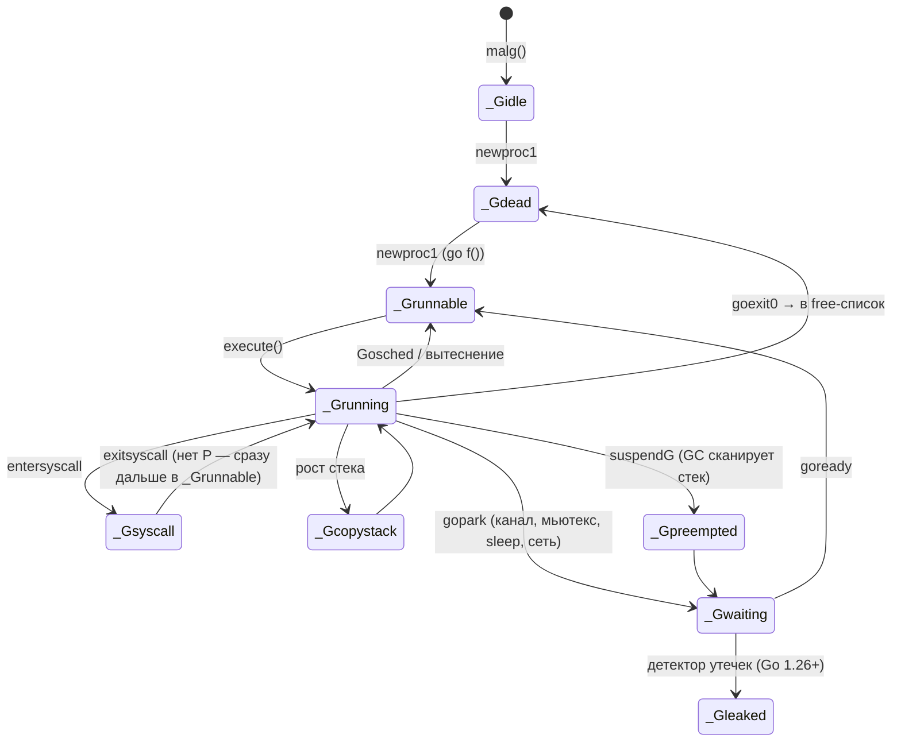
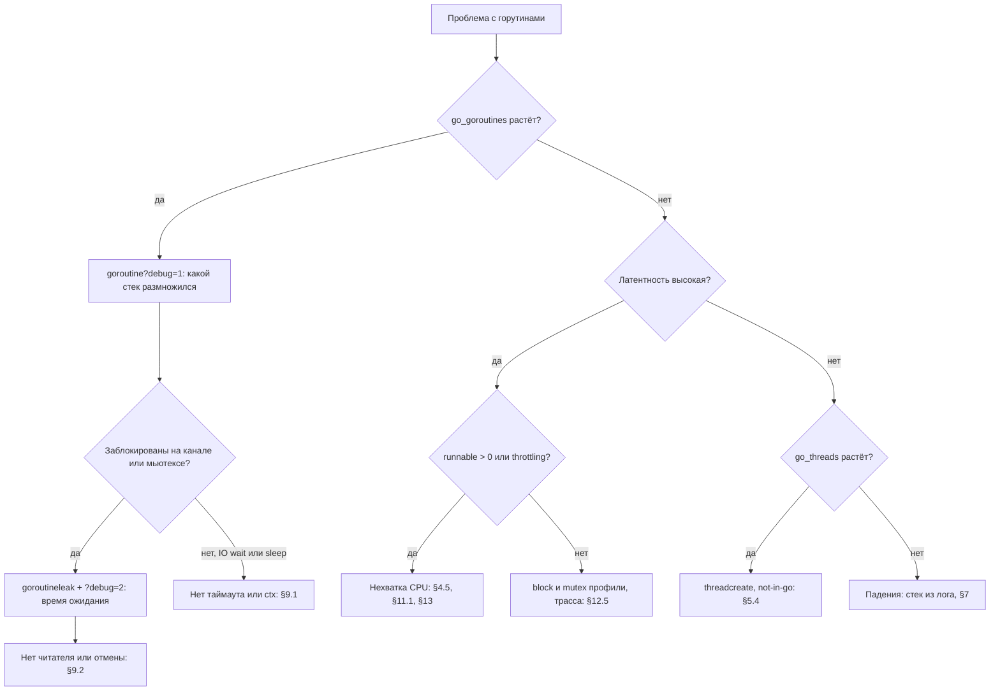

# Go Goroutines: Deep Dive для Senior Go-разработчика

> Актуально для **Go 1.27** (go1.27.0 выпущен в августе 2026; последний патч на момент написания — go1.27.1).
> Факты о рантайме сверены с исходниками `release-branch.go1.27`, тег `go1.27.0` (`src/runtime/proc.go`, `runtime2.go`, `stack.go`, `preempt.go`, `mgc.go`, `src/runtime/pprof/pprof.go`), спецификацией (`doc/go_spec.html`), моделью памяти (`doc/go_mem.html`) и release notes Go 1.14, 1.22, 1.25, 1.26, 1.27.
> Все бенчмарки и выводы команд — **реальные одиночные прогоны** на `go1.27.1 darwin/arm64, Apple M3 Pro, GOMAXPROCS=11` (где указано иное — в тексте). На вашем железе абсолютные числа будут другими, соотношения — примерно те же.
> Места, где факт не удалось проверить по первоисточнику, помечены **⚠️ не проверено**.
> В выводах команд длинные пути сокращены: `./` — каталог временного модуля, `GOROOT` — каталог тулчейна, `GOMODCACHE` — кэш модулей. Остальное — как напечатано.
> Смежные документы: стеки, GC и утечки памяти — [`go-garbage-collector-deep-dive.md`](go-garbage-collector-deep-dive.md); каналы — [`Channel.md`](Channel.md) и [`channels_guide.md`](channels_guide.md).

---

## Оглавление

- [TL;DR](#tldr)
- [1. Модель: что такое горутина](#1-модель-что-такое-горутина)
- [2. Устройство: G, M, P](#2-устройство-g-m-p)
- [3. Планировщик](#3-планировщик)
- [4. Вытеснение (preemption)](#4-вытеснение-preemption)
- [5. Блокировки: рантайм, netpoller, системные вызовы](#5-блокировки-рантайм-netpoller-системные-вызовы)
- [6. Стек горутины](#6-стек-горутины)
- [7. Паники и горутины](#7-паники-и-горутины)
- [8. Запуск и ожидание: WaitGroup, errgroup, переменные цикла](#8-запуск-и-ожидание-waitgroup-errgroup-переменные-цикла)
- [9. Завершение, отмена и утечки](#9-завершение-отмена-и-утечки)
- [10. Настройки и параметры](#10-настройки-и-параметры)
- [11. Production: контейнеры и Kubernetes](#11-production-контейнеры-и-kubernetes)
- [12. Наблюдаемость и диагностика](#12-наблюдаемость-и-диагностика)
- [13. Оптимизация](#13-оптимизация)
- [14. Грабли, заблуждения и советы: сводка](#14-грабли-заблуждения-и-советы-сводка)
- [15. Сравнение с другими платформами](#15-сравнение-с-другими-платформами)
- [16. Вопросы для собеседования](#16-вопросы-для-собеседования)
- [17. Чеклист и шпаргалка](#17-чеклист-и-шпаргалка)

---

## TL;DR

1. **Горутина — это функция, которую рантайм Go исполняет на собственном растущем стеке и сам планирует на потоки ОС.** Это не поток и не корутина языка: у неё нет идентификатора в публичном API, её нельзя убить снаружи, её результат отбрасывается.
2. **Цена горутины** (замер, §1.5): стек 2 KiB + `runtime.g` 456 B, всего ≈ 2.7 KiB на спящую горутину; создание ≈ 170 ns при переиспользовании структуры и ≈ 600 ns при массовом создании; переключение между горутинами через канал ≈ 100 ns.
3. **Модель G-M-P.** G — горутина, M — поток ОС, P — «право исполнять Go-код» (их `GOMAXPROCS`). У каждого P локальная очередь на 256 G плюс слот `runnext`; есть глобальная очередь и work stealing (§3).
4. **Планировщик не round-robin и не имеет кванта.** Горутина работает, пока не заблокируется, не завершится или пока `sysmon` не вытеснит её после **10 ms** (`forcePreemptNS`). Новая и только что разбуженная горутина попадают в `runnext` и исполняются следующими (LIFO), §3.5.
5. **Вытеснение.** С Go 1.2 — кооперативное (проверка в прологе функции), с **Go 1.14** — асинхронное по сигналу. Плотный цикл без вызовов больше не вешает планировщик и GC (§4).
6. **Блокировка бывает трёх видов**, и цена у них разная: на примитиве рантайма (канал, мьютекс, `time.Sleep`) поток освобождается; сеть ждёт через netpoller без потока; блокирующий системный вызов и cgo **держат поток**. 1000 горутин в блокирующем `read(2)` — это 1000 потоков (замер, §5.4). Лимит — 10 000 потоков, дальше `fatal error: thread exhaustion`.
7. **Насыщение всех P CPU-bound-горутинами ломает латентность.** При 4 занятых P из 4 `time.Sleep(1ms)` просыпался с опозданием p50 = 24 ms; при 3 занятых из 4 — 129 µs (замер, §4.5). Метрика `/sched/latencies:seconds` этого опоздания таймеров не показывает.
8. **Panic в любой горутине без `recover` завершает весь процесс.** `recover` действует только в той горутине, где случилась паника; «родитель» поймать её не может (§7).
9. **`main` не ждёт остальные горутины.** Когда `main.main` возвращается, процесс завершается (спецификация, §1.4).
10. **Утечка горутины — это горутина, которая никогда не проснётся.** С **Go 1.27** есть профиль `goroutineleak` (GA; эксперимент в 1.26): GC находит горутины, заблокированные на недостижимых примитивах (§9.2).
11. **Структуры `g` никогда не освобождаются.** После всплеска в 1 млн горутин в куче остаётся ≈ 467 MiB, хотя стеки возвращены (замер, §2.5). Ограничивайте конкурентность на входе.
12. **Удобства последних версий:** переменные цикла per-iteration (Go 1.22), `sync.WaitGroup.Go` и `testing/synctest` (Go 1.25), container-aware `GOMAXPROCS` (Go 1.25), метрики состояний горутин (Go 1.26), метки pprof в tracebacks по умолчанию (Go 1.27).
13. **Горутина на каждую мелкую задачу — это замедление.** Сумма 100 000 чисел: последовательно 124 µs, по горутине на элемент 18.4 ms, по чанку на P — 19 µs (§13.2). Воркер-пул на канале для задач в 1 µs оказался **медленнее**, чем горутина на задачу (§13.1).
14. **Главные инструменты:** дамп горутин (`/debug/pprof/goroutine?debug=2`, SIGQUIT), `goroutineleak`, `runtime/metrics` (`/sched/*`), `GODEBUG=schedtrace=1000`, `go tool trace`, `-race`, `go vet` (§12).

---

## 1. Модель: что такое горутина

### 1.1 Определение

Спецификация языка (`doc/go_spec.html`, раздел «Go statements») определяет горутину одной фразой:

> A "go" statement starts the execution of a function call as an independent concurrent thread of control, or *goroutine*, within the same address space.

То есть язык гарантирует только три вещи: независимый поток управления, конкурентность, общее адресное пространство. Всё остальное — растущий стек, планировщик, потоки ОС — это реализация в рантайме (`src/runtime`), и именно о ней этот документ.

С точки зрения рантайма горутина — это структура `runtime.g` (§2.1) плюс стек. Планировщик кладёт указатель на `g` в очередь, поток ОС берёт его оттуда, восстанавливает регистры `SP`/`PC` из `g.sched` и продолжает исполнение.

### 1.2 Горутина и поток ОС

| | Поток ОС | Горутина |
|---|---|---|
| Кто планирует | ядро | рантайм Go в user space (§3) |
| Стек | фиксированный, резервируется при создании (на Linux обычно 8 MiB виртуальной памяти по `ulimit -s`, **⚠️ не проверено** в этой сессии) | растущий, от 2 KiB до 1 GB (`stackMin = 2048` в `stack.go`, `maxstacksize` в `proc.go`) |
| Создание | системный вызов | вызов функции рантайма `newproc`, ≈ 170–600 ns (§1.5) |
| Переключение | вход в ядро, сохранение всех регистров | в user space, сохраняются `SP`, `PC`, `BP` и ещё три поля (`gobuf`, 48 B); ≈ 100 ns (§1.5) |
| Блокировка на I/O | поток спит в ядре | горутина паркуется, поток исполняет другие горутины (§5) |
| Идентификатор | есть (TID) | в публичном API нет (§1.4) |
| Сколько можно | тысячи | сотни тысяч и миллионы, ограничение — память |

Отношение M:N: N горутин исполняются на M потоках. Одновременно Go-код исполняют не больше `GOMAXPROCS` потоков.

**Почему так спроектировано.** Модель «поток на соединение» проста для программиста, но дорога в памяти и переключениях. Модель «event loop + callbacks» дешёвая, но ломает последовательный код. Горутины дают последовательный код при цене, близкой к event loop: блокирующий с виду `conn.Read` внутри превращается в регистрацию в epoll/kqueue и парковку горутины.

**Цена решения:**
- рантайм должен уметь перемещать стек, отсюда запрет указателей из кучи на стек и зависимость от escape analysis (см. [GC deep dive, §1.4](go-garbage-collector-deep-dive.md#14-стеки-горутин-contiguous-stacks-рост-и-shrinking));
- пролог почти каждой функции содержит проверку границы стека;
- вызовы в C (cgo) дорогие: нужно переключиться на системный стек и сообщить планировщику (§5.5);
- планировщик в user space не знает о приоритетах и не видит, что ядро вытеснило поток (важно под CPU-лимитами, §11).

### 1.3 Семантика оператора `go`

Из спецификации:

> The function value and parameters are evaluated as usual in the calling goroutine, but unlike with a regular call, program execution does not wait for the invoked function to complete. [...] If the function has any return values, they are discarded when the function completes.

Три следствия:

1. **Аргументы вычисляются сразу, в вызывающей горутине.** `go send(ctx, buildMessage())` сначала синхронно выполнит `buildMessage()`, и только `send` уйдёт в новую горутину.
2. **Результат теряется.** Вернуть значение или ошибку из горутины можно только через канал, общую память под синхронизацией или обёртку вроде `errgroup` (§8.3).
3. **Замыкание захватывает переменные по ссылке.** Что именно оно увидит, зависит от синхронизации (§8.4, §8.5).

Модель памяти (`doc/go_mem.html`) добавляет два правила:

> The `go` statement that starts a new goroutine is synchronized before the start of the goroutine's execution.

> The exit of a goroutine is not guaranteed to be synchronized before any event in the program.

Первое означает: всё, что записано до `go f()`, внутри `f` видно без дополнительной синхронизации. Второе: **завершение горутины ничего не гарантирует наблюдателю**. Чтобы увидеть результат её работы, нужен канал, `WaitGroup` или мьютекс.

### 1.4 Жизненный цикл: начало, конец и чего у горутины нет

**Главная горутина.** `runtime.main` (`proc.go`) запускается в горутине с `goid = 1`, запускает `sysmon`, выполняет `init`-функции и вызывает `main.main`. Спецификация («Program execution»):

> When that function invocation returns, the program exits. It does not wait for other (non-main) goroutines to complete.

**Грабли: `main` завершился раньше горутины**

```go
package main

import "fmt"

func main() {
	go fmt.Println("отправляю событие в Kafka")
}
```

```text
$ go run ./mainexit
$ echo $?
0
```

Программа ничего не напечатала и вышла с кодом 0. Почему так: `main.main` вернулся раньше, чем планировщик дал новой горутине поработать. Как заметить: `go vet` это **не ловит**; симптом в production — потерянные при остановке сервиса события, незакоммиченные offset'ы. Как исправить: дождаться горутин явно (`sync.WaitGroup`, `errgroup`) и строить graceful shutdown (§11.3).

**Способы завершиться.** Горутина заканчивается, когда возвращается её функция, когда вызван `runtime.Goexit()` (выполняет все `defer`, остальные горутины не затрагивает) или когда завершается процесс (`os.Exit`, возврат из `main`, необработанная panic, фатальная ошибка рантайма).

**Чего нет и почему:**

| Чего нет | Почему | Что вместо |
|---|---|---|
| Убить горутину снаружи | принудительная остановка в произвольной точке оставила бы захваченные мьютексы и полуобновлённые структуры | кооперативная отмена через `context.Context` (§9.1) |
| ID горутины в публичном API | Go FAQ, «Why is there no goroutine ID?»: «Once one names a goroutine and constructs a model around it, it becomes special, and one is tempted to associate all computation with that goroutine, ignoring the possibility of using multiple, possibly shared goroutines for the processing» | явная передача `context.Context`; для диагностики — метки `pprof.Do` (§12.1) |
| Родитель и потомки | в рантайме есть только `parentGoid` для traceback (`runtime2.go`); иерархии, владения и каскадного завершения нет | структурировать самим: `errgroup`, `WaitGroup` |
| Возвращаемое значение | см. §1.3 | канал, `errgroup` |
| Приоритеты | планировщик не различает горутины по важности | разделять нагрузку по процессам или ограничивать конкурентность фоновой работы |

Внутри рантайма ID есть: `g.goid` виден в traceback (`goroutine 37 [chan receive]:`). ID выдаются пачками по 16 на P (`_GoidCacheBatch = 16` в `proc.go`), поэтому они не строго последовательны по времени создания.

### 1.5 Сколько стоит горутина

Замер: программа создаёт N горутин, каждая блокируется на чтении из канала; память — по `runtime/metrics`.

```go
block := make(chan struct{})
start := time.Now()
for range n {
	go func() { <-block }()
}
```

```text
goroutines=10001 spawn=8.386916ms (839 ns/goroutine)
stacks: 2064 B/goroutine, total runtime memory: 2656 B/goroutine
GC with 10000 parked goroutines: 3.712292ms

goroutines=100001 spawn=60.927333ms (609 ns/goroutine)
stacks: 2049 B/goroutine, total runtime memory: 2809 B/goroutine
GC with 100000 parked goroutines: 34.310708ms

goroutines=1000001 spawn=608.619791ms (609 ns/goroutine)
stacks: 2048 B/goroutine, total runtime memory: 2745 B/goroutine
GC with 1000000 parked goroutines: 342.54525ms
```

Размеры структур рантайма, прочитанные из DWARF того же бинарника (`debug/dwarf`):

```text
sizeof(runtime.g) = 456 bytes
sizeof(runtime.sudog) = 104 bytes
sizeof(runtime.gobuf) = 48 bytes
sizeof(runtime.m) = 1936 bytes
sizeof(runtime.p) = 14320 bytes
```

Что из этого следует:

- **Память: ≈ 2.7 KiB на спящую горутину** = 2048 B стека + 456 B `g` (аллоцируется в size class побольше) + `sudog` для ожидания на канале + замыкание. 1 млн горутин ≈ 2.7 GiB. Это нижняя граница: реальный стек обработчика с JSON, gRPC и драйвером БД вырастает до 8–32 KiB.
- **GC линейно зависит от числа горутин**: полный цикл `runtime.GC()` занял 34 ms на 100 тыс. и 342 ms на 1 млн спящих горутин. Каждый стек — root, который надо просканировать.
- **Создание ≈ 600 ns** при массовом создании, когда на каждую горутину выделяются новый `g` и новый стек.

Бенчмарк «создать и дождаться», где структуры `g` переиспользуются из free-списка (§2.4):

```go
//go:noinline
func work(wg *sync.WaitGroup) { wg.Done() }

func BenchmarkFuncCall(b *testing.B) {
	var wg sync.WaitGroup
	for b.Loop() {
		wg.Add(1)
		work(&wg)
	}
}

func BenchmarkGoroutineCreate(b *testing.B) {
	var wg sync.WaitGroup
	for b.Loop() {
		wg.Add(1)
		go work(&wg)
	}
	wg.Wait()
}

// Две горутины перебрасывают токен по небуферизованным каналам.
func BenchmarkChanPingPong(b *testing.B) {
	ping, pong := make(chan struct{}), make(chan struct{})
	go func() {
		for range ping {
			pong <- struct{}{}
		}
	}()
	for b.Loop() {
		ping <- struct{}{}
		<-pong
	}
	close(ping)
}
```

```text
BenchmarkFuncCall-11           189286792     6.010 ns/op    0 B/op   0 allocs/op
BenchmarkGoroutineCreate-11      7109394   169.2 ns/op     16 B/op   1 allocs/op
BenchmarkChanPingPong-11         5998098   199.6 ns/op      0 B/op   0 allocs/op
```

Горутина примерно в 28 раз дороже вызова функции (169 ns против 6 ns). Один обмен «туда-обратно» по каналу — 200 ns, то есть около 100 ns на одно переключение горутин. Практический вывод: горутина окупается, если работа внутри неё заметно больше микросекунды или если она ждёт I/O (§13).

> **Заблуждение:** «горутины бесплатные, можно запускать сколько угодно». На самом деле каждая стоит от 2.7 KiB памяти и добавляет работу GC, а структура `g` после завершения не возвращается в кучу (§2.5). Миллион горутин — это гигабайты и сотни миллисекунд на цикл GC.

### Что важно для Senior

- Язык гарантирует только конкурентность и общее адресное пространство. Параллелизм, порядок исполнения и момент старта горутины не гарантированы; код, который на них полагается, содержит ошибку.
- `go f(x)` вычисляет `x` синхронно, результат `f` теряется, завершение горутины ни с чем не синхронизировано. Любое наблюдение результата требует явной синхронизации.
- У горутины нет владельца, ID и способа остановить её снаружи. Владение и отмену проектирует автор кода: `context` + `WaitGroup`/`errgroup`.
- Держите в голове числа: ≈ 2.7 KiB и сотни наносекунд на горутину, ≈ 100 ns на переключение, линейный рост времени GC от числа горутин.

---

## 2. Устройство: G, M, P

### 2.1 Три сущности

Комментарий в начале `proc.go`:

> G - goroutine. M - worker thread, or machine. P - processor, a resource that is required to execute Go code. M must have an associated P to execute Go code, however it can be blocked or in a syscall w/o an associated P.

```text
                 глобальная очередь (sched.runq, под sched.lock)
                 ┌──────────────────────────────┐
                 │ G  G  G  G ...               │
                 └──────────────────────────────┘
        ┌───────────────┐   ┌───────────────┐   ┌───────────────┐
   P0   │ runnext: G    │   │ runnext: —    │   │ runnext: G    │   ← GOMAXPROCS штук
        │ runq[256]: GGG│   │ runq[256]: G  │   │ runq[256]: —  │
        │ mcache, gFree │   │ mcache, gFree │   │ mcache, gFree │
        └──────┬────────┘   └──────┬────────┘   └──────┬────────┘
               │                   │                   │
        ┌──────┴────────┐   ┌──────┴────────┐   ┌──────┴────────┐
   M    │ поток ОС      │   │ поток ОС      │   │ поток ОС      │   M без P: в syscall,
        │ g0, curg → G  │   │ g0, curg → G  │   │ g0, curg → G  │   в cgo или спит (midle)
        └───────────────┘   └───────────────┘   └───────────────┘

   + sysmon: отдельный поток без P (§4.4)
   + netpoller: epoll/kqueue, список горутин, ждущих сеть (§5.3)
```

| | Что это | Сколько | Размер структуры (замер, §1.5) |
|---|---|---|---|
| **G** | горутина: стек, сохранённые регистры, статус | сколько создал код | 456 B + стек |
| **M** | поток ОС; у каждого свой служебный `g0` со «системным» стеком и `gsignal` для обработки сигналов | сколько потребовалось, лимит 10 000 (§5.4) | 1936 B + стек потока |
| **P** | ресурс для исполнения Go-кода: локальная очередь, `mcache` аллокатора, кэш свободных `g`, таймеры | ровно `GOMAXPROCS` | 14 320 B |

**Зачем нужен P (история).** P появился в **Go 1.1**: коммит `779c45a507` (2013-03-01, первый тег с ним — go1.1) с описанием «runtime: improved scheduler. Distribute runnable queues, memory cache and cache of dead G's per processor. Faster non-blocking syscall enter/exit. More conservative worker thread blocking/unblocking». До него очередь готовых горутин была одна, под глобальным замком планировщика. Идея P: всё, что нужно для исполнения Go-кода (очередь, `mcache`, кэш свободных `g`), привязать не к потоку, а к отдельному объекту, которых ровно столько, сколько разрешено параллелизма. Когда поток блокируется в системном вызове, P отдаётся другому потоку вместе с очередью и кэшами (§5.2). Дизайн-документ — «Scalable Go Scheduler Design Doc» ([go.dev/s/go11sched](https://go.dev/s/go11sched), на него ссылается комментарий в `proc.go`); сам документ в этой сессии прочитать не удалось (Google Docs не отдаёт текст), поэтому мотивация выше восстановлена по описанию коммита, а не по документу.

### 2.2 Структура `g`

Ключевые поля (`runtime2.go`, `type g struct`):

```go
type g struct {
	stack       stack   // [stack.lo, stack.hi) — границы стека
	stackguard0 uintptr // с ним сравнивается SP в прологе; stackPreempt = запрос вытеснения
	_panic      *_panic // текущая panic
	_defer      *_defer // цепочка defer
	m           *m      // поток, который исполняет горутину сейчас
	sched       gobuf   // сохранённые SP, PC, BP — контекст для переключения
	atomicstatus atomic.Uint32 // статус (§2.3)
	goid         uint64
	waitsince    int64      // когда заблокировалась (для «N minutes» в дампе)
	waitreason   waitReason // причина ожидания (§3.4)
	preempt      bool       // запрос вытеснения
	lockedm      muintptr   // LockOSThread (§5.5)
	parentGoid   uint64     // кто создал
	gopc         uintptr    // PC оператора go, создавшего горутину
	startpc      uintptr    // PC функции горутины
	waiting      *sudog     // на чём ждёт (каналы)
	labels       unsafe.Pointer // метки pprof (§12.1)
	bubble       *synctestBubble // пузырь testing/synctest (§9.5)
	gcAssistBytes int64     // кредит/долг mark assist
	// ...
}
```

Контекст переключения — всего 48 байт (`gobuf`). Это возможно потому, что переключение происходит в известных точках (вызов рантайма), где компилятор уже сохранил всё нужное на стеке. Исключение — асинхронное вытеснение (§4.3): там регистры сохраняются целиком.

### 2.3 Состояния горутины

Константы из `runtime2.go`:



| Статус | Значение | Где G находится |
|---|---|---|
| `_Gidle` (0) | только что выделена | — |
| `_Grunnable` (1) | готова, ждёт P | в очереди P или глобальной |
| `_Grunning` (2) | исполняет код | на M, обычно с P |
| `_Gsyscall` (3) | в системном вызове или cgo | на M; P «прикреплён, но не принадлежит» |
| `_Gwaiting` (4) | заблокирована в рантайме | в очереди ожидания канала, семафора, таймера, netpoller |
| `_Gdead` (6) | не используется | в free-списке или только что завершилась |
| `_Gcopystack` (8) | стек копируется | на M |
| `_Gpreempted` (9) | остановлена для `suspendG` | — |
| `_Gleaked` (10) | признана утёкшей сборщиком мусора | нигде, никогда не проснётся (§9.2) |
| `_Gdeadextra` (11) | `_Gdead`, прикреплённая к extra M для cgo-callback'ов | — |
| `_Gscan` (0x1000) | бит: GC сканирует стек | комбинируется с остальными |

Статус работает ещё и как замок на стек: комментарий в `runtime2.go` — «the G status acts like a lock on the goroutine's stack». Поэтому переходы делаются через CAS (`casgstatus`).

Изменения последних версий (по `git log -S`): `_Gleaked` и `_Gdeadextra` появились в **Go 1.26**; в том же релизе убрали статус P `_Psyscall` (теперь `_Psyscall_unused`) — «в системном вызове» определяется по статусу горутины, а не P (§5.2).

### 2.4 Создание: что делает `go f()`

Компилятор превращает `go f(x)` в вызов `runtime.newproc` с замыканием. Дальше (`proc.go`):

1. `newproc` переключается на системный стек (`systemstack`) и вызывает `newproc1`.
2. `newproc1` берёт готовую структуру из free-списка текущего P: `gfget(pp)`. Если пусто — `malg(stackMin)`: новая `g` и стек 2 KiB; новая `g` добавляется в `allgs`.
3. В `g.sched` записываются `SP` и `PC` так, будто функция была вызвана из `goexit`: когда `f` вернётся, управление попадёт в `goexit` → `goexit0`.
4. Наследуются: `parentGoid`, метки pprof (`labels`), пузырь `synctest` (`bubble`).
5. Статус `_Gdead → _Grunnable`, выдаётся `goid` из кэша P.
6. `runqput(pp, newg, true)` — горутина кладётся в слот **`runnext`** текущего P. Если там уже кто-то был, его вытесняют в хвост локальной очереди.
7. `wakep()` — если есть простаивающий P и нет «крутящихся» потоков, будится ещё один поток (§3.3).

Следствие шага 6 видно на живом коде:

```go
func main() {
	runtime.GOMAXPROCS(1)
	var wg sync.WaitGroup
	for i := range 5 {
		wg.Go(func() { fmt.Print(i, " ") })
	}
	wg.Wait()
	fmt.Println()
}
```

```text
4 0 1 2 3
4 0 1 2 3
4 0 1 2 3
```

Последняя созданная горутина (4) стоит в `runnext` и исполняется первой, остальные были вытеснены из `runnext` в очередь по порядку. Это **не гарантия языка**: при `GOMAXPROCS > 1` и под `-race` (там `runqput` случайно отключает `runnext`, константа `randomizeScheduler`) порядок другой.

> **Заблуждение:** «горутины запускаются в порядке создания» или «горутина стартует сразу после `go`». На самом деле `go` только ставит горутину в очередь. Когда она начнёт исполняться и в каком порядке — не определено.

### 2.5 Завершение и переиспользование

Когда функция горутины возвращается, управление попадает в `goexit0` → `gdestroy`:

1. статус `_Grunning → _Gdead`, обнуляются `m`, `_defer`, `_panic`, `labels`, `bubble`;
2. `gfput(pp, gp)` кладёт `g` в free-список P. Если размер стека не равен текущему стартовому (`startingStackSize`) — стек освобождается, остаётся только структура;
3. когда в локальном списке накопилось 64 структуры, половина переносится в глобальный (`sched.gFree`);
4. `schedule()` — поток берёт следующую горутину.

Структура `g` в кучу не возвращается никогда. Комментарии в исходниках: «Goroutine structs are published in the allg list and never freed» (`runtime2.go`), «allgs contains all Gs ever created (including dead Gs), and thus never shrinks» (`proc.go`).

**Грабли: всплеск горутин оставляет память навсегда**

```go
const n = 1_000_000
block := make(chan struct{})
var wg sync.WaitGroup
for range n {
	wg.Go(func() { <-block })
}
report("пик: 1M горутин ждут")
close(block)
wg.Wait()
runtime.GC()
report("все завершились + GC")
debug.FreeOSMemory()
report("после debug.FreeOSMemory()")
```

```text
старт                              goroutines=1        heap objects=   0.1 MiB  stacks=    0.2 MiB  total-released=    4.7 MiB
пик: 1M горутин ждут               goroutines=1000001  heap objects= 621.0 MiB  stacks= 1953.9 MiB  total-released= 2646.9 MiB
все завершились + GC               goroutines=1        heap objects= 466.8 MiB  stacks=    3.3 MiB  total-released= 2648.4 MiB
после debug.FreeOSMemory()         goroutines=1        heap objects= 466.8 MiB  stacks=    3.3 MiB  total-released=  959.1 MiB
```

Все горутины завершились, стеки освобождены (1954 → 3.3 MiB), но в куче остались **466.8 MiB живых объектов** — миллион структур `g` в free-списках. Их не освободит ни GC, ни `debug.FreeOSMemory()`. Как заметить: `go_goroutines` вернулся к норме, а `go_memory_classes_heap_objects_bytes` остался на «полке»; в heap-профиле (`inuse_space`) почти вся память висит на `runtime.malg`:

```text
$ go tool pprof -sample_index=inuse_space -top -nodecount=5 sp heap.pprof
Showing nodes accounting for 472.38MB, 99.89% of 472.88MB total
      flat  flat%   sum%        cum   cum%
  472.38MB 99.89% 99.89%   472.38MB 99.89%  runtime.mallocgc
         0     0% 99.89%     8.66MB  1.83%  runtime.allgadd
         0     0% 99.89%     8.66MB  1.83%  runtime.growslice
         0     0% 99.89%   461.71MB 97.64%  runtime.malg
         0     0% 99.89%   463.71MB 98.06%  runtime.newobject
```

`runtime.malg` в топе heap-профиля — подпись прошлого всплеска горутин. Как исправить: не допускать всплеска — ограничивать число одновременных горутин на входе (§13.3). Постфактум помогает только рестарт.

### Что важно для Senior

- G — работа, M — исполнитель, P — лицензия на исполнение Go-кода и владелец локальных ресурсов (очередь, `mcache`, free-список `g`). Параллелизм Go-кода ограничен числом P, число потоков — нет.
- `go f()` — это взять `g` из free-списка, записать `SP`/`PC`, положить в `runnext`. Никаких системных вызовов; поэтому сотни наносекунд.
- Новая горутина идёт в `runnext` текущего P: исполняется следующей на том же ядре, с прогретым кэшем. Отсюда LIFO-порядок на одном P.
- Структуры `g` не освобождаются. Пик числа горутин определяет минимальный объём памяти процесса до рестарта.
- Статусы `_Gwaiting`, `_Gsyscall`, `_Grunnable` — то, что вы видите в дампах и метриках `/sched/goroutines/*` (§12).

---
## 3. Планировщик

### 3.1 Очереди

| Очередь | Где | Размер | Синхронизация |
|---|---|---|---|
| `p.runnext` | у каждого P | 1 слот | CAS |
| `p.runq` | у каждого P | кольцевой буфер на **256** (`runq [256]guintptr`, `runtime2.go`) | lock-free: пишет только владелец, читать (красть) могут другие P |
| `sched.runq` | глобальная | не ограничена (связный список) | `sched.lock` |

Правила пополнения (`runqput`, `runqputslow`, `goschedImpl` в `proc.go`):

- новая (`go f()`) и разбуженная (`goready`) горутина → `runnext` текущего P; прежний обитатель `runnext` → хвост `runq`;
- если `runq` полна → **половина** локальной очереди и новая горутина одной пачкой уходят в глобальную (`runqputslow`);
- вытесненная по времени и вызвавшая `runtime.Gosched()` горутина → в **глобальную** очередь (`goschedImpl` → `globrunqput`);
- горутины, разбуженные netpoller'ом или `sysmon`, → `injectglist`: на простаивающие P, остаток в глобальную очередь.

**Почему локальные очереди.** Глобальная очередь под одним мьютексом не масштабируется: каждый `go` и каждое переключение — борьба за замок. Локальная очередь даёт два выигрыша: нет конкуренции (владелец пишет без блокировок) и локальность данных (горутина, созданная на P, обычно исполняется на том же ядре).

### 3.2 Как поток выбирает следующую горутину

`schedule()` вызывает `findRunnable()`, которая блокируется, пока работа не найдётся. Порядок проверок (по коду `findRunnable`, go1.27):

1. запустить созревшие таймеры этого P (`pp.timers.check`);
2. горутина-читатель трассировки, если трасса включена;
3. воркер GC, если идёт mark-фаза;
4. **раз в 61 тик** (`pp.schedtick%61 == 0`) — одна горутина из глобальной очереди. Комментарий в коде: «Check the global runnable queue once in a while to ensure fairness. Otherwise two goroutines can completely occupy the local runqueue by constantly respawning each other»;
5. локальная очередь: сначала `runnext`, потом голова `runq`;
6. глобальная очередь: забрать пачку в локальную — `min(128, размер очереди, размер/GOMAXPROCS + 1)` (`globrunqgetbatch`), то есть свою долю, а не всё;
7. netpoller без блокировки: готовы ли сетевые горутины (опрашивает только один поток одновременно, `sched.pollingNet`, с Go 1.25);
8. **work stealing** — украсть у другого P (§3.3);
9. idle-воркер GC, если идёт mark;
10. отдать P, перепроверить все источники, заблокироваться в netpoller'е или уснуть (`stopm`).

### 3.3 Work stealing и «крутящиеся» потоки

`stealWork` (`proc.go`): до **4 попыток** (`stealTries = 4`), в каждой — обход всех P в случайном порядке. У жертвы забирается **половина** локальной очереди (`runqgrab`: `n = n - n/2`). На последней попытке вор также проверяет таймеры жертвы и может забрать её `runnext`.

Поток, который ищет работу, называется **spinning**. Правила (комментарий «Worker thread parking/unparking» в начале `proc.go`):

- новый поток будится при появлении работы (`wakep`), только если есть простаивающий P **и** нет ни одного spinning-потока;
- одновременно крутится не больше половины занятых P: условие `2*sched.nmspinning < gomaxprocs - sched.npidle` в `findRunnable`. Комментарий: «This is necessary to prevent excessive CPU consumption when GOMAXPROCS>>1 but the program parallelism is low»;
- последний spinning-поток, нашедший работу, обязан разбудить следующего.

**Отвергнутые альтернативы** (перечислены в том же комментарии):

| Вариант | Почему отвергнут |
|---|---|
| Централизовать состояние планировщика | «would inhibit scalability» |
| Прямая передача: разбудил горутину — сразу отдай её и P новому потоку | «thread state thrashing»: разбудивший поток может тут же остаться без работы; теряется локальность |
| Будить поток на каждую разбуженную горутину при свободном P | «excessive thread parking/unparking»: потоки просыпаются и сразу засыпают, не найдя работы |

**Цена решения:** spinning-потоки жгут CPU вхолостую. На машине со многими ядрами и «рваной» нагрузкой (много коротких пробуждений) это заметно в CPU-профиле как `runtime.findRunnable`, `runtime.stealWork`, `runtime.runqgrab`. Завышенный `GOMAXPROCS` усиливает эффект: больше P — больше обходов (§11.1).

### 3.4 Парковка и пробуждение

Горутина блокируется вызовом `gopark(unlockf, lock, reason, ...)`:

1. `gp.waitreason = reason`;
2. `mcall(park_m)` — переключение на стек `g0`;
3. статус `_Grunning → _Gwaiting`, горутина отвязывается от M;
4. вызывается `unlockf` (например, отпустить замок канала);
5. `schedule()` — поток берёт другую горутину.

Пробуждение: `goready(gp)` → `ready()` → `_Gwaiting → _Grunnable` → `runqput(pp, gp, next=true)` → `wakep()`. Разбуженная горутина попадает в `runnext` **того P, который её разбудил**, а не туда, где она работала раньше.

Причина ожидания (`waitReason`, `runtime2.go`) — то, что вы видите в квадратных скобках в дампе горутин:

| В дампе | Что это |
|---|---|
| `chan receive`, `chan send` | ожидание на канале |
| `chan receive (nil chan)`, `chan send (nil chan)` | операция с nil-каналом, блокировка навсегда |
| `select`, `select (no cases)` | `select`; пустой `select {}` |
| `sync.Mutex.Lock`, `sync.RWMutex.RLock`, `sync.RWMutex.Lock` | ожидание мьютекса |
| `sync.WaitGroup.Wait`, `sync.Cond.Wait` | `Wait` |
| `semacquire` | прочие семафоры рантайма |
| `IO wait` | сеть или pipe через netpoller |
| `sleep` | `time.Sleep` |
| `syscall` | это не `waitReason`, а статус `_Gsyscall`: системный вызов или cgo |
| `GC assist marking`, `GC assist wait` | горутина помогает GC (mark assist) |
| `chan receive (durable)`, `select (durable)` и т.п. | ожидание внутри пузыря `synctest` (§9.5) |
| `coroutine` | итератор `iter.Pull` (корутина рантайма, `coro.go`, Go 1.23) |

### 3.5 Справедливость и «квант»

У планировщика Go **нет кванта времени**, который горутина расходует, и нет round-robin. Правила:

- Горутина исполняется, пока не заблокируется, не завершится, не вызовет `Gosched` или пока её не вытеснят.
- Вытесняет `sysmon`: если один и тот же `schedtick` у P держится ≥ **10 ms** (`forcePreemptNS = 10 * 1000 * 1000`), горутине посылается запрос на вытеснение (§4.4).
- Горутина из `runnext` **наследует** срез времени предыдущей (`inheritTime`): `schedtick` не увеличивается. Комментарий в `runqput`: «To prevent a ping-pong pair of goroutines from starving all others, we depend on sysmon to preempt "long-running goroutines". That is, any set of goroutines sharing the same time slice». То есть пара горутин, перебрасывающая сообщения друг другу, вместе получает те же 10 ms.
- Голодание глобальной очереди предотвращает проверка раз в 61 тик (§3.2, п. 4).

`runnext` появился в **Go 1.5** (коммит «runtime: yield time slice to most recently readied G», найден `git log -S'runnext'`). Смысл: паттерн «отправил в канал — получатель сразу обработал» исполняется на одном ядре без задержки на очередь.

> **Заблуждение:** «планировщик Go даёт каждой горутине квант 10 ms по кругу». На самом деле 10 ms — это порог, после которого `sysmon` *попросит* горутину уступить. Горутина, которая часто блокируется, вообще не доживает до порога. Вытесненная горутина уходит в глобальную очередь, откуда её могут достать нескоро. Строгой очерёдности и гарантий по времени ожидания нет.

> **Заблуждение:** «`runtime.Gosched()` помогает другим горутинам и ускоряет программу». На самом деле `Gosched` отправляет текущую горутину в **глобальную** очередь под `sched.lock`. Это было нужно до Go 1.14, чтобы плотный цикл не вешал планировщик. С асинхронным вытеснением (§4.3) в прикладном коде `Gosched` почти никогда не нужен; в busy-wait цикле он маскирует отсутствие нормальной синхронизации.

### Что важно для Senior

- Три уровня очередей: `runnext` → локальная (256) → глобальная. Плюс netpoller и чужие очереди как источники работы.
- Поток без работы не засыпает сразу: он крутится в поиске (spinning), чтобы новая работа стартовала без задержки на пробуждение потока. Цена — CPU; ограничение — не больше половины занятых P.
- Разбуженная горутина исполняется на P того, кто её разбудил, и наследует его срез времени. Это ускоряет request-response паттерны и может задерживать остальные горутины в локальной очереди.
- Гарантий порядка и времени ожидания нет. Если нужна латентность — оставляйте свободные P (§4.5) и смотрите `/sched/latencies:seconds` (§12.3).

---

## 4. Вытеснение (preemption)

### 4.1 История

| Версия | Что было | Проблема |
|---|---|---|
| до Go 1.2 | только добровольная передача управления: блокировка, системный вызов, `Gosched` | release notes 1.2: «a goroutine that was looping forever could starve out other goroutines on the same thread» |
| Go 1.2 | кооперативное вытеснение: «The scheduler is invoked occasionally upon entry to a function» (release notes 1.2) | цикл без не-inline вызовов функций (`for {}`) не вытеснялся: вешал планировщик и задерживал STW |
| **Go 1.14** | асинхронное вытеснение по сигналу | — |

Release notes Go 1.14:

> Goroutines are now asynchronously preemptible. As a result, loops without function calls no longer potentially deadlock the scheduler or significantly delay garbage collection.

### 4.2 Синхронные safe-point'ы

Комментарий в начале `preempt.go` описывает три вида точек, где горутину можно остановить: когда она заблокирована, в синхронном safe-point'е и в асинхронном.

Синхронный safe-point совмещён с проверкой стека в прологе функции. Чтобы вытеснить горутину, рантайм записывает в `g.stackguard0` значение `stackPreempt` (заведомо больше любого адреса стека). Следующая проверка `SP < stackguard0` «проваливается», управление попадает в `morestack` → `newstack`, а там рантайм видит, что это не нехватка стека, а запрос вытеснения, и вызывает `gopreempt_m`.

Цена: ноль дополнительных инструкций — проверка стека нужна в любом случае. Ограничение: работает только при вызове функции (не inline и не `nosplit`).

### 4.3 Асинхронные safe-point'ы

`preemptone` (`proc.go`) делает оба действия сразу: ставит `gp.preempt = true` и `stackguard0 = stackPreempt`, а если платформа поддерживает (`preemptMSupported`) и не задан `GODEBUG=asyncpreemptoff=1` — вызывает `preemptM(mp)`.

На Unix `preemptM` посылает потоку сигнал **`SIGURG`** (`sigPreempt = _SIGURG` в `signal_unix.go`). Обработчик сигнала проверяет, можно ли остановить горутину на текущей инструкции (`isAsyncSafePoint` в `preempt.go`):

- это пользовательская горутина, а не `g0`;
- поток не держит замков рантайма, не в аллокаторе;
- на стеке хватает места для сохранения регистров;
- инструкция не помечена компилятором как unsafe-point (последовательность write barrier, `nosplit`-функции);
- это Go-код, а не ассемблер;
- функция не из `runtime.`, `internal/runtime/` и `reflect.`.

Если всё выполнено, обработчик подменяет `PC` так, будто горутина сама вызвала `asyncPreempt`. Та сохраняет все регистры и входит в планировщик.

**Почему не вытеснять прямо в обработчике сигнала.** Комментарий в `preempt.go`: это занимало бы M на каждую вытесненную G, а планировщик не рассчитан на запуск из обработчика сигнала — он аллоцирует память и запускает потоки.

**Цена решения:**
- в асинхронном safe-point'е у рантайма нет точной карты указателей для самого верхнего фрейма, поэтому он сканируется консервативно, а стек в этот момент нельзя сжимать (`isShrinkStackSafe` в `stack.go`);
- процесс получает больше сигналов. Release notes 1.14: программы, использующие `syscall` или `golang.org/x/sys/unix`, «will see more slow system calls fail with `EINTR` errors». Стандартная библиотека повторяет такие вызовы сама; сырые системные вызовы и C-библиотеки через cgo должны обрабатывать `EINTR`.

**Проверка на живом коде:**

```go
func main() {
	runtime.GOMAXPROCS(1)
	go func() {
		for { // плотный цикл без вызовов функций: нет синхронных safe-point'ов
		}
	}()
	start := time.Now()
	time.Sleep(10 * time.Millisecond) // отдаём единственный P горутине с циклом
	fmt.Println("main снова получил P через", time.Since(start).Round(time.Millisecond))
}
```

```text
$ go run ./preempt
main снова получил P через 14ms

$ GODEBUG=asyncpreemptoff=1 ./preempt
[процесс всё ещё висит через 5s, kill]
```

С асинхронным вытеснением `main` получил P обратно через 14 ms. Без него программа зависла: единственный P занят циклом, в котором нет ни одного вызова функции. Так вёл себя любой Go до 1.14.

### 4.4 sysmon

`sysmon` (`proc.go`) — поток рантайма, который работает **без P** и поэтому не зависит от планировщика. Цикл:

- спит от **20 µs**; после 50 пустых циклов подряд интервал удваивается, максимум **10 ms**;
- если сеть не опрашивалась больше 10 ms — опрашивает netpoller и ставит готовые горутины в очередь;
- раз в секунду пересчитывает `GOMAXPROCS` по cgroup и affinity (Go 1.25, §11.1);
- `retake()`: вытесняет горутины, работающие ≥ 10 ms, и отбирает P у потоков, застрявших в системных вызовах (§5.2);
- запускает принудительный GC, если его не было 2 минуты (`forcegcperiod`);
- печатает `schedtrace`, если включён (§12.2).

Из этих чисел следует важная деталь: вытеснение срабатывает **не ровно через 10 ms**. `sysmon` сначала должен заметить, что `schedtick` не меняется, затем на следующем проходе увидеть, что прошло ≥ 10 ms. При интервале сна до 10 ms реальная задержка — от 10 до 20 ms и больше.

### 4.5 Насыщение CPU и опоздание таймеров

Таймеры в Go привязаны к P и срабатывают, только когда P заходит в планировщик (`pp.timers.check` в `findRunnable`) или когда свободный P крадёт их у занятого. Если **все** P заняты CPU-bound работой, таймер ждёт вытеснения.

Замер: N горутин считают SHA-256 в цикле, одна горутина делает `time.Sleep(1ms)` и измеряет опоздание. `GOMAXPROCS=4`.

```go
// «Обработчик запросов»: просыпается раз в 1 ms и меряет, насколько опоздал.
wg.Go(func() {
	for time.Now().Before(deadline) {
		t := time.Now()
		time.Sleep(time.Millisecond)
		late = append(late, time.Since(t)-time.Millisecond)
	}
})
```

```text
GOMAXPROCS=4 cpu-bound=0: sched latency p50=8.192µs p99=20.48µs p99.9=114.688µs
  опоздание time.Sleep(1ms): p50=158µs p99=203µs max=1.887ms (n=1723)
GOMAXPROCS=4 cpu-bound=3: sched latency p50=128ns p99=8.192µs p99.9=10.24µs
  опоздание time.Sleep(1ms): p50=129µs p99=140µs max=293µs (n=1771)
GOMAXPROCS=4 cpu-bound=4: sched latency p50=192ns p99=768ns p99.9=768ns
  опоздание time.Sleep(1ms): p50=24.048ms p99=47.72ms max=47.72ms (n=81)
GOMAXPROCS=4 cpu-bound=64: sched latency p50=201.326592ms p99=805.306368ms p99.9=805.306368ms
  опоздание time.Sleep(1ms): p50=24.05ms p99=47.562ms max=47.562ms (n=81)
```

(`sched latency` — квантили гистограммы `/sched/latencies:seconds`, значения — верхние границы бакетов.)

Что видно:

- **Один свободный P решает всё.** При 3 занятых P из 4 таймер опаздывает на 129 µs. При 4 из 4 — на **24 ms** (p50) и до 48 ms: в 190 раз хуже.
- **Метрика `/sched/latencies` этого не показывает.** При 4 CPU-bound горутинах её p99 = 768 ns, потому что она измеряет время в состоянии `_Grunnable`, а спящая горутина всё это время в `_Gwaiting` — её таймер просто ещё не сработал.
- При 64 CPU-bound горутинах на 4 P метрика показывает p50 ≈ 200 ms: каждая горутина ждёт своей очереди за 15 другими по 10+ ms.

Почему опоздание 24 ms, а не 10: см. §4.4 — `sysmon` в «ленивом» режиме просыпается раз в 10 ms, и ему нужно два прохода. Это интерпретация по коду `sysmon`/`retake`; точное распределение зависит от ОС и железа.

> **Совет.** Не занимайте все P CPU-bound работой в сервисе, который должен отвечать быстро — ограничьте число фоновых CPU-воркеров до `GOMAXPROCS-1` или меньше. Эффект: опоздание таймеров 129 µs вместо 24 ms (замер выше). Не нужно, если это batch-процесс без требований к латентности.

То же относится к `context.WithTimeout`, `time.After`, `Ticker`, дедлайнам сетевых операций: все они — таймеры.

### Что важно для Senior

- Вытеснение двухуровневое: флаг в `stackguard0` (срабатывает на прологе функции) и сигнал `SIGURG` (срабатывает почти на любой инструкции пользовательского кода).
- 10 ms — порог, а не квант; фактическая задержка вытеснения 10–20+ ms, потому что её делает `sysmon` с собственным интервалом сна.
- Асинхронное вытеснение не работает внутри рантайма, ассемблера и cgo. Долгая ассемблерная функция или C-вызов по-прежнему не вытесняются.
- Латентность таймеров и дедлайнов зависит от наличия свободного P. Метрика `/sched/latencies` опоздание таймеров не отражает — меряйте сами (как в §4.5) или смотрите трассу.
- `SIGURG` в `strace` Go-процесса — норма, а не проблема.

---

## 5. Блокировки: рантайм, netpoller, системные вызовы

### 5.1 Три вида блокировки

| Вид | Примеры | Статус G | Что с потоком (M) | Что с P |
|---|---|---|---|---|
| На примитиве рантайма | канал, `sync.Mutex`, `WaitGroup`, `time.Sleep`, `select` | `_Gwaiting` | свободен, берёт другую горутину | остаётся у потока |
| Сеть и pollable-файлы | `net.Conn`, pipe, сокеты | `_Gwaiting` (`IO wait`) | свободен | остаётся у потока |
| Блокирующий системный вызов, cgo | чтение обычного файла, `syscall.Read` на блокирующем fd, DNS через libc, любой C-вызов | `_Gsyscall` | **заблокирован вместе с горутиной** | отбирается и передаётся другому потоку |

Первые два вида дешёвые: цена — ≈ 100 ns на переключение (§1.5). Третий создаёт потоки.

### 5.2 Системный вызов: что происходит с P

Вход (`entersyscall` → `reentersyscall` в `proc.go`):

1. сохраняются `SP`/`PC` в `g.syscallsp`/`g.syscallpc` (чтобы GC мог сканировать стек);
2. статус `_Grunning → _Gsyscall`;
3. P **остаётся прикреплённым** к M (`m.p`), но больше ему не принадлежит: комментарий к `_Gsyscall` — «It may have a P attached, but it does not own it».

Дальше два сценария.

**Быстрый вызов.** Системный вызов вернулся за микросекунды. `exitsyscall` делает CAS `_Gsyscall → _Grunning`, видит, что P на месте, и продолжает. Ни одного замка.

**Долгий вызов.** `sysmon` в `retake()` находит P, чья горутина в системном вызове дольше одного своего тика (от 20 µs). Он отбирает P (`takeP`) и передаёт другому потоку (`handoffp`), который продолжает исполнять очередь этого P. Исключение: если локальная очередь P пуста и есть простаивающие или spinning P, `sysmon` ждёт до 10 ms — незачем отбирать P, для которого нет работы.

Когда вызов наконец возвращается, `exitsyscall` обнаруживает, что P нет. Поток пытается взять прежний P или любой простаивающий (`exitsyscallTryGetP`). Не получилось — горутина уходит в глобальную очередь (`exitsyscall0` → `globrunqput`), а поток засыпает.

Для заведомо блокирующих вызовов есть `entersyscallblock`: P отдаётся сразу, без ожидания `sysmon`.

**Изменение в Go 1.26:** убран статус P `_Psyscall` (коммит «runtime: eliminate _Psyscall»). Раньше вход в системный вызов менял статус P, и `sysmon` соревновался с `exitsyscall` за CAS на P. Теперь признак «в системном вызове» — только статус горутины, а синхронизация идёт через бит `_Gscan`. Release notes 1.26 сообщают: «The baseline runtime overhead of cgo calls has been reduced by ~30%».

**Цена решения:** каждый системный вызов и cgo-вызов платит за `entersyscall`/`exitsyscall`. А каждая горутина, которая в вызове надолго, держит поток ОС.

### 5.3 Netpoller

Сетевые сокеты в Go открываются в неблокирующем режиме. Когда `read` возвращает `EAGAIN`, рантайм регистрирует fd в мультиплексоре ОС (epoll на Linux, kqueue на macOS/BSD, IOCP на Windows) и паркует горутину с причиной `IO wait`. Поток свободен.

Кто опрашивает мультиплексор:
- любой поток, оставшийся без работы, в `findRunnable` (без блокировки — шаг 7 в §3.2, с блокировкой — перед сном);
- `sysmon`, если никто не опрашивал больше 10 ms.

Что идёт через netpoller, а что нет (`os/file_unix.go`, функция `newFile`): pollable считаются pipe, сокеты и файлы, открытые в неблокирующем режиме. **Обычные файлы и каталоги — нет** (комментарий: «Don't try to use kqueue with regular files on *BSDs»; на Linux epoll для обычных файлов не работает в принципе). Чтение с диска — всегда блокирующий системный вызов с потоком.

### 5.4 Потоки растут от блокирующих вызовов

```go
// 1. Блокировка в рантайме: канал. Горутина паркуется, поток свободен.
block := make(chan struct{})
for range n {
	go func() { <-block }()
}

// 2. Блокирующий системный вызов мимо netpoller: read(2) на блокирующем fd.
var p [2]int
syscall.Pipe(p[:])
for range n {
	go func() {
		buf := make([]byte, 1)
		syscall.Read(p[0], buf) // поток заблокирован в ядре вместе с горутиной
	}()
}

// 3. То же чтение через os.File: fd неблокирующий, ожидание через netpoller.
r, _, _ := os.Pipe()
for range n {
	go func() {
		buf := make([]byte, 1)
		r.Read(buf)
	}()
}
```

```text
старт:
  threads=5 goroutines not-in-go=0
1000 горутин ждут на канале:
  threads=9 goroutines not-in-go=0
1000 горутин в блокирующем read(2):
  threads=1008 goroutines not-in-go=1000
ещё 1000 горутин в os.File.Read на pipe (netpoller):
  threads=1012 goroutines not-in-go=1000
```

(`threads` — метрика `/sched/threads/total:threads`, `not-in-go` — `/sched/goroutines/not-in-go:goroutines`; обе появились в Go 1.26.)

1000 горутин на канале стоили 4 потока. 1000 горутин в блокирующем `read(2)` — **999 новых потоков**. Те же чтения через `os.File` — ещё 4 потока.

**Грабли: исчерпание потоков**

Рантайм ограничивает число потоков: `sched.maxmcount = 10000` (`proc.go`), меняется через `debug.SetMaxThreads`. Комментарий в `checkmcount`: лимит защищает от «accidental fork bomb from something like millions of goroutines blocking on system calls». Воспроизведение с лимитом, сниженным до 100:

```go
func main() {
	debug.SetMaxThreads(100) // по умолчанию 10000
	var p [2]int
	syscall.Pipe(p[:])
	for range 200 {
		go func() {
			buf := make([]byte, 1)
			syscall.Read(p[0], buf)
		}()
	}
	time.Sleep(time.Second)
}
```

```text
runtime: program exceeds 100-thread limit
fatal error: thread exhaustion

runtime stack:
runtime.throw({0x104e58832?, 0x7971eb8ce008?})
	GOROOT/src/runtime/panic.go:1243 +0x38 fp=0x16b0b6ce0 sp=0x16b0b6cb0 pc=0x104e3e848
runtime.checkmcount()
	GOROOT/src/runtime/proc.go:990 +0xac fp=0x16b0b6d10 sp=0x16b0b6ce0 pc=0x104e0fd8c
```

Почему так: каждая горутина в блокирующем вызове держит M; чтобы исполнять остальные горутины, рантайм создаёт новые M. Это `fatal error`, `recover` его не ловит — процесс падает целиком. Типичные источники в production: массовое чтение файлов с медленного диска или NFS, cgo-вызовы в библиотеку, которая блокируется (драйверы БД на C, DNS-резолвер libc при недоступном DNS), `syscall`-вызовы на блокирующих fd. Как заметить: растут `go_threads` и `/sched/goroutines/not-in-go:goroutines`; профиль `threadcreate`; в дампе много горутин в состоянии `[syscall]`. `go vet` не ловит. Как исправить: ограничить конкурентность таких операций семафором (§13.3); не поднимать `SetMaxThreads` — это отодвигает падение, а не убирает причину.

Простаивающие потоки рантайм не завершает, а паркует в списке `sched.midle` (`mput`). Поток завершается, только если горутина вышла, оставаясь привязанной через `LockOSThread` (см. `gdestroy`). Поэтому после всплеска блокирующих вызовов число потоков остаётся высоким до рестарта.

### 5.5 `LockOSThread` и cgo

`runtime.LockOSThread()` привязывает горутину к текущему потоку: никакая другая горутина на нём исполняться не будет, пока не вызван `UnlockOSThread` столько же раз. Из документации (`proc.go`): «If the calling goroutine exits without unlocking the thread, the thread will be terminated».

Когда нужно: API с состоянием на поток — GUI-фреймворки, OpenGL, `setns`/`unshare` в Linux, некоторые C-библиотеки. Цена: привязанная горутина при каждом переключении требует передачи P конкретному потоку (`startlockedm`/`stoplockedm` в `schedule`), это заметно медленнее обычного переключения.

Вызов C-функции через cgo для планировщика выглядит как системный вызов: `entersyscall`, исполнение на системном стеке `g0`, `exitsyscall`. Отсюда три следствия: вызов дороже Go-вызова на порядки, C-код не вытесняется (§4.3), блокирующий C-вызов держит поток (§5.4).

### Что важно для Senior

- Вопрос «сколько горутин выдержит сервис» зависит от того, **на чём** они блокируются. Канал и сеть — дёшево. Диск, cgo, блокирующий syscall — по потоку на горутину.
- P не простаивает, пока горутина в системном вызове: `sysmon` отберёт его через 20 µs — 10 ms и отдаст другому потоку. За это платят созданием потоков.
- Потоки не возвращаются ОС. Пик блокирующих вызовов определяет число потоков до рестарта; лимит 10 000 (появился в Go 1.2 вместе с `debug.SetMaxThreads`) — аварийный предохранитель.
- С Go 1.26 в `runtime/metrics` есть `/sched/threads/total:threads` и `/sched/goroutines/not-in-go:goroutines` — следите за ними, а не только за числом горутин.
- Обычные файлы не идут через netpoller. Сервис, который читает много файлов конкурентно, должен ограничивать эту конкурентность сам.

---

## 6. Стек горутины

Подробно устройство стека (contiguous stacks, рост, shrinking, связь с escape analysis) разобрано в [GC deep dive, §1.4](go-garbage-collector-deep-dive.md#14-стеки-горутин-contiguous-stacks-рост-и-shrinking). Здесь — то, что важно именно для работы с горутинами.

### 6.1 Параметры

| Параметр | Значение | Источник |
|---|---|---|
| минимальный стек | 2048 B | `stackMin` в `stack.go` |
| стартовый размер | адаптивный: степень двойки ≥ среднего размера просканированных стеков, пересчитывается на каждом GC (Go 1.19) | `startingStackSize`, `gcComputeStartingStackSize` в `stack.go` |
| рост | удвоение с копированием | `newstack`: `newsize := oldsize * 2` |
| сжатие | вдвое, если используется < 1/4; только во время GC | `shrinkstack` |
| максимум | 1 GB на 64-bit, 250 MB на 32-bit | `maxstacksize` в `runtime.main` |
| стек `g0` | выделяет ОС (cgo, macOS, Windows) или 16 KiB (Linux без cgo) | `allocm` в `proc.go` |

Нюанс адаптивного старта, видимый в коде: совсем новая `g` всегда получает `malg(stackMin)`, а стек размера `startingStackSize` получает `g`, взятая из free-списка (`gfget`). В `gfput` стек, размер которого не равен текущему `startingStackSize`, освобождается.

### 6.2 Цена роста стека

Бенчмарк: горутина сразу уходит в рекурсию глубиной 100 с фреймом ≈ 160 B (≈ 16 KiB стека). Перед замером 1000 таких же горутин висят на глубине, и дважды вызван GC — чтобы рантайм измерил средний размер стека.

```go
//go:noinline
func deep(n int) int {
	var pad [128]byte
	if n == 0 {
		return int(pad[0])
	}
	return deep(n-1) + int(pad[1])
}

func BenchmarkSpawnDeepStack(b *testing.B) {
	// ... прогрев: 1000 горутин на глубине 100, runtime.GC() ×2 ...
	var wg sync.WaitGroup
	for b.Loop() {
		wg.Add(1)
		go func() { deep(100); wg.Done() }()
	}
	wg.Wait()
}
```

```text
# GODEBUG=adaptivestackstart=0 — «до» (поведение до Go 1.19: всегда 2 KiB)
BenchmarkSpawnDeepStack-11    	 1000000	      1891 ns/op	      35 B/op	       1 allocs/op
# по умолчанию (adaptivestackstart=1) — «после», два прогона
BenchmarkSpawnDeepStack-11    	 4463526	      1130 ns/op	      19 B/op	       1 allocs/op
BenchmarkSpawnDeepStack-11    	 1479088	      1235 ns/op	      21 B/op	       1 allocs/op
```

Адаптивный старт сэкономил около 35–40% времени: горутина сразу получает стек нужного размера вместо трёх копирований 2 → 4 → 8 → 16 KiB. Числа шумные (одиночные прогоны), направление устойчивое.

Текущее значение — метрика `/gc/stack/starting-size:bytes`.

### 6.3 Переполнение стека

**Грабли: бесконечная рекурсия**

```go
type node struct{ parent *node }

func depth(n *node) int { return 1 + depth(n.parent) } // забыли условие выхода

func main() {
	n := &node{}
	n.parent = n // цикл в данных
	println(depth(n))
}
```

```text
runtime: goroutine stack exceeds 1000000000-byte limit
runtime: sp=0x1bf9bbe03a0 stack=[0x1bf9bbe0000, 0x1bfbbbe0000]
fatal error: stack overflow

runtime stack:
runtime.throw({0x100b75c46?, 0x200000001?})
	GOROOT/src/runtime/panic.go:1243 +0x38 fp=0x16f2fe500 sp=0x16f2fe4d0 pc=0x100b6d5b8
runtime.newstack()
	GOROOT/src/runtime/stack.go:1207 +0x480 fp=0x16f2fe630 sp=0x16f2fe500 pc=0x100b55300
```

Почему так: стек растёт удвоением до 1 GB, затем `fatal error`. Это не panic: `recover` не поможет, падает весь процесс. Перед падением процесс успевает занять гигабайт памяти — в контейнере с `limits.memory` меньше 1 GiB вы увидите **OOMKilled** вместо этого сообщения. Как заметить: `go vet` на этом примере ничего не сообщил. Как исправить: условие выхода, ограничение глубины, итеративный обход; для недоверенного ввода (JSON, AST) — явный лимит вложенности. `debug.SetMaxStack` можно снизить, чтобы падать раньше и с понятной диагностикой.

### Что важно для Senior

- Стек — не «2 KiB на горутину», а «от 2 KiB»: реальный размер определяет глубина вызовов. Смотрите `/memory/classes/heap/stacks:bytes`, поделённое на число горутин.
- Рост стека — копирование; у короткоживущих горутин с глубокими вызовами это заметная доля CPU (`runtime.newstack`, `runtime.copystack` в профиле). Адаптивный старт (Go 1.19) лечит это автоматически.
- Сжатие стека происходит только на GC. Горутина, однажды вырастившая стек до мегабайт, держит его как минимум до следующего цикла.
- Переполнение стека — `fatal error`, не panic. В контейнере с лимитом памяти < 1 GiB оно выглядит как OOMKilled.

---

## 7. Паники и горутины

### 7.1 Правило

Необработанная panic в **любой** горутине завершает **весь процесс** с кодом 2. `recover` останавливает раскрутку только в той горутине, где случилась panic, и только из `defer`-функции этой горутины.

**Грабли: `recover` в «родителе» не ловит панику «потомка»**

```go
func handle() {
	defer func() {
		if r := recover(); r != nil {
			fmt.Println("recovered:", r) // не сработает: panic в другой горутине
		}
	}()
	go func() {
		var m map[string]int
		m["order"] = 1 // panic: assignment to entry in nil map
	}()
	time.Sleep(100 * time.Millisecond)
	fmt.Println("handler завершился")
}
```

```text
panic: assignment to entry in nil map

goroutine 5 [running]:
main.handle.func2()
	./panicg/main.go:16 +0x34
created by main.handle in goroutine 1
	./panicg/main.go:14 +0x40
exit status 2
```

Строка `handler завершился` не напечатана: процесс упал раньше. Почему так: у горутин нет иерархии (§1.4), раскрутка стека идёт только по стеку паникующей горутины, а на нём нет `defer` с `recover`. Важное следствие: recovery-middleware в `net/http`, gRPC и chi защищает только горутину обработчика. Любая горутина, которую обработчик запустил через `go`, не защищена, и одна её паника роняет сервис со всеми запросами в полёте. Как заметить: `go vet` не ловит; в логах — `panic:` и рестарт пода. Как исправить: `recover` в начале каждой горутины, от которой не должен зависеть процесс.

```go
// goSafe запускает fn в горутине и превращает панику в запись в лог.
func goSafe(ctx context.Context, wg *sync.WaitGroup, fn func(context.Context)) {
	wg.Go(func() {
		defer func() {
			if r := recover(); r != nil {
				slog.ErrorContext(ctx, "goroutine panic", "panic", r, "stack", string(debug.Stack()))
			}
		}()
		fn(ctx)
	})
}
```

Когда `recover` **не** нужен: если горутина могла оставить общее состояние в неконсистентном виде (паника под мьютексом в середине обновления), безопаснее упасть и перезапуститься, чем продолжать с испорченными данными.

**Почему так спроектировано.** Паника означает ошибку программиста: нарушен инвариант. Тихо завершить одну горутину и продолжить — значит оставить процесс в неизвестном состоянии: канал, который никто не закроет, мьютекс, который никто не отпустит. Go выбирает fail-fast.

### 7.2 Как это ведёт себя с `WaitGroup.Go` и `errgroup`

`sync.WaitGroup.Go` (Go 1.25) паники не ловит. Больше того, при панике он намеренно **не вызывает `Done`**. Комментарий в `sync/waitgroup.go`:

> Calling Done will unblock Wait in the main goroutine, allowing it to race with the fatal panic and possibly even exit the process (os.Exit(0)) before the panic completes. This is almost certainly undesirable, so instead avoid calling Done and simply panic.

`errgroup.Group.Go` (`golang.org/x/sync` v0.23.0) паники тоже не превращает в ошибку — процесс падает:

```go
var g errgroup.Group
g.Go(func() error {
	var m map[string]int
	m["order"] = 1
	return nil
})
fmt.Println("Wait:", g.Wait())
```

```text
panic: assignment to entry in nil map

goroutine 19 [running]:
main.main.func1()
	./deps/egpanic/main.go:13 +0x34
golang.org/x/sync/errgroup.(*Group).Go.func1()
	GOMODCACHE/golang.org/x/sync@v0.23.0/errgroup/errgroup.go:93 +0x4c
created by golang.org/x/sync/errgroup.(*Group).Go in goroutine 1
	GOMODCACHE/golang.org/x/sync@v0.23.0/errgroup/errgroup.go:78 +0x98
exit status 2
```

Комментарий в `errgroup.go` объясняет, почему паника не превращается в ошибку из `Wait`: это «delays panics arbitrarily», «turns f's panic stack into a mere value» и «risks deadlocks that hide the panic entirely».

### 7.3 Что `recover` не ловит

`recover` перехватывает только panic. Фатальные ошибки рантайма (`fatal error:` в выводе) завершают процесс безусловно. Воспроизведённые в этом документе:

| Сообщение | Причина | Раздел |
|---|---|---|
| `fatal error: all goroutines are asleep - deadlock!` | все горутины заблокированы | §9.3 |
| `fatal error: stack overflow` | стек > 1 GB | §6.3 |
| `fatal error: thread exhaustion` | потоков > 10 000 | §5.4 |
| `fatal error: concurrent map writes` | запись в map из нескольких горутин без синхронизации | ниже |

```go
cache := map[int]int{}
var wg sync.WaitGroup
for i := range 8 {
	wg.Go(func() {
		defer func() { recover() }() // не поможет: это fatal error, а не panic
		for j := range 100000 {
			cache[j] = i
		}
	})
}
wg.Wait()
```

```text
fatal error: concurrent map writes

goroutine 18 [running]:
internal/runtime/maps.fatal({0x10414faa0?, 0x0?})
	GOROOT/src/runtime/panic.go:1195 +0x20
main.main.func1()
```

К этой же категории относится `fatal error: runtime: out of memory` (в этом документе не воспроизводился).

### 7.4 `runtime.Goexit`

`Goexit` завершает текущую горутину, выполняя все `defer`. Это не panic: `recover` внутри этих `defer` вернёт `nil`. Используется в `testing` (`t.FailNow`, `t.Fatal`, `t.Skip`).

Отсюда известные грабли: `t.Fatal` из горутины, запущенной тестом, завершает **эту** горутину, а не тест. `go vet` ловит это анализатором `testinggoroutine` («report calls to (*testing.T).Fatal from goroutines started by a test» — из `go tool vet help`). Из других горутин используйте `t.Error` и возвращайтесь.

Документация `Goexit` (`panic.go`): вызов из главной горутины завершает её без возврата из `main`; программа продолжает работать, пока живы другие горутины, а когда они закончатся — падает. Реальный вывод программы из одного `runtime.Goexit()` в `main`:

```text
fatal error: no goroutines (main called runtime.Goexit) - deadlock!
exit status 2
```

### Что важно для Senior

- Одна необработанная паника в фоновой горутине = падение всего процесса и всех запросов в полёте. Recovery-middleware покрывает только горутину обработчика.
- Каждая точка `go` в сервисе — решение: либо там есть `recover`, либо вы осознанно согласны на падение процесса.
- `recover` не всесилен: `fatal error` (deadlock, stack overflow, concurrent map writes, thread exhaustion, OOM) не перехватывается.
- `WaitGroup.Go` при панике не делает `Done` — чтобы `Wait` не разблокировался и `main` не успел выйти с кодом 0 раньше, чем паника завершит процесс.

---
## 8. Запуск и ожидание: WaitGroup, errgroup, переменные цикла

### 8.1 `sync.WaitGroup`

`WaitGroup` — счётчик: `Add(n)` увеличивает, `Done()` уменьшает, `Wait()` блокируется до нуля. Единственное правило: **`Add` вызывается до `go`**, в той горутине, которая потом вызовет `Wait`.

**Грабли: `wg.Add` внутри горутины**

```go
func main() {
	var wg sync.WaitGroup
	var sent atomic.Int64
	for range 1000 {
		go func() {
			wg.Add(1) // ошибка: Add внутри горутины
			defer wg.Done()
			sent.Add(1)
		}()
	}
	wg.Wait() // может вернуться раньше, чем горутины успели сделать Add
	fmt.Println("sent:", sent.Load(), "из 1000")
}
```

```text
$ go run ./wgadd      # три запуска
sent: 991 из 1000
sent: 994 из 1000
sent: 987 из 1000

$ go vet ./wgadd
wgadd/main.go:14:10: WaitGroup.Add called from inside new goroutine
```

Почему так: `go` только ставит горутину в очередь (§2.4). `Wait` может увидеть счётчик 0 до того, как часть горутин начнёт исполняться и сделает `Add`. Как заметить: `go vet` ловит анализатором `waitgroup` (добавлен в Go 1.25, release notes: «reports misplaced calls to `sync.WaitGroup.Add`»). Как исправить: `wg.Add(1)` перед `go` или `wg.Go` (§8.2).

### 8.2 `WaitGroup.Go` (Go 1.25)

```go
var wg sync.WaitGroup
for _, topic := range topics {
	wg.Go(func() { consume(ctx, topic) })
}
wg.Wait()
```

`wg.Go(f)` — это `wg.Add(1); go func() { defer wg.Done(); f() }()` с одной особенностью при панике (§7.2). Он убирает два класса ошибок: `Add` не там и забытый `Done`.

В Go 1.27 `go fix` умеет переписывать старый паттерн автоматически: анализатор `waitgroupgo` («replace wg.Add(1)/go/wg.Done() with wg.Go» — из `go tool fix help`; release notes 1.27: «The existing `waitgroup` analyzer was renamed to `waitgroupgo` to avoid ambiguity»).

> **Совет.** В новом коде на Go ≥ 1.25 используйте `wg.Go` вместо ручных `Add`/`Done` — когда не нужно `Add(n)` на несколько горутин сразу. Эффект: анализатор `waitgroup` и ошибки из §8.1 становятся невозможными по построению. Не нужно, если горутине требуется вернуть ошибку или нужен лимит конкурентности — тогда `errgroup` (§8.3).

### 8.3 `errgroup`: ошибки, отмена и лимит

`golang.org/x/sync/errgroup` добавляет к `WaitGroup` три вещи: возврат первой ошибки, отмену остальных через `context`, ограничение числа одновременных горутин.

```go
func fetchUser(ctx context.Context, id int) error {
	if id == 50 {
		return errors.New("user 50: redis: connection refused")
	}
	select {
	case <-time.After(20 * time.Millisecond):
		return nil
	case <-ctx.Done():
		return ctx.Err() // отмена: первый упавший запрос гасит остальные
	}
}

func main() {
	g, ctx := errgroup.WithContext(context.Background())
	g.SetLimit(8) // не больше 8 горутин одновременно; g.Go блокируется при достижении лимита
	var started, peak, running atomic.Int64
	for id := range 100 {
		g.Go(func() error {
			started.Add(1)
			n := running.Add(1)
			for p := peak.Load(); n > p && !peak.CompareAndSwap(p, n); p = peak.Load() {
			}
			defer running.Add(-1)
			return fetchUser(ctx, id)
		})
	}
	err := g.Wait()
	fmt.Println("err:", err)
	fmt.Println("started:", started.Load(), "peak concurrent:", peak.Load(), "goroutines after Wait:", runtime.NumGoroutine())
}
```

```text
err: user 50: redis: connection refused
started: 100 peak concurrent: 8 goroutines after Wait: 1
```

(`golang.org/x/sync v0.23.0`.) Что видно: одновременно работало не больше 8 горутин; `Wait` вернул первую ошибку; после `Wait` горутин не осталось. Обратите внимание на `started: 100`: после ошибки `errgroup` **не перестаёт запускать** новые задачи — он только отменяет контекст. Задачи после 50-й стартовали и сразу вышли по `ctx.Done()`. Если функция не проверяет контекст, отмена на неё не подействует.

`errgroup` не ловит паники (§7.2).

### 8.4 Переменные цикла (Go 1.22)

Release notes Go 1.22:

> Previously, the variables declared by a "for" loop were created once and updated by each iteration. In Go 1.22, each iteration of the loop creates new variables, to avoid accidental sharing bugs.

Поведение зависит от директивы `go` в `go.mod` модуля, а не от версии компилятора. Один и тот же код, один и тот же тулчейн go1.27.1:

```go
func main() {
	var wg sync.WaitGroup
	for _, topic := range []string{"orders", "payments", "refunds"} {
		wg.Add(1)
		go func() {
			defer wg.Done()
			fmt.Println("consume", topic)
		}()
	}
	wg.Wait()
}
```

```text
# go.mod: go 1.21
$ go vet .
main.go:14:27: loop variable topic captured by func literal
$ go run .
consume refunds
consume refunds
consume refunds

# go.mod: go 1.22
$ go vet .
$ go run .
consume refunds
consume payments
consume orders
```

> **Заблуждение:** «в замыкание горутины нельзя захватывать переменную цикла, нужно `topic := topic` или передавать параметром». Это было верно до Go 1.22. С `go 1.22` и новее в `go.mod` у каждой итерации своя переменная, и копия `x := x` — лишний шум. Но проверьте `go.mod`: модуль с `go 1.21`, собранный свежим компилятором, сохраняет старую семантику (вывод выше). `go vet` (анализатор `loopclosure`) предупреждает только в старом режиме.

### 8.5 Гонка данных

Горутины разделяют память. Одновременный доступ к переменной из двух горутин, из которых хотя бы одна пишет, без синхронизации — data race, и поведение программы не определено моделью памяти.

**Грабли: инкремент общего счётчика**

```go
func main() {
	var wg sync.WaitGroup
	processed := 0
	for range 1000 {
		wg.Go(func() { processed++ }) // гонка: read-modify-write без синхронизации
	}
	wg.Wait()
	fmt.Println("processed:", processed)
}
```

```text
$ go run ./race       # три запуска
processed: 956
processed: 962
processed: 943

$ go vet ./race       # пусто: vet гонки не ищет

$ go run -race ./race
==================
WARNING: DATA RACE
Read at 0x00c00019e048 by goroutine 12:
  main.main.func1()
      ./race/main.go:12 +0x2c

Previous write at 0x00c00019e048 by goroutine 9:
  main.main.func1()
      ./race/main.go:12 +0x3c

Goroutine 12 (running) created at:
  sync.(*WaitGroup).Go()
      GOROOT/src/sync/waitgroup.go:238 +0x6c
```

Почему так: `processed++` — три операции (прочитать, прибавить, записать), и горутины на разных P перетирают результаты друг друга. Как заметить: только детектор гонок, `-race` в тестах и на staging. Документация детектора (go.dev/doc/articles/race_detector): «memory usage may increase by 5-10x and execution time by 2-20x» и «The race detector only finds races that happen at runtime, so it can't find races in code paths that are not executed». Как исправить: `atomic.Int64`, `sync.Mutex` или передача владения через канал.

> **Совет.** Запускайте тесты с `-race` в CI всегда — когда в проекте есть хоть одна горутина. Не нужно включать `-race` в production-сборку: 2–20× по времени и 5–10× по памяти.

### Что важно для Senior

- `Add` до `go`, `Done` в `defer`; на Go ≥ 1.25 — `wg.Go`, и вопрос закрыт.
- `errgroup.WithContext` + `SetLimit` — стандартный способ «параллельно, с первой ошибкой, не больше N». Отмена работает, только если задачи слушают `ctx`.
- Семантику переменных цикла определяет `go` в `go.mod`. При обновлении директивы с < 1.22 поведение меняется; в подавляющем большинстве случаев это исправление ошибок.
- `go vet` находит структурные ошибки (`waitgroup`, `loopclosure`, `lostcancel`, `copylocks`, `testinggoroutine`), но не гонки. Гонки находит только `-race`, и только на исполненных путях.

---

## 9. Завершение, отмена и утечки

### 9.1 Правило владения

Горутину нельзя остановить снаружи (§1.4), поэтому у каждой горутины должны быть:

1. **владелец** — код, который её запустил и дождётся её завершения (`WaitGroup`, `errgroup`);
2. **условие выхода** — закрытие входного канала или отмена `context.Context`;
3. **гарантия, что она это условие увидит** — каждая блокирующая операция стоит в `select` рядом с `<-ctx.Done()` либо принимает `ctx`.

`context` — кооперативный протокол: `cancel()` только закрывает канал `ctx.Done()`. Горутина, которая его не проверяет, не остановится.

Полезные API (версии — по `api/go1.*.txt`):

| API | Версия | Зачем |
|---|---|---|
| `context.WithCancelCause`, `context.Cause` | 1.20 | узнать, **почему** отменили |
| `context.WithTimeoutCause`, `WithDeadlineCause` | 1.21 | причина для таймаута |
| `context.WithoutCancel` | 1.21 | сохранить значения контекста, но отвязаться от отмены родителя (§9.4) |
| `context.AfterFunc` | 1.21 | выполнить функцию при отмене, без отдельной ждущей горутины |
| `signal.NotifyContext` | — | отмена по SIGTERM (§11.3) |

### 9.2 Утечка горутины и профиль `goroutineleak`

Утечка — горутина, которая заблокирована и никогда не проснётся. Она держит стек, всё, на что стек ссылается, и остаётся root'ом для GC. Типичные источники перечислены в [GC deep dive, §12.1](go-garbage-collector-deep-dive.md#121-утечки-горутин); здесь — механизм обнаружения.

**Грабли: ранний `return` при чтении из небуферизованного канала**

```go
func processBatch(ids []int) error {
	ch := make(chan result) // небуферизованный
	for _, id := range ids {
		go func() {
			res, err := processItem(id)
			ch <- result{res, err} // после раннего return читателя нет
		}()
	}
	for range ids {
		if r := <-ch; r.err != nil {
			return r.err // оставшиеся горутины заблокированы навсегда
		}
	}
	return nil
}

func main() {
	for range 100 { // 100 «запросов» по 10 элементов
		_ = processBatch([]int{0, 1, 2, 3, 4, 5, 6, 7, 8, 9})
	}
	time.Sleep(50 * time.Millisecond)
	fmt.Println("NumGoroutine:", runtime.NumGoroutine())
	pprof.Lookup("goroutineleak").WriteTo(os.Stdout, 1)
}
```

```text
NumGoroutine: 901
goroutineleak profile: total 900
900 @ 0x100df3f18 0x100d8e224 0x100d8de38 0x100e479f0 0x100dfa024
#	0x100e479ef	main.processBatch.func1+0x8f	./leak/main.go:30
```

Каждый «запрос» оставил 9 горутин; профиль нашёл все 900 и указал строку. `go vet` на этом коде ничего не сообщил.

**Как работает детектор.** Release notes Go 1.27:

> A *leaked* goroutine is a goroutine blocked on some concurrency primitive (channels, `sync.Mutex`, `sync.Cond`, etc) that cannot possibly become unblocked. The runtime detects leaked goroutines using the garbage collector: if a goroutine G is blocked on concurrency primitive P, and P is unreachable from any runnable goroutine or any goroutine that *those* could unblock, then P cannot be unblocked, so goroutine G can never wake up.

По коду (`mgc.go`, `pprof.go`): запрос профиля вызывает `goroutineLeakGC()` — специальный цикл GC, в котором стеки заблокированных горутин сначала **не** считаются root'ами. Маркировка идёт от работоспособных горутин; если примитив, на котором ждёт горутина, оказался достижим — её стек добавляется в root'ы, и так до неподвижной точки. Оставшиеся получают статус `_Gleaked` (`findGoroutineLeaks`). Обычные циклы GC этого не делают, поэтому, пока профиль не запрошен, накладных расходов нет (release notes 1.26: «designed to not incur any additional run-time overhead unless it is actively in-use»).

| | |
|---|---|
| Статус | эксперимент `GOEXPERIMENT=goroutineleakprofile` в Go 1.26; **включён по умолчанию с Go 1.27** (эксперимент удалён коммитом «drop goroutineleakprofile experiment», тег go1.27rc1) |
| Как получить | `pprof.Lookup("goroutineleak").WriteTo(w, 1)`; HTTP: `/debug/pprof/goroutineleak` (`net/http/pprof`); `debug=2` — формат как у паники, **включая и не утёкшие горутины** (см. `writeGoroutineLeak`) |
| Цена запроса | полный цикл GC |
| Ложные срабатывания | по построению нет: найденная горутина действительно не может проснуться |
| Пропуски | есть, см. ниже |

**Ограничение — достижимость.** Release notes: «the runtime may fail to identify leaks caused by blocking on concurrency primitives reachable through global variables or the local variables of runnable goroutines». Воспроизведение:

```go
var events = make(chan int) // глобальный канал: достижим всегда

func main() {
	for range 100 {
		go func() { events <- 1 }() // читателя нет и не будет
	}
	time.Sleep(50 * time.Millisecond)
	fmt.Println("NumGoroutine:", runtime.NumGoroutine())
	pprof.Lookup("goroutineleak").WriteTo(os.Stdout, 1)
}
```

```text
NumGoroutine: 101
goroutineleak profile: total 0
```

100 горутин утекли, профиль пуст: канал достижим через глобальную переменную, и рантайм не может доказать, что в него никто не прочитает. То же касается утечек на таймерах, сети и «вечных» циклах — это не блокировка на недостижимом примитиве. Для таких случаев остаётся обычный профиль `goroutine` и рост `go_goroutines` (§12).

**Исправление** исходного примера — буфер по числу отправителей и отмена оставшейся работы:

```go
func processBatch(ctx context.Context, ids []int) error {
	ctx, cancel := context.WithCancel(ctx)
	defer cancel() // ранний return отменяет оставшуюся работу

	ch := make(chan result, len(ids)) // отправка никогда не блокируется
	for _, id := range ids {
		go func() {
			res, err := processItem(ctx, id)
			ch <- result{res, err}
		}()
	}
	for range ids {
		if r := <-ch; r.err != nil {
			return r.err
		}
	}
	return nil
}
```

```text
NumGoroutine: 1
goroutineleak profile: total 0
```

### 9.3 Deadlock: что рантайм находит сам

`checkdead` (`proc.go`) срабатывает, когда не осталось ни одного потока, исполняющего Go-код, и нет таймеров:

```go
func main() {
	jobs := make(chan int)
	jobs <- 1 // никто не читает
}
```

```text
fatal error: all goroutines are asleep - deadlock!

goroutine 1 [chan send]:
main.main()
	./deadlock/main.go:5 +0x34
exit status 2
```

**Грабли: частичный deadlock в работающем сервисе**

```go
func transfer(from, to *account, amount int) {
	from.mu.Lock()
	defer from.mu.Unlock()
	time.Sleep(10 * time.Millisecond)
	to.mu.Lock() // порядок захвата зависит от аргументов → ABBA deadlock
	defer to.mu.Unlock()
	from.balance -= amount
	to.balance += amount
}

func startTransfers() {
	a, b := &account{balance: 100}, &account{balance: 100}
	go transfer(a, b, 10)
	go transfer(b, a, 20)
}

func main() {
	startTransfers()
	// main жив (как HTTP-сервер в реальном сервисе), поэтому checkdead не сработает.
	time.Sleep(200 * time.Millisecond)
	fmt.Println("процесс работает, deadlock рантаймом не обнаружен")
	pprof.Lookup("goroutineleak").WriteTo(os.Stdout, 1)
}
```

```text
процесс работает, deadlock рантаймом не обнаружен
goroutineleak profile: total 2
2 @ 0x10301bf18 0x102ffc354 0x102ffc335 0x10301cfe8 0x103026484 0x10306f71c 0x10306f6d1 0x10306f6c9 0x103022024
#	0x10301cfe7	internal/sync.runtime_SemacquireMutex+0x27	GOROOT/src/runtime/sema.go:95
#	0x103026483	internal/sync.(*Mutex).lockSlow+0x173		GOROOT/src/internal/sync/mutex.go:149
#	0x10306f71b	internal/sync.(*Mutex).Lock+0xfb		GOROOT/src/internal/sync/mutex.go:70
#	0x10306f6d0	sync.(*Mutex).Lock+0xb0				GOROOT/src/sync/mutex.go:46
#	0x10306f6c8	main.transfer+0xa8				./partial/main.go:20
```

Почему так: `all goroutines are asleep` означает буквально «все». Пока жива хоть одна горутина, способная работать (HTTP-сервер, тикер, обработчик сигналов), рантайм молчит. Две заблокированные навсегда горутины для него — обычное ожидание. Как заметить: профиль `goroutineleak` (нашёл обе, вывод выше — оба мьютекса достижимы только из самих заблокированных горутин); в дампе — горутины в `[sync.Mutex.Lock, N minutes]`. Как исправить: единый порядок захвата замков (например, по возрастанию ID счёта).

> **Заблуждение:** «Go сам обнаруживает deadlock'и». На самом деле рантайм обнаруживает только полную остановку программы. В сервисе с сетевым listener'ом этого практически не бывает; частичные deadlock'и находят профилем `goroutineleak` и дампом горутин.

### 9.4 Горутина, пережившая HTTP-запрос

**Грабли: фоновая работа на контексте запроса**

```go
// saveAudit имитирует запрос в PostgreSQL, уважающий контекст.
func saveAudit(ctx context.Context) error {
	select {
	case <-time.After(50 * time.Millisecond):
		return nil
	case <-ctx.Done():
		return ctx.Err()
	}
}

mux.HandleFunc("/bad", func(w http.ResponseWriter, r *http.Request) {
	go func() { done <- fmt.Sprint("bad:  ", saveAudit(r.Context())) }()
	w.WriteHeader(http.StatusAccepted)
})
mux.HandleFunc("/good", func(w http.ResponseWriter, r *http.Request) {
	ctx, cancel := context.WithTimeout(context.WithoutCancel(r.Context()), time.Second)
	go func() {
		defer cancel()
		done <- fmt.Sprint("good: ", saveAudit(ctx))
	}()
	w.WriteHeader(http.StatusAccepted)
})
```

```text
bad:  context canceled
good: <nil>
```

Почему так: `net/http` отменяет `r.Context()`, как только обработчик вернулся. Горутина, запущенная из обработчика с этим контекстом, получает `context canceled` на первом же обращении к БД — аудит не записан, ошибки клиент не видит. Как заметить: `context canceled` в логах фоновых операций; `go vet` не ловит. Как исправить: `context.WithoutCancel(r.Context())` (Go 1.21) сохраняет значения (trace ID, логгер), но отвязывает отмену; обязательно свой таймаут и владелец, который дождётся горутину при остановке сервиса (§11.3) — иначе получится §1.4: работа потеряется при shutdown.

### 9.5 Тесты: `goleak` и `synctest`

**`go.uber.org/goleak`** (v1.3.0) сравнивает набор горутин в конце теста с ожидаемым:

```go
// StartWorker запускает воркер и «забывает» дать способ его остановить.
func StartWorker(jobs <-chan int) {
	go func() {
		for range jobs {
		}
	}()
}

func TestStartWorker(t *testing.T) {
	defer goleak.VerifyNone(t)
	jobs := make(chan int)
	StartWorker(jobs)
	jobs <- 1
	// close(jobs) забыли
}
```

```text
--- FAIL: TestStartWorker (0.45s)
    worker_test.go:15: found unexpected goroutines:
        [Goroutine 36 in state chan receive, with deps/leaktest.StartWorker.func1 on top of the stack:
        deps/leaktest.StartWorker.func1()
        	./deps/leaktest/worker.go:6 +0x34
        created by deps/leaktest.StartWorker in goroutine 35
        	./deps/leaktest/worker.go:5 +0x64
        ]
FAIL
```

**`testing/synctest`** (эксперимент в Go 1.24, GA в **Go 1.25**; `synctest.Sleep` добавлен в Go 1.27 — `api/go1.27.txt`). Тест исполняется в «пузыре» с виртуальным временем: часы прыгают вперёд, когда все горутины пузыря заблокированы.

```go
// Run шлёт heartbeat раз в 30 секунд, пока контекст не отменён.
func Run(ctx context.Context, send func()) {
	t := time.NewTicker(30 * time.Second)
	defer t.Stop()
	for {
		select {
		case <-t.C:
			send()
		case <-ctx.Done():
			return
		}
	}
}

func TestRun(t *testing.T) {
	synctest.Test(t, func(t *testing.T) {
		ctx, cancel := context.WithCancel(t.Context())
		n := 0
		go Run(ctx, func() { n++ })

		time.Sleep(5 * time.Minute) // виртуальное время: реально занимает микросекунды
		synctest.Wait()             // ждём, пока все горутины пузыря заблокируются
		if n != 10 {
			t.Fatalf("heartbeats = %d, want 10", n)
		}
		cancel()
		synctest.Wait() // Run должна выйти; иначе synctest.Test упадёт с deadlock
	})
}
```

```text
=== RUN   TestRun
--- PASS: TestRun (0.00s)
PASS
```

Пять минут виртуального времени — 0.00 s реального. Обратите внимание: `n` читается без синхронизации, и это корректно — `synctest.Wait()` гарантирует, что все горутины пузыря заблокированы.

`synctest` заодно ловит утечки. Тот же тест без `cancel`:

```go
func TestRunLeak(t *testing.T) {
	synctest.Test(t, func(t *testing.T) {
		go Run(context.Background(), func() {})
		time.Sleep(time.Minute)
	})
}
```

```text
--- FAIL: TestRunLeak (0.00s)
panic: deadlock: main bubble goroutine has exited but blocked goroutines remain [recovered, repanicked]
...
goroutine 38 [select (durable), synctest bubble 1]:
gr/heartbeat.Run({0x1029ef0e0, 0x102a3df40}, 0x1029ef7b0)
	./heartbeat/heartbeat.go:13 +0xc0
created by gr/heartbeat.TestRunLeak.func1 in goroutine 37
	./heartbeat/heartbeat_test.go:29 +0x58
```

> **Совет.** Для кода с таймерами, тикерами и таймаутами пишите тесты через `synctest.Test` — когда в тесте есть `time.Sleep` «чтобы горутина успела». Эффект: тест на 5 минут логического времени исполняется за 0.00 s и не флакает. Не подходит, если горутины блокируются на реальном I/O (сеть, файлы): пузырь не считает такую блокировку «durable», и время не сдвинется.

### Что важно для Senior

- У каждой горутины — владелец, условие выхода и `select` с `ctx.Done()` на каждой блокирующей операции. Это проверяется на code review, а не инструментом.
- `goroutineleak` (Go 1.27) даёт находки без ложных срабатываний, но с пропусками: глобальные каналы, сеть, таймеры он не видит. Отсутствие находок не означает отсутствие утечек.
- Рантайм обнаруживает только полную остановку. Частичный deadlock — это два-три зависших обработчика и медленно растущий `go_goroutines`.
- Контекст HTTP-запроса умирает вместе с обработчиком. Фоновая работа — `WithoutCancel` + свой таймаут + владелец.
- В тестах: `goleak` в `TestMain` для пакетов с горутинами, `synctest` для всего, что зависит от времени.

---

## 10. Настройки и параметры

### 10.1 Таблица параметров

| Параметр | Значения | Версия | Эффект |
|---|---|---|---|
| `GOMAXPROCS` (env), `runtime.GOMAXPROCS(n)` | число P; по умолчанию — CPU с учётом affinity и cgroup-лимита | cgroup — 1.25 | верхняя граница параллелизма Go-кода. Ручная установка отключает автообновление (§11.1) |
| `GODEBUG=containermaxprocs=0` | 0/1 (def 1) | 1.25 | не учитывать cgroup CPU limit |
| `GODEBUG=updatemaxprocs=0` | 0/1 (def 1) | 1.25 | не пересчитывать `GOMAXPROCS` на лету |
| `GODEBUG=asyncpreemptoff=1` | 0/1 (def 0) | 1.14 | отключить асинхронное вытеснение (§4.3). Только для диагностики |
| `GODEBUG=adaptivestackstart=0` | 0/1 (def 1) | 1.19 | всегда стартовать с 2 KiB стека (§6.2) |
| `GODEBUG=schedtrace=N` | период в ms | — | печатать состояние планировщика в stderr (§12.2) |
| `GODEBUG=scheddetail=1` | вместе с `schedtrace` | — | построчно каждый P, M, G |
| `GODEBUG=tracebackancestors=N` | глубина | — | в traceback показывать стек создателя горутины (§12.1) |
| `GODEBUG=tracebacklabels=0` | 0/1 (def 1 с 1.27) | 1.26; default 1 — 1.27 | не печатать метки pprof в заголовке горутины (`doc/godebug.md`) |
| `GOTRACEBACK` | `none`, `single` (default), `all`, `system`, `crash` | — | сколько горутин печатать при падении (`runtime/extern.go`) |
| `debug.SetMaxThreads(n)` | default 10 000 | 1.2 | лимит потоков ОС (§5.4) |
| `debug.SetMaxStack(n)` | default 1 GB (64-bit) | 1.2 | лимит стека одной горутины (§6.3) |
| `debug.SetTraceback(level)` | как `GOTRACEBACK` | — | то же из кода |

GODEBUG-дефолты, привязанные к версии (`containermaxprocs`, `updatemaxprocs`, `tracebacklabels`), определяются директивой `go` в `go.mod` главного модуля, а не версией компилятора.

### 10.2 Рекомендации по сценариям

| Сценарий | Настройки | Обоснование |
|---|---|---|
| Сервис в Kubernetes с `limits.cpu`, Go ≥ 1.25 | ничего не задавать | рантайм сам возьмёт `ceil(limit)`, минимум 2, и будет следить за изменениями (§11.1) |
| Сервис в Kubernetes без `limits.cpu` | `GOMAXPROCS` из `requests.cpu` через Downward API | иначе `GOMAXPROCS` = число CPU ноды: лишние spinning-потоки и GC-воркеры |
| Go < 1.25 в контейнере | `go.uber.org/automaxprocs` или `GOMAXPROCS` вручную | рантайм не знает о cgroup |
| Сервис с латентностью + фоновые CPU-задачи | число CPU-воркеров ≤ `GOMAXPROCS - 1` | свободный P для таймеров и запросов (§4.5) |
| Падение в production, нужен полный дамп | `GOTRACEBACK=all` | по умолчанию печатается только упавшая горутина |
| Нужен core dump | `GOTRACEBACK=crash` + `ulimit -c` | анализ в `dlv core` |
| Поиск «кто создал эту горутину» | `GODEBUG=tracebackancestors=5` | цепочка создателей в traceback; стоит памяти на каждую горутину — не для постоянного включения |
| Метки содержат чувствительные данные | `GODEBUG=tracebacklabels=0` | с 1.27 метки печатаются в traceback по умолчанию |

### Что важно для Senior

- Ручек у планировщика почти нет, и это намеренно: единственный настоящий параметр — `GOMAXPROCS`, и с Go 1.25 его обычно не надо трогать.
- Всё остальное в `GODEBUG` — диагностика (`schedtrace`, `tracebackancestors`) или аварийный откат поведения (`asyncpreemptoff`, `adaptivestackstart`).
- `SetMaxThreads` и `SetMaxStack` — предохранители. Повышать их значит лечить симптом.
- Проверяйте директиву `go` в `go.mod`: от неё зависят дефолты GODEBUG и семантика переменных цикла.

---

## 11. Production: контейнеры и Kubernetes

### 11.1 `GOMAXPROCS` и CPU limit

Механика container-aware `GOMAXPROCS` (Go 1.25) и её влияние на GC разобраны в [GC deep dive, §9.4](go-garbage-collector-deep-dive.md#94-container-aware-gomaxprocs-go-125-и-cpu-throttling). Коротко, по `cgroup_linux.go` и release notes 1.25:

- `GOMAXPROCS` = min(логические CPU по affinity, `ceil(quota/period)`), но не меньше 2;
- учитывается только CPU **limit**, не requests;
- `sysmon` раз в секунду пересчитывает значение (`sysmonUpdateGOMAXPROCS`);
- `GOMAXPROCS` из env или вызов `runtime.GOMAXPROCS(n)` отключают автоматику.

> Проверить это запуском в этой сессии было нельзя: машина — macOS без Docker, а логика cgroup есть только в Linux-сборке. Факты выше — из исходников и release notes.

**Что завышенный `GOMAXPROCS` делает с планировщиком** (не только с GC):

```text
limits.cpu = 2, нода 64 CPU, GOMAXPROCS = 64 (Go < 1.25 без automaxprocs)

• 64 P → 64 потока могут исполнять Go-код одновременно
• квота 200 ms CPU на 100 ms периода сгорает за ~3 ms при полной загрузке
• ядро замораживает ВСЕ потоки процесса до конца периода (CFS throttling)
• планировщик Go об этом не знает: горутина «исполняется», таймеры «тикают»,
  а поток стоит. sysmon тоже заморожен.
```

Последствия:

- хвосты латентности размером с остаток периода CFS (до ~100 ms);
- до половины занятых P могут быть spinning (§3.3) — они жгут квоту впустую;
- горутина, вытесненная ядром посреди критической секции, держит мьютекс, пока весь процесс заморожен.

Метрика throttling — `container_cpu_cfs_throttled_periods_total / container_cpu_cfs_periods_total` (cAdvisor; имена метрик приведены по памяти, **⚠️ не проверено** в этой сессии).

> **Устаревший совет:** «подключайте `go.uber.org/automaxprocs`». Начиная с **Go 1.25** он не нужен и вреден: он вызывает `runtime.GOMAXPROCS(n)`, что отключает периодическое обновление при изменении лимита (in-place resize пода). Вместо него — ничего не делать, убедившись, что в `go.mod` стоит `go 1.25` или новее.

### 11.2 Пример манифеста

```yaml
apiVersion: apps/v1
kind: Deployment
metadata:
  name: orders-api
spec:
  template:
    spec:
      terminationGracePeriodSeconds: 30   # должен быть больше таймаута graceful shutdown (§11.3)
      containers:
        - name: app
          image: registry.example.com/orders-api:1.42.0
          resources:
            requests:
              cpu: "2"
              memory: 1Gi
            limits:
              cpu: "2"        # Go ≥ 1.25: GOMAXPROCS=2 автоматически
              memory: 1Gi     # 1 GiB < maxstacksize: бесконечная рекурсия = OOMKilled (§6.3)
          env:
            - name: GOTRACEBACK
              value: "all"    # при падении — стеки всех горутин в логах
            # GOMAXPROCS не задаём: автоматика из cgroup
            # Если limits.cpu убрать, раскомментировать:
            # - name: GOMAXPROCS
            #   valueFrom:
            #     resourceFieldRef:
            #       resource: requests.cpu
            #       divisor: "1"
          lifecycle:
            preStop:
              exec:
                command: ["sleep", "5"]   # дать endpoint'у выйти из балансировки до SIGTERM
```

Манифест не применялся к кластеру в этой сессии; это иллюстрация.

Что учитывать при выборе лимитов с точки зрения горутин:

- `limits.cpu < 1` даёт `GOMAXPROCS = 2` при квоте меньше одного ядра: throttling при любой параллельной работе.
- `limits.cpu: 1` → `GOMAXPROCS = 2` (минимум 2 по `cgroup_linux.go`): два P делят квоту одного ядра.
- Память: закладывайте стеки. 50 тыс. горутин с реальным стеком 8 KiB — 400 MiB только стеков.

### 11.3 Graceful shutdown

Kubernetes шлёт `SIGTERM`, ждёт `terminationGracePeriodSeconds`, затем `SIGKILL`. За это время нужно перестать принимать работу и дождаться горутин.

```go
// consume имитирует Kafka-consumer: обрабатывает сообщения, пока контекст жив.
func consume(ctx context.Context, id int) {
	t := time.NewTicker(20 * time.Millisecond)
	defer t.Stop()
	for {
		select {
		case <-t.C: // обработка сообщения
		case <-ctx.Done():
			fmt.Printf("consumer %d: commit offsets, выход (%v)\n", id, context.Cause(ctx))
			return
		}
	}
}

func main() {
	// SIGTERM от kubelet → отмена корневого контекста.
	ctx, stop := signal.NotifyContext(context.Background(), syscall.SIGTERM, os.Interrupt)
	defer stop()

	srv := &http.Server{Addr: "127.0.0.1:0"}
	var wg sync.WaitGroup // владелец всех фоновых горутин
	for id := range 2 {
		wg.Go(func() { consume(ctx, id) })
	}
	wg.Go(func() {
		if err := srv.ListenAndServe(); !errors.Is(err, http.ErrServerClosed) {
			fmt.Println("http:", err)
		}
	})

	// Для демонстрации шлём SIGTERM сами себе.
	time.AfterFunc(100*time.Millisecond, func() { syscall.Kill(os.Getpid(), syscall.SIGTERM) })

	<-ctx.Done()
	fmt.Println("получен сигнал, начинаем graceful shutdown")

	// Отдельный контекст с дедлайном меньше terminationGracePeriodSeconds.
	shCtx, cancel := context.WithTimeout(context.Background(), 5*time.Second)
	defer cancel()
	if err := srv.Shutdown(shCtx); err != nil {
		fmt.Println("shutdown:", err)
	}

	done := make(chan struct{})
	go func() { wg.Wait(); close(done) }()
	select {
	case <-done:
		fmt.Println("все горутины завершились")
	case <-shCtx.Done():
		fmt.Println("таймаут: часть горутин не завершилась") // тут полезен дамп горутин
	}
}
```

```text
получен сигнал, начинаем graceful shutdown
consumer 1: commit offsets, выход (terminated signal received)
consumer 0: commit offsets, выход (terminated signal received)
все горутины завершились
```

Структура: один корневой контекст, один `WaitGroup`-владелец, отдельный контекст с дедлайном на сам shutdown. В ветке таймаута стоит записать дамп горутин (`pprof.Lookup("goroutine").WriteTo(os.Stderr, 2)`) — он покажет, кто не вышел и на чём висит.

### Что важно для Senior

- Планировщик Go не видит CFS throttling. Завышенный `GOMAXPROCS` под лимитом превращает параллелизм в заморозки всего процесса.
- Go ≥ 1.25 сам читает cgroup-лимит; `automaxprocs` и ручной `GOMAXPROCS` отключают слежение за изменениями. Без `limits.cpu` автоматики нет — задавайте `GOMAXPROCS` из requests.
- Минимум `GOMAXPROCS` — 2. При `limits.cpu ≤ 1` конкурентных P больше, чем квоты.
- Graceful shutdown — это проверка всей модели владения горутинами: если `wg.Wait()` не возвращается, в сервисе есть горутина без условия выхода.

---
## 12. Наблюдаемость и диагностика

### 12.1 Дамп горутин

Главный инструмент. Три способа получить:

| Способ | Когда |
|---|---|
| `GET /debug/pprof/goroutine?debug=2` (`net/http/pprof`) | сервис жив, есть доступ к внутреннему порту |
| `pprof.Lookup("goroutine").WriteTo(w, 2)` | из кода: по таймауту shutdown, по сигналу |
| `kill -QUIT <pid>` (SIGQUIT) | рантайм печатает стеки в stderr и **завершает процесс** с кодом 2; подходит, когда сервис завис и HTTP не отвечает |

Пример: два Kafka-consumer'а с метками, горутина на мьютексе, горутина в `Sleep`.

```go
for _, topic := range []string{"orders", "payments"} {
	pprof.Do(ctx, pprof.Labels("component", "kafka-consumer", "topic", topic), func(ctx context.Context) {
		go consume(ctx, msgs)
	})
}
go func() { mu.Lock() }()
go func() { time.Sleep(time.Hour) }()
```

**`debug=2` — каждая горутина отдельно, в формате паники:**

```text
goroutine 35 [select] {component: "kafka-consumer", topic: orders}:
main.consume(...)
	./dump/main.go:13
created by main.main.func1 in goroutine 1
	./dump/main.go:29 +0x7c

goroutine 36 [select] {component: "kafka-consumer", topic: payments}:
main.consume(...)
	./dump/main.go:13
created by main.main.func1 in goroutine 1
	./dump/main.go:29 +0x7c

goroutine 37 [sync.Mutex.Lock]:
internal/sync.runtime_SemacquireMutex(0x0?, 0x0?, 0x0?)
	GOROOT/src/runtime/sema.go:95 +0x28
internal/sync.(*Mutex).lockSlow(0x4f830a690020)
	GOROOT/src/internal/sync/mutex.go:149 +0x174
internal/sync.(*Mutex).Lock(...)
	GOROOT/src/internal/sync/mutex.go:70
sync.(*Mutex).Lock(...)
	GOROOT/src/sync/mutex.go:46
main.main.func2()
	./dump/main.go:32 +0x68
created by main.main in goroutine 1
	./dump/main.go:32 +0x1a8

goroutine 38 [sleep]:
time.Sleep(0x34630b8a000)
	GOROOT/src/runtime/time.go:368 +0x150
main.main.func3()
	./dump/main.go:33 +0x28
created by main.main in goroutine 1
	./dump/main.go:33 +0x1b4
```

Как читать заголовок `goroutine 37 [sync.Mutex.Lock, 12 minutes] {k: v}:`

- `37` — `goid`;
- `[sync.Mutex.Lock]` — статус или причина ожидания (таблица в §3.4);
- `, N minutes` — сколько горутина ждёт; печатается только при ожидании ≥ 1 минуты (`traceback.go`: `if waitfor >= 1`). В примере выше его нет — программа жила 100 ms. **Долгое ожидание на `chan send`/`sync.Mutex.Lock` — первый признак утечки или deadlock**;
- `{component: "kafka-consumer", topic: orders}` — метки `pprof.Do`. В заголовке traceback они печатаются по умолчанию с **Go 1.27** (`tracebacklabels=1`; в 1.26 — opt-in);
- `created by ... in goroutine 1` — кто и где создал.

**`debug=1` — агрегировано по одинаковым стекам, с количеством:**

```text
goroutine profile: total 5
1 @ 0x102709218 0x1026e8b08 0x10275f254 0x10270f3c4
# labels: {"component":"kafka-consumer", "topic":"orders"}
#	0x10275f253	main.consume+0x73	./dump/main.go:13

1 @ 0x102709218 0x1026e95d4 0x1026e95b5 0x10270a388 0x102712224 0x10275f128 0x10275f0dd 0x10275f0d9 0x10270f3c4
#	0x10270a387	internal/sync.runtime_SemacquireMutex+0x27	GOROOT/src/runtime/sema.go:95
#	0x102712223	internal/sync.(*Mutex).lockSlow+0x173		GOROOT/src/internal/sync/mutex.go:149
#	0x10275f127	internal/sync.(*Mutex).Lock+0x67		GOROOT/src/internal/sync/mutex.go:70
#	0x10275f0dc	sync.(*Mutex).Lock+0x1c				GOROOT/src/sync/mutex.go:46
#	0x10275f0d8	main.main.func2+0x18				./dump/main.go:32
```

При десятках тысяч горутин начинайте с `debug=1`: строка вида `48211 @ ...` сразу показывает, какой стек размножился. `debug=2` на таком объёме — мегабайты текста; он нужен, когда важны время ожидания и аргументы.

**Кто создал создателя.** `GODEBUG=tracebackancestors=N` добавляет стек родителя:

```text
goroutine 5 [running]:
main.handle.func2()
	./panicg/main.go:16 +0x34
created by main.handle in goroutine 1
	./panicg/main.go:14 +0x40
[originating from goroutine 1]:
main.handle(...)
	./panicg/main.go:18 +0x40
main.main(...)
	./panicg/main.go:24 +0x1c
```

> **Совет.** Оборачивайте долгоживущие горутины (consumer'ы, воркеры, обработчики по tenant'ам) в `pprof.Do` с метками — когда в сервисе больше нескольких видов фоновых горутин. Эффект: в дампе и в CPU-профиле видно, чья это горутина; с Go 1.27 метки печатаются и в traceback при падении. Не кладите в метки секреты и персональные данные: они попадут в логи (отключается `GODEBUG=tracebacklabels=0`).

### 12.2 `GODEBUG=schedtrace`

Программа: 64 CPU-bound горутины, `GOMAXPROCS=4`, `GODEBUG=schedtrace=1000`.

```text
SCHED 0ms: gomaxprocs=4 idleprocs=3 threads=2 spinningthreads=0 needspinning=0 idlethreads=0 runqueue=0 [ 0 0 0 0 ] schedticks=[ 0 0 0 0 ]
SCHED 1010ms: gomaxprocs=4 idleprocs=0 threads=5 spinningthreads=0 needspinning=1 idlethreads=0 runqueue=22 [ 17 7 7 7 ] schedticks=[ 43 42 44 44 ]
SCHED 2021ms: gomaxprocs=4 idleprocs=0 threads=5 spinningthreads=0 needspinning=1 idlethreads=0 runqueue=33 [ 2 0 14 11 ] schedticks=[ 84 83 85 85 ]
```

| Поле | Значение | Как читать |
|---|---|---|
| `gomaxprocs=4` | число P | |
| `idleprocs=0` | простаивающие P | 0 при полной очереди — CPU насыщен |
| `threads=5` | всего M | растёт без остановки — блокирующие вызовы (§5.4) |
| `spinningthreads` | потоки в поиске работы | |
| `needspinning=1` | кто-то просил spinning-поток, а свободного P нет | признак нехватки P |
| `idlethreads` | спящие M | |
| `runqueue=22` | длина **глобальной** очереди | устойчиво > 0 — горутины ждут CPU |
| `[ 17 7 7 7 ]` | длины локальных очередей по P | |
| `schedticks=[ 43 42 44 44 ]` | счётчики переключений по P | ≈ 42 переключения в секунду на P ≈ один срез в 24 ms: горутины не блокируются сами, их вытесняет `sysmon` (ср. с §4.5) |

Здесь 4 горутины исполняются, 22 + 17 + 7 + 7 + 7 = 60 ждут — всего 64. С `scheddetail=1` добавляются строки по каждому P, M и G:

```text
  P0: status=1 schedtick=42 syscalltick=4 m=0 runqsize=20 gfreecnt=0 timerslen=0
  M3: p=1 curg=27 mallocing=0 throwing=0 preemptoff= locks=0 dying=0 spinning=false blocked=false lockedg=nil
  G1: status=1(chan receive) m=nil lockedm=0
```

`schedtrace` не требует пересборки и почти бесплатен: строку печатает `sysmon`. Это способ посмотреть на планировщик там, где нет ни метрик, ни pprof.

### 12.3 `runtime/metrics`

Метрики планировщика (`src/runtime/metrics/description.go`; версии — по `git log -S`):

| Метрика | Версия | Что показывает |
|---|---|---|
| `/sched/goroutines:goroutines` | 1.16 | живые горутины (= `runtime.NumGoroutine()`) |
| `/sched/goroutines-created:goroutines` | 1.26 | создано с начала работы; производная — скорость создания |
| `/sched/goroutines/running:goroutines` | 1.26 | исполняются (≤ `GOMAXPROCS`) |
| `/sched/goroutines/runnable:goroutines` | 1.26 | готовы, ждут P. **Устойчиво > 0 — нехватка CPU** |
| `/sched/goroutines/waiting:goroutines` | 1.26 | ждут на примитивах и I/O |
| `/sched/goroutines/not-in-go:goroutines` | 1.26 | в системном вызове или cgo. **Каждая держит поток** (§5.4) |
| `/sched/threads/total:threads` | 1.26 | потоки, принадлежащие рантайму |
| `/sched/latencies:seconds` | 1.17 | гистограмма времени в `_Grunnable` до запуска. Сэмплируется: отслеживается примерно 1 переход из 8 (`gTrackingPeriod = 8`) |
| `/sched/gomaxprocs:threads` | 1.19 | текущий `GOMAXPROCS` |
| `/sched/pauses/total/gc:seconds`, `/sched/pauses/total/other:seconds` | — | гистограммы STW-пауз |
| `/gc/stack/starting-size:bytes` | — | стартовый размер стека (§6.1) |
| `/memory/classes/heap/stacks:bytes` | — | память под стеки горутин |

Оговорка из описаний метрик состояний: «Not guaranteed to add up to /sched/goroutines:goroutines with other goroutine metrics» — значения приблизительные и снимаются не атомарно.

**Расхождение документации и кода.** Release notes Go 1.26 называют метрику числа потоков `/sched/threads:threads`. В исходниках go1.27 (`description.go`) и в реальном выводе она называется **`/sched/threads/total:threads`**. Верить коду: по имени из release notes `metrics.Read` вернёт `KindBad`.

Чего в метриках **нет**: опоздания таймеров при насыщении всех P (§4.5). `/sched/latencies` его не видит.

### 12.4 Prometheus и Grafana

`prometheus/client_golang` v1.24.1: по умолчанию Go-коллектор отдаёт `go_goroutines` и `go_threads`; метрики `/sched/*` включаются явно.

```go
reg := prometheus.NewRegistry()
reg.MustRegister(collectors.NewGoCollector(
	collectors.WithGoCollectorRuntimeMetrics(
		collectors.GoRuntimeMetricsRule{Matcher: regexp.MustCompile(`^/sched/`)},
	),
))
```

Реальный вывод `/metrics` (строки `_bucket` опущены):

```text
go_goroutines 8
go_sched_gomaxprocs_threads 11
go_sched_goroutines_created_goroutines_total 18
go_sched_goroutines_goroutines 15
go_sched_goroutines_not_in_go_goroutines 0
go_sched_goroutines_runnable_goroutines 1
go_sched_goroutines_running_goroutines 1
go_sched_goroutines_waiting_goroutines 13
go_sched_latencies_seconds_sum 2.2784e-05
go_sched_latencies_seconds_count 7
go_sched_threads_total_threads 6
go_threads 7
```

Запросы для дашборда и алертов (составлены по именам метрик из вывода выше; на живом Prometheus в этой сессии **не исполнялись**):

```promql
# Утечка: число горутин растёт в течение суток
deriv(go_goroutines[6h]) > 0

# Скорость создания горутин (Go 1.26+)
rate(go_sched_goroutines_created_goroutines_total[5m])

# Нехватка CPU: горутины стоят в очереди
avg_over_time(go_sched_goroutines_runnable_goroutines[5m]) > 0.5 * go_sched_gomaxprocs_threads

# p99 ожидания в очереди планировщика
histogram_quantile(0.99, sum by (le, pod) (rate(go_sched_latencies_seconds_bucket[5m])))

# Блокирующие вызовы и потоки
go_sched_goroutines_not_in_go_goroutines
go_threads
```

| Панель | Запрос | Что считать аномалией |
|---|---|---|
| Горутины | `go_goroutines` по подам | монотонный рост; «пила» с растущим минимумом |
| Состояния (stacked) | `go_sched_goroutines_{running,runnable,waiting,not_in_go}_goroutines` | растёт `runnable` — мало CPU; растёт `not_in_go` — блокирующие вызовы |
| Потоки | `go_threads` | рост до сотен и тысяч; приближение к 10 000 |
| Латентность планировщика | p50/p99 из `go_sched_latencies_seconds_bucket` | p99 выше единиц миллисекунд |
| CPU throttling | метрики cAdvisor (§11.1) | любой устойчивый throttling у латентного сервиса |
| Память стеков | `go_memory_classes_heap_stacks_bytes / go_goroutines` | средний стек в десятки KiB |

Пороги в таблице — отправная точка, а не норматив: подбирайте по базовой линии своего сервиса.

### 12.5 Профили и трасса

| Профиль | Что показывает | Как включить |
|---|---|---|
| `goroutine` | все горутины со стеками | всегда доступен |
| `goroutineleak` | горутины, которые не могут проснуться (Go 1.27) | всегда доступен; запрос запускает GC (§9.2) |
| `threadcreate` | стеки, приведшие к созданию потоков | всегда доступен |
| `block` | где горутины ждали на каналах, мьютексах, `select` | `runtime.SetBlockProfileRate(n)` |
| `mutex` | кто **держал** замок, пока другие ждали | `runtime.SetMutexProfileFraction(n)` |
| CPU | где тратится CPU; с метками `pprof.Do` | `pprof.StartCPUProfile` / `/debug/pprof/profile` |

Пример: 64 горутины обращаются к кэшу под одним мьютексом.

```go
func lookup(k int) int {
	mu.Lock() // один мьютекс на весь кэш
	defer mu.Unlock()
	time.Sleep(100 * time.Microsecond) // «медленная» работа под замком
	return cache[k]
}
```

```text
$ go tool pprof -top bp block.pprof
Type: delay
Showing nodes accounting for 9520.13ms, 100% of 9520.13ms total
      flat  flat%   sum%        cum   cum%
 9366.90ms 98.39% 98.39%  9366.90ms 98.39%  sync.(*Mutex).Lock (inline)
  153.23ms  1.61%   100%   153.23ms  1.61%  sync.(*WaitGroup).Wait
         0     0%   100%  9366.90ms 98.39%  main.lookup

$ go tool pprof -top bp mutex.pprof
Type: delay
Showing nodes accounting for 9.32s, 100% of 9.32s total
      flat  flat%   sum%        cum   cum%
     9.32s   100%   100%      9.32s   100%  sync.(*Mutex).Unlock
         0     0%   100%      9.32s   100%  main.lookup
```

Суммарно горутины прождали 9.4 секунды при времени работы программы 153 ms: `block` показывает, **где ждали** (`Mutex.Lock` в `lookup`), `mutex` — **кто задерживал** (`Unlock` в `lookup`). В дампе горутин такая картина выглядит как десятки горутин в `[sync.Mutex.Lock]` с одним стеком.

**`go tool trace`** показывает то, чего не видит ни один профиль: когда каждая горутина исполнялась, на каком P, сколько ждала в очереди, кто её разбудил, где были STW. Это основной инструмент для хвостов латентности. Flight recorder (`runtime/trace.FlightRecorder`, Go 1.25) держит последние секунды трассы в памяти и сбрасывает их по событию. Практика работы с трассой разобрана в [GC deep dive, §10.5](go-garbage-collector-deep-dive.md#105-go-tool-trace-и-flight-recorder); в этой сессии трасса не снималась.

### 12.6 Пошаговые алгоритмы расследования

| Симптом | Первый инструмент | Что искать |
|---|---|---|
| `go_goroutines` растёт | `goroutine?debug=1`, `goroutineleak` | стек с тысячами горутин; `chan send`/`chan receive` без второй стороны |
| Сервис «завис», CPU ≈ 0 | `goroutine?debug=2` или SIGQUIT | `[sync.Mutex.Lock, N minutes]`, `[semacquire]`, `[chan ...]`; `goroutineleak` |
| Высокая латентность, CPU высокий | `runnable`, `/sched/latencies`, CPU throttling, трасса | очередь на P, насыщение всех P (§4.5), завышенный `GOMAXPROCS` (§11.1) |
| Высокая латентность, CPU низкий | профили `block` и `mutex`, трасса | конкуренция за мьютекс, ожидание пула соединений |
| Растёт `go_threads` | `threadcreate`, `not_in_go`, дамп (`[syscall]`) | блокирующие syscalls, cgo, файловый I/O |
| `fatal error: thread exhaustion` | то же + стек из лога падения | то же (§5.4) |
| Память растёт вместе с горутинами | `go_memory_classes_heap_stacks_bytes`, heap-профиль | утечка горутин; `runtime.malg` в heap-профиле — след всплеска (§2.5) |
| Процесс падает с `panic:` в фоне | стек из лога, `GOTRACEBACK=all` | горутина без `recover` (§7.1) |
| Неверные данные, флаки в тестах | `go test -race` | data race (§8.5) |
| OOMKilled без роста кучи | логи: `goroutine stack exceeds` может не успеть напечататься | бесконечная рекурсия (§6.3), всплеск горутин |



**Алгоритм «утечка горутин»:**

1. Подтвердить: `go_goroutines` не возвращается к базовой линии после спада нагрузки.
2. Снять `curl -s 'http://pod:6060/debug/pprof/goroutine?debug=1' | head -50`. Сверху — самые многочисленные стеки.
3. Снять `/debug/pprof/goroutineleak?debug=1` (Go 1.27). Если стек там есть — утечка доказана, строка известна.
4. Если там пусто, а стек в п. 2 растёт — утечка на достижимом примитиве (глобальный канал, сеть без таймаута, тикер). Снять `debug=2`, посмотреть время ожидания.
5. Сравнить два снимка с интервалом: `go tool pprof -base g1.pb.gz g2.pb.gz` (снимки без `debug`).
6. Найти в коде: кто должен был прочитать, закрыть или отменить. Исправить по §9.2, добавить тест с `goleak` или `synctest`.

**Алгоритм «хвосты латентности»:**

1. Проверить CPU throttling и `GOMAXPROCS` (§11.1).
2. Посмотреть `go_sched_goroutines_runnable_goroutines` и p99 `go_sched_latencies_seconds`.
3. Если очередь есть — найти CPU-потребителя (CPU-профиль), ограничить фоновую работу (§4.5, §13.3).
4. Если очереди нет — профили `block` и `mutex` (§12.5).
5. Если профили чистые — трасса: смотреть конкретный медленный запрос (регионы и задачи `runtime/trace`), STW, GC assist.

### Что важно для Senior

- Дамп горутин отвечает на вопрос «что сервис делает прямо сейчас». Начинайте с `debug=1` (агрегат), переходите к `debug=2` (время ожидания, метки).
- Метрики состояний горутин (Go 1.26) разделяют три разные проблемы: `runnable` — мало CPU, `waiting` — ждут друг друга или I/O, `not-in-go` — заняты потоки.
- `/sched/latencies` — сэмплированная гистограмма времени в очереди. Она не покажет опоздание таймеров и заморозку от throttling.
- `block` показывает, где ждали; `mutex` — кто держал. Оба выключены по умолчанию.
- Имена метрик берите из `metrics.All()` или из исходников: в release notes 1.26 имя метрики потоков указано неверно.

---

## 13. Оптимизация

Общее правило: горутина — это ≈ 170 ns и ≈ 100 ns на каждую синхронизацию (§1.5). Параллелить имеет смысл работу, которая заметно дороже этого.

### 13.1 Гранулярность: 10 000 задач по ≈ 1 µs

Задача — SHA-256 от 1 KiB. Четыре способа выполнить 10 000 таких задач:

```go
const tasks = 10_000

var payload = make([]byte, 1024)

func task() byte { s := sha256.Sum256(payload); return s[0] }

// «До»: последовательно.
func BenchmarkTasksSequential(b *testing.B) {
	for b.Loop() {
		var sum int64
		for range tasks {
			sum += int64(task())
		}
	}
}

// Горутина на задачу.
func BenchmarkTasksGoroutinePerTask(b *testing.B) {
	for b.Loop() {
		var sum atomic.Int64
		var wg sync.WaitGroup
		for range tasks {
			wg.Go(func() { sum.Add(int64(task())) })
		}
		wg.Wait()
	}
}

// Пул воркеров, задачи через канал.
func BenchmarkTasksWorkerPoolChan(b *testing.B) {
	for b.Loop() {
		var sum atomic.Int64
		var wg sync.WaitGroup
		jobs := make(chan int, 256)
		for range runtime.GOMAXPROCS(0) {
			wg.Go(func() {
				for range jobs {
					sum.Add(int64(task()))
				}
			})
		}
		for i := range tasks {
			jobs <- i
		}
		close(jobs)
		wg.Wait()
	}
}

// «После»: по одному чанку на P.
func BenchmarkTasksChunked(b *testing.B) {
	for b.Loop() {
		var sum atomic.Int64
		var wg sync.WaitGroup
		workers := runtime.GOMAXPROCS(0)
		chunk := (tasks + workers - 1) / workers
		for lo := 0; lo < tasks; lo += chunk {
			n := min(chunk, tasks-lo)
			wg.Go(func() {
				var local int64
				for range n {
					local += int64(task())
				}
				sum.Add(local)
			})
		}
		wg.Wait()
	}
}
```

```text
BenchmarkTasksSequential-11           	     338	   3544276 ns/op	       0 B/op	       0 allocs/op
BenchmarkTasksGoroutinePerTask-11     	     633	   1869209 ns/op	  400666 B/op	   20003 allocs/op
BenchmarkTasksWorkerPoolChan-11       	     459	   2615459 ns/op	    2923 B/op	      26 allocs/op
BenchmarkTasksChunked-11              	    1876	    641652 ns/op	     640 B/op	      35 allocs/op
```

| Вариант | Время | Ускорение | Аллокации |
|---|---|---|---|
| последовательно | 3.54 ms | 1× | 0 |
| горутина на задачу | 1.87 ms | 1.9× | 20 003 |
| воркер-пул через канал | 2.62 ms | 1.4× | 26 |
| чанки по числу P | 0.64 ms | **5.5×** | 35 |

На 11 ядрах «горутина на задачу» дала всего 1.9×: накладные расходы на создание и планирование сравнимы с самой задачей. **Воркер-пул на канале оказался медленнее, чем горутина на задачу**: канал — общая точка синхронизации под мьютексом, и на микросекундных задачах 11 воркеров конкурируют за него. Чанки убирают синхронизацию из горячего пути: одна горутина на P, результат складывается один раз.

> **Заблуждение:** «воркер-пул всегда эффективнее, чем горутина на задачу, потому что горутины дорого создавать». На самом деле создание горутины (≈ 170 ns) сопоставимо с операцией на канале под конкуренцией. Пул нужен, чтобы **ограничить конкурентность** (§13.3) или переиспользовать дорогой ресурс воркера, а не чтобы сэкономить на создании горутин. Замер выше: пул 2.62 ms против 1.87 ms у горутины на задачу.

> **Совет.** Для CPU-bound обработки большого числа мелких однородных элементов делите вход на `GOMAXPROCS` чанков — когда задача короче ≈ 10 µs. Эффект: 5.5× против 1.9× у горутины на задачу (замер выше). Не подходит, если задачи сильно различаются по длительности (чанки будут неравными — тогда канал с пачками по 100–1000 элементов) или блокируются на I/O.

### 13.2 Слишком мелкая работа: сумма 100 000 чисел

```go
func BenchmarkSumSequential(b *testing.B) {
	for b.Loop() {
		var sum int64
		for _, v := range nums {
			sum += v
		}
		_ = sum
	}
}

func BenchmarkSumGoroutinePerElement(b *testing.B) {
	for b.Loop() {
		var sum atomic.Int64
		var wg sync.WaitGroup
		for _, v := range nums {
			wg.Go(func() { sum.Add(v) })
		}
		wg.Wait()
	}
}

func BenchmarkSumChunked(b *testing.B) {
	for b.Loop() {
		var sum atomic.Int64
		var wg sync.WaitGroup
		workers := runtime.GOMAXPROCS(0)
		chunk := (len(nums) + workers - 1) / workers
		for lo := 0; lo < len(nums); lo += chunk {
			part := nums[lo:min(lo+chunk, len(nums))]
			wg.Go(func() {
				var local int64
				for _, v := range part {
					local += v
				}
				sum.Add(local)
			})
		}
		wg.Wait()
	}
}
```

```text
BenchmarkSumSequential-11             	    9668	    124189 ns/op	       0 B/op	       0 allocs/op
BenchmarkSumGoroutinePerElement-11    	      64	  18394102 ns/op	 4800051 B/op	  200002 allocs/op
BenchmarkSumChunked-11                	   63438	     18916 ns/op	     816 B/op	      35 allocs/op
```

Горутина на элемент — **в 148 раз медленнее** последовательного цикла (18.4 ms против 124 µs) и 4.8 MB аллокаций. Чанки — в 6.6 раза быстрее последовательного. Работа «сложить два числа» стоит ≈ 1 ns; обернуть её в горутину — добавить 180 ns.

### 13.3 Ограничение конкурентности: горутины не ускоряют узкое место

200 000 «запросов в PostgreSQL» через пул из 50 соединений, запрос 200 µs. Вариант без лимита запускает горутину на каждый запрос; вариант с лимитом — семафор на 100.

```go
var pool = make(chan struct{}, poolSize) // poolSize = 50

// query имитирует запрос: ждём свободное соединение, «выполняем» 200 µs.
func query() {
	pool <- struct{}{}
	time.Sleep(200 * time.Microsecond)
	<-pool
}

// ...
var sem chan struct{}
if limit > 0 {
	sem = make(chan struct{}, limit)
}
for range tasks {
	if sem != nil {
		sem <- struct{}{} // backpressure: продюсер ждёт, а не плодит горутины
	}
	wg.Go(func() {
		query()
		if sem != nil {
			<-sem
		}
	})
}
wg.Wait()
```

```text
limit=0    elapsed=964ms peak goroutines=179628 peak stacks=352.6 MiB
limit=100  elapsed=933ms peak goroutines=102 peak stacks=1.5 MiB
```

Время одинаковое (964 против 933 ms): пропускную способность определяет пул из 50 соединений, а не число горутин. Зато пик памяти стеков — **352.6 MiB против 1.5 MiB**, и после варианта без лимита 180 тыс. структур `g` останутся в куче навсегда (§2.5).

> **Совет.** Ограничивайте конкурентность на входе семафором, `errgroup.SetLimit` или числом воркеров — когда поток задач не ограничен извне (чтение из очереди, обход списка, fan-out по ID). Эффект: 1.5 MiB вместо 352.6 MiB стеков при том же времени (замер выше). Лимит выбирайте по узкому месту: размер пула соединений, лимит downstream-сервиса, `GOMAXPROCS` для CPU-работы. Не нужно для горутины на входящий HTTP-запрос: там лимит задаёт сервер и балансировщик (но проверьте, что он есть).

То, что продюсер блокируется на `sem <- struct{}{}`, — не побочный эффект, а цель: это backpressure. Он перестаёт читать из Kafka быстрее, чем сервис успевает обработать.

### 13.4 Прочие приёмы

| Приём | Когда | Эффект |
|---|---|---|
| Адаптивный стартовый стек | включён по умолчанию с Go 1.19 | −35–40% времени на горутину с глубоким стеком (§6.2); делать ничего не надо |
| Не оборачивать в горутину то, что можно вызвать | работа короче ≈ 1 µs | 6 ns вместо 169 ns (§1.5) |
| Буферизованный канал вместо небуферизованного между стадиями | производитель и потребитель работают неравномерно | меньше переключений горутин; размер буфера — не лимит памяти и не замена backpressure |
| Батчи через канал вместо поэлементной передачи | поток мелких сообщений | синхронизация один раз на батч (см. §13.1: чанки против канала) |
| `GOMAXPROCS` по реальной квоте CPU | контейнер | меньше spinning и throttling (§11.1) |
| Оставить свободный P | сервис с латентностью | 129 µs вместо 24 ms опоздания таймеров (§4.5) |

### Что важно для Senior

- Прежде чем параллелить, сравните стоимость работы с ≈ 200 ns накладных расходов на горутину и синхронизацию. Для наносекундной работы параллелизм через горутину на элемент — замедление на два порядка.
- Канал — точка синхронизации. На микросекундных задачах воркер-пул через канал проигрывает и чанкам, и даже горутине на задачу.
- Число горутин не увеличивает пропускную способность узкого места. Оно увеличивает память и нагрузку на планировщик и GC.
- Лимит конкурентности — это одновременно защита памяти, backpressure и защита downstream'а. Выбирайте его по узкому месту, а не «побольше».

---

## 14. Грабли, заблуждения и советы: сводка

Подробный разбор каждого пункта — в разделе своего механизма.

### 14.1 Грабли

| Ситуация | Что происходит | Как заметить | Как исправить | § |
|---|---|---|---|---|
| `main` вернулся раньше горутин | работа молча потеряна, код выхода 0 | `go vet` не ловит; потери при остановке | `WaitGroup`, graceful shutdown | 1.4, 11.3 |
| Всплеск горутин | структуры `g` остаются в куче навсегда (467 MiB на 1 млн) | `runtime.malg` в heap-профиле | лимит конкурентности | 2.5, 13.3 |
| Все P заняты CPU-работой | таймеры и дедлайны опаздывают на десятки ms | замер опоздания, трасса; `/sched/latencies` не показывает | оставить свободный P | 4.5 |
| Блокирующие syscalls и cgo из многих горутин | поток на горутину; `fatal error: thread exhaustion` на 10 000 | `go_threads`, `not-in-go`, `threadcreate` | семафор на такие операции | 5.4 |
| Бесконечная рекурсия | `fatal error: stack overflow` после 1 GB; в контейнере — OOMKilled | лог падения; `go vet` не ловит | условие выхода, лимит глубины | 6.3 |
| Panic в фоновой горутине | падает весь процесс; `recover` «родителя» не помогает | `panic:` в логах | `recover` в начале горутины | 7.1 |
| Конкурентная запись в map | `fatal error: concurrent map writes`, `recover` не ловит | `-race` | мьютекс, `sync.Map` | 7.3 |
| `t.Fatal` из горутины теста | завершается горутина, а не тест | `go vet` (`testinggoroutine`) | `t.Error` + возврат | 7.4 |
| `wg.Add` внутри горутины | `Wait` возвращается раньше времени | `go vet` (`waitgroup`, Go 1.25) | `Add` до `go` или `wg.Go` | 8.1 |
| Захват переменной цикла при `go < 1.22` в `go.mod` | все горутины видят последнее значение | `go vet` (`loopclosure`) | поднять `go` в `go.mod` | 8.4 |
| Общая переменная без синхронизации | потерянные обновления, неопределённое поведение | только `-race` | `atomic`, мьютекс, канал | 8.5 |
| Ранний `return` при чтении из небуферизованного канала | отправители заблокированы навсегда | `goroutineleak` (Go 1.27), `goleak` | буфер по числу отправителей + отмена | 9.2 |
| Утечка на глобальном канале | `goroutineleak` её **не видит** | рост `go_goroutines`, профиль `goroutine` | условие выхода через `ctx` | 9.2 |
| Частичный deadlock (ABBA) | часть горутин висит, процесс жив, рантайм молчит | `goroutineleak`, `[sync.Mutex.Lock, N minutes]` | единый порядок захвата | 9.3 |
| Фоновая горутина на `r.Context()` | `context canceled` сразу после ответа | логи; `go vet` не ловит | `context.WithoutCancel` + таймаут + владелец | 9.4 |
| Завышенный `GOMAXPROCS` под CPU-лимитом | throttling, заморозки всего процесса | метрики throttling | Go ≥ 1.25 или `GOMAXPROCS` из лимита | 11.1 |

### 14.2 Заблуждения

| Думают | На самом деле | До какой версии было верно | § |
|---|---|---|---|
| Горутины бесплатные | ≈ 2.7 KiB, ≈ 170–600 ns, +время GC; `g` не освобождается | — | 1.5, 2.5 |
| Горутины запускаются в порядке создания и сразу | `go` только ставит в очередь; на одном P порядок LIFO для последней | — | 2.4 |
| У планировщика квант 10 ms и round-robin | 10 ms — порог вытеснения `sysmon`'ом; фактически 10–20+ ms; очерёдности нет | — | 3.5, 4.4 |
| `runtime.Gosched()` нужен в циклах | с асинхронным вытеснением не нужен | было нужно до Go 1.14 | 3.5, 4.3 |
| Плотный цикл `for {}` вешает программу | вытесняется сигналом | было верно до Go 1.14 | 4.3 |
| Блокирующий вызов в горутине «не занимает поток» | верно для каналов и сети; syscall и cgo держат поток | — | 5.1 |
| `recover` в вызывающей функции ловит панику горутины | только в той же горутине | — | 7.1 |
| Нужно писать `x := x` в цикле перед `go` | с `go 1.22+` в `go.mod` не нужно | верно до Go 1.22 | 8.4 |
| Go сам находит deadlock'и | только полную остановку всех горутин | — | 9.3 |
| `goroutineleak` найдёт все утечки | только блокировку на недостижимых примитивах | — | 9.2 |
| Нужен `automaxprocs` | рантайм сам читает cgroup-лимит | верно до Go 1.25 | 11.1 |
| Воркер-пул всегда быстрее горутины на задачу | на микрозадачах канал — узкое место | — | 13.1 |
| Больше горутин — выше пропускная способность | её определяет узкое место | — | 13.3 |

### 14.3 Советы

| Действие | Когда применять | Измеренный эффект | Когда не нужно | § |
|---|---|---|---|---|
| Оставить свободный P (CPU-воркеров ≤ `GOMAXPROCS-1`) | сервис с требованиями к латентности | опоздание таймера 129 µs вместо 24 ms | batch-процессы | 4.5 |
| `wg.Go` вместо `Add`/`Done` | Go ≥ 1.25 | исключает ошибки §8.1 по построению | нужен возврат ошибки или лимит → `errgroup` | 8.2 |
| `-race` в CI | есть горутины | находит гонки, невидимые `go vet` | production-сборка (2–20× по времени) | 8.5 |
| `synctest` для кода с таймерами | тесты со `time.Sleep` | 5 минут логического времени за 0.00 s | реальный сетевой и файловый I/O | 9.5 |
| `pprof.Do` с метками на долгоживущих горутинах | несколько видов фоновых горутин | метки в дампе, профиле и traceback (1.27) | секреты в метках | 12.1 |
| Чанки по числу P для мелких CPU-задач | задача короче ≈ 10 µs | 5.5× против 1.9× у горутины на задачу | неравномерные задачи, I/O | 13.1 |
| Лимит конкурентности по узкому месту | неограниченный поток задач | 1.5 MiB вместо 352.6 MiB стеков, то же время | лимит уже задан выше по стеку | 13.3 |
| Не подключать `automaxprocs` | Go ≥ 1.25 | сохраняется автообновление `GOMAXPROCS` | Go < 1.25 | 11.1 |

### Что важно для Senior

- Почти все грабли сводятся к трём причинам: нет владельца и условия выхода; нет синхронизации доступа к общим данным; нет лимита конкурентности.
- Статический анализ ловит мало: `waitgroup`, `loopclosure`, `testinggoroutine`, `lostcancel`. Остальное — `-race`, `goleak`/`synctest` в тестах и профили в production.
- Половина «общеизвестных» советов устарела: `x := x` (1.22), `Gosched` в циклах (1.14), `automaxprocs` (1.25). Называйте версию, когда даёте совет.

---
## 15. Сравнение с другими платформами

> **⚠️ не проверено:** всё, что в этом разделе сказано о других платформах (JVM, Rust, Erlang, ОС), приведено по памяти и в этой сессии по первоисточникам не сверялось. Столбец Go опирается на разделы выше. Используйте раздел как карту для разговора с коллегами, а не как справочник.

### 15.1 Таблица

| | Go: горутины | Потоки ОС (pthreads, Java platform threads) | Java virtual threads (JDK 21+) | `async`/`await` (Rust, C#, Python, Kotlin) | Процессы Erlang/BEAM |
|---|---|---|---|---|---|
| Модель | stackful, M:N | 1:1 | stackful, M:N поверх carrier-потоков | stackless: компилятор строит конечный автомат | stackful, M:N |
| Стек | растущий, копируемый, от 2 KiB | фиксированный, мегабайты виртуальной памяти | фреймы в куче, растут | нет стека; состояние в объекте future | растущий, куча на процесс |
| «Цвет» функций | нет: любая функция может блокироваться | нет | нет | есть: `async` заражает сигнатуры | нет |
| Вытеснение | да, с Go 1.14 асинхронное | да, ядром | в точках блокировки; CPU-bound код не вытесняется | нет: только в точках `await` | да, по счётчику редукций |
| Блокирующий syscall | поток занят, P передаётся (§5.2) | поток занят | carrier может быть «приколот» (pinning) | блокирует поток исполнителя; нужен отдельный пул | выносится в dirty schedulers |
| Память между единицами | общая; гонки возможны | общая | общая | общая (в Rust гонки запрещает компилятор) | изолированная; только сообщения |
| Отмена | кооперативная, `context` | прерывание/флаги | `interrupt` | drop future (Rust), токены отмены | `exit`-сигналы, links, supervisors |
| Отказ единицы | panic роняет процесс (§7) | исключение завершает поток | исключение завершает поток | ошибка как значение | падает один процесс, supervisor перезапускает |
| Структурная конкурентность | нет в языке; `errgroup` | нет | `StructuredTaskScope` | есть в части экосистем (Kotlin, Swift, Trio) | supervision trees |

### 15.2 Ключевые мысли для обсуждения

- **Go выбрал stackful + отсутствие «цвета».** Плата — растущие стеки и собственный планировщик в рантайме. Выигрыш — любой существующий синхронный код можно запустить конкурентно без переписывания сигнатур.
- **Stackless async дешевле по памяти на единицу**: нет стека, только состояние между `await`. Плата — разделение мира на sync и async и отсутствие вытеснения: CPU-bound код внутри задачи блокирует исполнитель.
- **Virtual threads в Java пришли к той же модели**, что и горутины, спустя годы. Отличия в деталях: исторический код с `synchronized` и нативными вызовами мог «прикалывать» carrier-поток; в Go аналог — блокирующий syscall или cgo (§5.4).
- **Erlang решает то, что Go оставляет программисту**: изоляцию памяти и отказов. В Go panic в одной горутине роняет процесс, а общая память требует дисциплины и `-race`. Плата Erlang — копирование сообщений.
- **Чего Go не хватает по сравнению со structured concurrency**: гарантии, что горутина не переживёт создавшую её область. `errgroup` и `WaitGroup` — соглашение, а не свойство языка; отсюда утечки (§9).

### Что важно для Senior

- Горутина — stackful-корутина с вытеснением, M:N-планированием и общей памятью. Каждое из этих слов — проектное решение со своей ценой.
- Отсутствие «цвета» функций — главное эргономическое преимущество Go перед async/await; отсутствие изоляции и структурной конкурентности — главный долг.
- Сравнивая платформы, сравнивайте поведение при блокирующем вызове, при CPU-bound коде и при отказе единицы — там различия настоящие.

---

## 16. Вопросы для собеседования

Уровни: 🟢 Middle, 🟡 Senior, 🔴 Staff. Вопросы с подвохом помечены ⚠️. Схема ответа: что → почему так → цена → как видно в production.

### 🟢 Middle

**1. Что такое горутина и чем она отличается от потока ОС?**
Функция, исполняемая конкурентно под управлением рантайма Go. Планируется в user space, а не ядром; стек растущий, от 2 KiB (`stackMin`), а не фиксированный; создание — сотни наносекунд без системного вызова; при блокировке на канале или сети поток освобождается. Цена: рантайм должен уметь копировать стек и содержать планировщик. Замер: ≈ 2.7 KiB и ≈ 170–600 ns на горутину (§1.5).

**2. Что такое G, M, P?**
G — горутина (`runtime.g`: стек, сохранённые регистры, статус). M — поток ОС. P — ресурс, необходимый для исполнения Go-кода: локальная очередь на 256 горутин, `mcache`, кэш свободных `g`. P ровно `GOMAXPROCS`. M без P может только сидеть в системном вызове или спать. P ввели в Go 1.1: очереди, `mcache` и кэш свободных `g` стали per-P, а при блокировке потока P вместе с ними передаётся другому потоку (§2.1).

**3. ⚠️ Что напечатает программа из `main`, которая делает только `go fmt.Println("hi")`?**
Скорее всего, ничего: `main` возвращается, и процесс завершается, не дожидаясь горутин (спецификация: «It does not wait for other (non-main) goroutines to complete»). Код выхода 0, `go vet` молчит (§1.4).

**4. Что делает `GOMAXPROCS`?**
Задаёт число P — максимум потоков, одновременно исполняющих Go-код. Не ограничивает число потоков вообще: потоки в системных вызовах не в счёт. По умолчанию — число доступных CPU; с Go 1.25 на Linux учитывается CPU limit cgroup (не меньше 2) и значение обновляется на лету (§11.1).

**5. Что случится, если в горутине произойдёт panic?**
Если в **этой** горутине нет `defer` с `recover` — завершится весь процесс с кодом 2. `recover` в функции, которая запустила горутину, не поможет: раскрутка идёт по стеку паникующей горутины (§7.1). Recovery-middleware HTTP-сервера защищает только горутину обработчика.

**6. Как дождаться завершения нескольких горутин?**
`sync.WaitGroup`: `Add` до `go`, `Done` в `defer`, `Wait` в конце. С Go 1.25 — `wg.Go(f)`. Если нужна ошибка, отмена остальных и лимит — `errgroup.WithContext` + `SetLimit` (§8).

**7. ⚠️ Что напечатает цикл `for i := range 3 { go func() { fmt.Println(i) }() }`?**
Зависит от директивы `go` в `go.mod`. С `go 1.22+` — 0, 1, 2 в произвольном порядке: у каждой итерации своя переменная. С `go 1.21` и старше — одна общая переменная, и горутины увидят то значение, которое она имеет на момент их исполнения (§8.4, там же реальный вывод для обоих режимов). Плюс без ожидания `main` может выйти раньше.

**8. Что такое data race и как её найти?**
Одновременный доступ к памяти из двух горутин, хотя бы один — запись, без синхронизации. Поведение не определено. Находит только детектор: `go test -race`. `go vet` гонки не ищет. Детектор видит только исполненные пути и стоит 2–20× времени и 5–10× памяти (§8.5).

**9. Как остановить горутину?**
Снаружи — никак. Только кооперативно: горутина сама проверяет `ctx.Done()` или закрытие канала и выходит. Почему: принудительная остановка оставила бы захваченные мьютексы и полуобновлённые данные (§1.4, §9.1).

**10. Что такое утечка горутин?**
Горутина, которая заблокирована навсегда: отправка в канал без читателя, чтение без писателя, ожидание мьютекса, который никто не отпустит. Держит стек и всё, на что он ссылается. Симптом — монотонный рост `go_goroutines`. Инструменты: профиль `goroutine`, `goroutineleak` (Go 1.27), `goleak` в тестах (§9.2).

### 🟡 Senior

**11. Опишите путь горутины от `go f()` до исполнения.**
`newproc` → `newproc1`: взять `g` из free-списка P (`gfget`) или создать (`malg`, стек 2 KiB), записать в `g.sched` `SP`/`PC` так, чтобы возврат из `f` попал в `goexit`, статус `_Gdead → _Grunnable`, `runqput(pp, newg, next=true)` — в слот `runnext` текущего P, `wakep()` — разбудить поток, если есть простаивающий P и нет spinning. Исполнение начнётся, когда какой-то M вызовет `schedule()` → `findRunnable()` → `execute()` (§2.4).

**12. В каком порядке `findRunnable` ищет работу?**
Таймеры своего P → trace reader → GC worker → раз в 61 тик глобальная очередь (справедливость) → `runnext` и локальная очередь → глобальная очередь (пачкой: своя доля, не больше 128) → netpoller без блокировки → work stealing (4 попытки, случайный порядок, половина чужой очереди) → idle GC → отдать P и уснуть в netpoller'е или на `stopm` (§3.2).

**13. Что такое spinning-потоки и зачем они?**
Потоки, которые остались без работы и активно ищут её в чужих очередях, не засыпая. Нужны, чтобы новая работа стартовала без задержки на пробуждение потока. Ограничение: не больше половины занятых P; новый поток будится, только если нет ни одного spinning. Цена — CPU вхолостую, заметная при завышенном `GOMAXPROCS` (§3.3).

**14. ⚠️ Есть ли у планировщика Go квант времени?**
Нет. Горутина работает, пока не заблокируется или пока `sysmon` не обнаружит, что `schedtick` у P не менялся 10 ms (`forcePreemptNS`), и не запросит вытеснение. Реальная задержка 10–20+ ms, потому что `sysmon` сам спит до 10 ms. Горутина из `runnext` наследует срез предыдущей. Вытесненная уходит в глобальную очередь (§3.5, §4.4).

**15. Как работает вытеснение? Что изменилось в Go 1.14?**
Синхронное (с Go 1.2): рантайм пишет в `g.stackguard0` значение `stackPreempt`, проверка стека в прологе следующей функции проваливается в `morestack`, а тот — в планировщик. Не работает в цикле без вызовов. Асинхронное (Go 1.14): `sysmon` шлёт потоку `SIGURG`, обработчик проверяет, что горутина в async safe-point'е, и подменяет `PC` на `asyncPreempt`. Не работает в рантайме, ассемблере, cgo. Побочный эффект — больше `EINTR` у сырых системных вызовов (§4).

**16. Что происходит, когда горутина делает блокирующий системный вызов?**
`entersyscall`: статус `_Gsyscall`, P остаётся прикреплённым. Если вызов короткий — `exitsyscall` находит P на месте, быстрый путь. Если длинный — `sysmon` через 20 µs–10 ms отбирает P и передаёт другому потоку (`handoffp`); при необходимости создаётся новый M. По возвращении горутина ищет свободный P, иначе идёт в глобальную очередь, а её поток засыпает. Итог: поток на каждую заблокированную в syscall горутину (§5.2, замер в §5.4).

**17. Почему 10 000 горутин в `conn.Read` не создают 10 000 потоков?**
Сокеты неблокирующие. При `EAGAIN` fd регистрируется в epoll/kqueue, горутина паркуется (`IO wait`), поток свободен. Готовые fd забирают потоки без работы в `findRunnable` и `sysmon` раз в 10 ms. Обычные файлы так не умеют: чтение с диска — блокирующий syscall с потоком (§5.3).

**18. ⚠️ Сервис упал с `fatal error: thread exhaustion`. Что это и что делать?**
Превышен лимит 10 000 потоков ОС (`sched.maxmcount`). Причина — тысячи горутин одновременно в блокирующих системных вызовах или cgo. Это `fatal error`, `recover` не ловит. Диагностика: `go_threads`, `/sched/goroutines/not-in-go`, профиль `threadcreate`, горутины в `[syscall]` в дампе. Лечение — ограничить конкурентность этих операций семафором. Поднимать `SetMaxThreads` — лечить симптом (§5.4).

**19. Как устроен стек горутины и что происходит при его нехватке?**
Непрерывный, от 2 KiB (стартовый размер адаптивный с Go 1.19). В прологе функции — проверка `SP < stackguard0`. Не хватает → `morestack` → `newstack`: выделить вдвое больший, скопировать, поправить указатели внутри стека. Возможно, потому что указателей из кучи на стек не бывает (escape analysis). Сжатие вдвое на GC, если занято меньше четверти. Предел 1 GB → `fatal error: stack overflow` (§6).

**20. Как найти утечку горутин в production?**
1) `go_goroutines` не возвращается к базовой линии. 2) `/debug/pprof/goroutine?debug=1` — какой стек размножился. 3) `/debug/pprof/goroutineleak` (Go 1.27) — доказанные утечки со строкой кода. 4) `debug=2` — время ожидания (`[chan send, 42 minutes]`). 5) Два снимка и `pprof -base`. Ограничение `goroutineleak`: не видит утечки на глобальных каналах, сети и таймерах (§9.2, §12.6).

**21. ⚠️ Обнаруживает ли Go deadlock?**
Только полный: «all goroutines are asleep» — когда не осталось ни одной горутины, способной работать, и нет таймеров. В сервисе с HTTP-listener'ом этого практически не бывает. Частичный deadlock (две горутины взяли мьютексы в разном порядке) рантайм не замечает. С Go 1.27 его находит профиль `goroutineleak`, если мьютексы недостижимы из работоспособных горутин (§9.3).

**22. Обработчик HTTP запускает горутину для записи аудита и возвращает ответ. Что может пойти не так?**
(а) Контекст `r.Context()` отменяется при выходе из обработчика — запись получит `context canceled`. Решение: `context.WithoutCancel` (Go 1.21) + свой таймаут. (б) Panic в этой горутине роняет процесс: recovery-middleware её не покрывает. (в) При остановке сервиса горутина будет убита вместе с процессом — нужен владелец (`WaitGroup`) в graceful shutdown. (г) Без лимита всплеск запросов даёт всплеск горутин (§9.4, §7.1, §11.3, §13.3).

**23. Когда воркер-пул лучше, чем горутина на задачу, и когда хуже?**
Лучше — когда нужно ограничить конкурентность (пул соединений, downstream, память) или у воркера дорогое состояние. Хуже — на мелких CPU-задачах: канал становится точкой конкуренции. Замер на задачах ≈ 1 µs: пул через канал 2.62 ms, горутина на задачу 1.87 ms, чанки по числу P 0.64 ms (§13.1).

### 🔴 Staff

**24. Сервис в Kubernetes: `limits.cpu: 2`, нода 64 CPU, Go 1.23. p99 латентности — 100 ms при средней загрузке CPU 40%. Что происходит?**
`GOMAXPROCS = 64` (до Go 1.25 рантайм не читает cgroup). 64 P → всплески параллелизма (GC-воркеры, spinning-потоки, параллельные запросы) сжигают квоту 200 ms за несколько миллисекунд; ядро замораживает все потоки до конца периода CFS. Планировщик Go этого не видит. Проверка: метрики throttling. Лечение: Go ≥ 1.25 (с `go 1.25` в `go.mod`), либо `GOMAXPROCS=2`, либо `automaxprocs` на старой версии (§11.1).

**25. ⚠️ `/sched/latencies:seconds` показывает p99 в микросекунды, а таймауты срабатывают с опозданием на десятки миллисекунд. Как это возможно?**
Метрика измеряет время в `_Grunnable`. Горутина, спящая на таймере, находится в `_Gwaiting`, пока таймер не сработал. А таймеры срабатывают, когда их P заходит в планировщик. Если все P заняты CPU-bound горутинами, это происходит только при вытеснении — раз в 10–20+ ms. Замер: при 4 занятых P из 4 `time.Sleep(1ms)` опаздывал на 24 ms (p50) при p99 метрики 768 ns; при 3 из 4 — на 129 µs. Решение — оставлять свободный P (§4.5).

**26. После инцидента число горутин вернулось к норме, а память — нет. Heap-профиль показывает `runtime.malg`. Объясните.**
Структуры `g` никогда не освобождаются: после завершения горутины `g` попадает в free-список (`gfput`) и остаётся в `allgs`. Стеки освобождаются, `g` — нет. 1 млн горутин на пике оставляет ≈ 467 MiB (замер). GC и `FreeOSMemory` не помогут — это живые объекты. Лечение — рестарт; профилактика — лимит конкурентности на входе (§2.5, §13.3).

**27. Как работает детектор утечек горутин и почему у него нет ложных срабатываний?**
Специальный цикл GC, в котором стеки заблокированных горутин изначально не root'ы. Маркировка идёт от работоспособных горутин; если примитив, на котором ждёт заблокированная горутина, помечен — её стек добавляется в root'ы; итерации до неподвижной точки. Оставшиеся горутины ждут на примитивах, недостижимых ни из одной горутины, способной работать, — значит, разбудить их некому. Ложных срабатываний нет по построению; пропуски есть: глобальные переменные и локальные переменные работоспособных горутин делают примитив достижимым (§9.2; там же воспроизведённый пропуск).

**28. Почему `sync.WaitGroup.Go` при панике не вызывает `Done`?**
Если вызвать `Done`, `Wait` в главной горутине разблокируется и начнёт гонку с завершением процесса по панике: `main` может успеть вернуться или вызвать `os.Exit(0)` раньше, чем рантайм напечатает панику и выйдет с кодом 2. Поэтому `Go` перевыбрасывает панику, не уменьшая счётчик (комментарий в `sync/waitgroup.go`, §7.2).

**29. Какие альтернативы пробуждения потоков отвергнуты в планировщике и почему?**
(1) Централизованное состояние — не масштабируется. (2) Прямая передача горутины и P новому потоку при пробуждении — «thread state thrashing» и потеря локальности: разбудивший поток может сразу остаться без работы. (3) Будить поток на каждую готовую горутину при свободном P — лишние парковки. Выбрано: будить, только если есть простаивающий P и нет spinning-потоков; последний spinning, нашедший работу, будит следующего (комментарий в начале `proc.go`, §3.3).

**30. Вы проектируете consumer, читающий Kafka и пишущий в PostgreSQL. Как организовать горутины?**
Владение: один корневой `ctx` от `signal.NotifyContext`, один `WaitGroup`/`errgroup` на все фоновые горутины. Конкурентность: число обработчиков ограничено размером пула соединений БД, а не числом сообщений; чтение из Kafka блокируется на семафоре — это backpressure. Отмена: каждая блокирующая операция принимает `ctx`. Отказ: `recover` на границе обработки одного сообщения с отправкой в DLQ; осознанное решение, что делать при панике под транзакцией. Shutdown: остановить чтение → дождаться обработчиков с дедлайном меньше `terminationGracePeriodSeconds` → закоммитить offset'ы → при таймауте записать дамп горутин. Наблюдаемость: `pprof.Do` с метками topic/partition, метрики состояний горутин, `goleak`/`synctest` в тестах (§9.1, §11.3, §12, §13.3).

### Что важно для Senior

- Отвечайте по схеме «что → почему так спроектировано → цена → как это видно в production», подкрепляя числами и именами функций рантайма.
- Вопросы с подвохом — про границы модели: `main` не ждёт, panic роняет процесс, deadlock находится только полный, кванта нет, метрика латентности не видит таймеры.
- Называйте версии: 1.1 (P), 1.2 (кооперативное вытеснение, лимит потоков), 1.5 (`runnext`), 1.14 (асинхронное вытеснение), 1.19 (адаптивный стек), 1.21 (`WithoutCancel`), 1.22 (переменные цикла), 1.25 (`WaitGroup.Go`, `synctest`, cgroup-aware `GOMAXPROCS`), 1.26 (метрики состояний, без `_Psyscall`), 1.27 (`goroutineleak` GA, метки в traceback).

---

## 17. Чеклист и шпаргалка

### 17.1 Чеклист «здоровье production-сервиса по горутинам»

**Конфигурация**
- [ ] Go ≥ 1.25 и `go 1.25+` в `go.mod`: cgroup-aware `GOMAXPROCS`, семантика переменных цикла, актуальные GODEBUG-дефолты
- [ ] `GOMAXPROCS` не задан вручную при наличии `limits.cpu`; без лимита — задан из `requests.cpu`; `automaxprocs` удалён
- [ ] `limits.cpu` ≥ 2 для сервисов с требованиями к латентности
- [ ] `GOTRACEBACK=all` (или `crash` при сборе core dump)
- [ ] `terminationGracePeriodSeconds` больше таймаута graceful shutdown
- [ ] `debug.SetMaxThreads` не поднят «на всякий случай»

**Наблюдаемость**
- [ ] `net/http/pprof` на внутреннем порту: `goroutine`, `goroutineleak` (1.27), `threadcreate`
- [ ] Метрики: `go_goroutines`, `go_threads`, `go_sched_goroutines_*` (1.26), `go_sched_latencies_seconds`, `go_memory_classes_heap_stacks_bytes`
- [ ] Алерты: рост `go_goroutines` без возврата к базовой линии; рост `go_threads`; устойчивый `runnable > 0`; CPU throttling
- [ ] Долгоживущие горутины размечены `pprof.Do`; в метках нет секретов
- [ ] Дамп горутин пишется в лог при таймауте shutdown
- [ ] Профили `block` и `mutex` можно включить без пересборки

**Код**
- [ ] У каждой горутины есть владелец (`WaitGroup`/`errgroup`), который её дождётся
- [ ] У каждой горутины есть условие выхода; каждая блокирующая операция — в `select` с `ctx.Done()` или принимает `ctx`
- [ ] Число одновременных горутин ограничено там, где поток задач не ограничен извне
- [ ] Блокирующие syscalls, файловый I/O и cgo ограничены семафором
- [ ] В фоновых горутинах есть `recover` — или осознанно принято, что паника роняет процесс
- [ ] Фоновая работа из HTTP-обработчика не использует `r.Context()` напрямую (`WithoutCancel` + таймаут)
- [ ] CPU-bound фоновые воркеры не занимают все P
- [ ] `go vet` и `go test -race` в CI; `goleak` в `TestMain` пакетов с горутинами; `synctest` для кода с таймерами
- [ ] Нет `time.Sleep` как способа синхронизации, нет `runtime.Gosched()` в прикладном коде
- [ ] Нет параллелизма на работе короче микросекунды; мелкие CPU-задачи обрабатываются чанками

### 17.2 Шпаргалка

**API и переменные окружения**

| Что | Назначение |
|---|---|
| `go f(x)` | запустить горутину; `x` вычисляется сразу |
| `sync.WaitGroup`: `Add`/`Done`/`Wait`, `Go` (1.25) | дождаться группы |
| `errgroup.WithContext`, `SetLimit`, `Go`, `Wait` | группа с ошибкой, отменой и лимитом |
| `context.WithCancel` / `WithTimeout` / `WithoutCancel` (1.21) / `AfterFunc` (1.21) / `Cause` (1.20) | отмена |
| `signal.NotifyContext` | отмена по сигналу |
| `runtime.NumGoroutine()` | число живых горутин без системных (`gcount(false)`) |
| `runtime.GOMAXPROCS(0)` | прочитать текущее значение |
| `runtime.Goexit()` | завершить текущую горутину с выполнением `defer` |
| `runtime.LockOSThread()` | привязать горутину к потоку |
| `runtime/debug.SetMaxThreads`, `SetMaxStack`, `Stack()`, `SetTraceback` | лимиты и диагностика |
| `pprof.Do(ctx, pprof.Labels(...), f)` | метки на горутине |
| `pprof.Lookup("goroutine" \| "goroutineleak" \| "threadcreate" \| "block" \| "mutex")` | профили |
| `runtime.SetBlockProfileRate`, `SetMutexProfileFraction` | включить `block` и `mutex` |
| `testing/synctest.Test`, `Wait`, `Sleep` (1.27) | тесты с виртуальным временем |
| `GOMAXPROCS`, `GOTRACEBACK`, `GODEBUG` | окружение (§10.1) |

**Команды**

```bash
# Дамп горутин: агрегат и подробный
curl -s 'http://localhost:6060/debug/pprof/goroutine?debug=1' | head -60
curl -s 'http://localhost:6060/debug/pprof/goroutine?debug=2' > goroutines.txt

# Доказанные утечки (Go 1.27)
curl -s 'http://localhost:6060/debug/pprof/goroutineleak?debug=1'

# Разница двух снимков
curl -s -o g1.pb.gz http://localhost:6060/debug/pprof/goroutine
curl -s -o g2.pb.gz http://localhost:6060/debug/pprof/goroutine
go tool pprof -base g1.pb.gz g2.pb.gz

# Кто создаёт потоки
go tool pprof http://localhost:6060/debug/pprof/threadcreate

# Стеки всех горутин и завершение процесса (код 2)
kill -QUIT <pid>

# Состояние планировщика раз в секунду, в stderr
GODEBUG=schedtrace=1000 ./app
GODEBUG=schedtrace=1000,scheddetail=1 ./app

# Проверки
go vet ./...
go test -race ./...
go fix ./...          # в 1.27 в том числе waitgroupgo: Add/go/Done → wg.Go
```

Команды с `curl` и `go tool pprof` по HTTP приведены как справочные: в этой сессии профили снимались через `pprof.Lookup(...).WriteTo` и `go tool pprof` по файлу.

**Ключевые константы рантайма (go1.27)**

| Константа | Значение | Файл |
|---|---|---|
| `stackMin` | 2048 B | `runtime/stack.go` |
| `maxstacksize` | 1 000 000 000 B (64-bit), 250 000 000 B (32-bit) | `runtime/proc.go` (`main`) |
| порог сжатия стека | занято < 1/4 → вдвое меньше | `runtime/stack.go` (`shrinkstack`) |
| `p.runq` | 256 | `runtime/runtime2.go` |
| проверка глобальной очереди | каждый 61-й `schedtick` | `runtime/proc.go` (`findRunnable`) |
| `stealTries` | 4 | `runtime/proc.go` (`stealWork`) |
| `forcePreemptNS` | 10 ms | `runtime/proc.go` |
| интервал `sysmon` | 20 µs … 10 ms | `runtime/proc.go` (`sysmon`) |
| `forcegcperiod` | 2 мин | `runtime/proc.go` |
| `sched.maxmcount` | 10 000 потоков | `runtime/proc.go` (`schedinit`) |
| `_GoidCacheBatch` | 16 | `runtime/proc.go` |
| free-список `g` на P | сброс половины в глобальный при 64 | `runtime/proc.go` (`gfput`) |
| `gTrackingPeriod` | 8 | `runtime/runtime2.go` |
| `sigPreempt` | `SIGURG` | `runtime/signal_unix.go` |
| стек `g0` (Linux без cgo) | 16 KiB | `runtime/proc.go` (`allocm`) |
| `sizeof(runtime.g)` | 456 B (go1.27.1 darwin/arm64, из DWARF) | `runtime/runtime2.go` |
| минимальный `GOMAXPROCS` из cgroup | 2 | `runtime/cgroup_linux.go` |

### 17.3 Первоисточники

**Исходники (тег `go1.27.0`)** — прочитаны в этой сессии:
- `src/runtime/proc.go` — планировщик: комментарий о дизайне в начале файла, `newproc`, `schedule`, `findRunnable`, `stealWork`, `sysmon`, `retake`, `entersyscall`/`exitsyscall`, `gfput`/`gfget`, `checkdead`
- `src/runtime/runtime2.go` — `type g`, `m`, `p`, статусы, `waitReason`
- `src/runtime/stack.go` — стеки: `newstack`, `shrinkstack`, `gcComputeStartingStackSize`
- `src/runtime/preempt.go` — вытеснение: комментарий о safe-point'ах, `isAsyncSafePoint`
- `src/runtime/mgc.go`, `src/runtime/pprof/pprof.go` — детектор утечек
- `src/runtime/metrics/description.go` — список метрик
- `src/runtime/cgroup_linux.go` — `GOMAXPROCS` из cgroup
- `src/sync/waitgroup.go`, `src/testing/synctest/synctest.go`, `src/os/file_unix.go`
- `doc/go_spec.html` («Go statements», «Program execution»), `doc/go_mem.html`, `doc/godebug.md`

**Release notes** — открыты в этой сессии, цитаты дословные:
- [Go 1.2](https://go.dev/doc/go1.2) — кооперативное вытеснение, лимит потоков, `SetMaxStack`
- [Go 1.14](https://go.dev/doc/go1.14) — асинхронное вытеснение
- [Go 1.22](https://go.dev/doc/go1.22) — переменные цикла
- [Go 1.25](https://go.dev/doc/go1.25) — container-aware `GOMAXPROCS`, `WaitGroup.Go`, `testing/synctest`, анализатор `waitgroup`, flight recorder
- [Go 1.26](https://go.dev/doc/go1.26) — эксперимент `goroutineleak`, метрики планировщика, cgo
- [Go 1.27](https://go.dev/doc/go1.27) — `goroutineleak` GA, метки в traceback, `synctest.Sleep`

**Документация** — открыта в этой сессии:
- [Go FAQ](https://go.dev/doc/faq) — «Why goroutines instead of threads?», «Why is there no goroutine ID?»
- [Data Race Detector](https://go.dev/doc/articles/race_detector)

**Дизайн-документы и статьи** — проверена только доступность ссылки (HTTP 200); содержание в этой сессии не читалось, описания даны по памяти (**⚠️ не проверено**):
- [Scalable Go Scheduler Design Doc](https://go.dev/s/go11sched) — Дмитрий Вьюков, введение P (ссылка есть в `proc.go`; Google Docs, прочитать автоматически не удалось)
- [Proposal: Non-cooperative goroutine preemption](https://github.com/golang/proposal/blob/master/design/24543-non-cooperative-preemption.md) — Остин Клементс
- [Contiguous stacks](https://go.dev/s/contigstacks)
- [The Go Memory Model](https://go.dev/ref/mem)
- [Diagnostics](https://go.dev/doc/diagnostics)
- [go.dev/blog/synctest](https://go.dev/blog/synctest), [go.dev/blog/loopvar-preview](https://go.dev/blog/loopvar-preview), [go.dev/blog/container-aware-gomaxprocs](https://go.dev/blog/container-aware-gomaxprocs)
- [go.dev/blog/execution-traces-2024](https://go.dev/blog/execution-traces-2024), [go.dev/blog/flight-recorder](https://go.dev/blog/flight-recorder)
- [go.dev/blog/pipelines](https://go.dev/blog/pipelines), [go.dev/blog/context](https://go.dev/blog/context)
- [go.dev/blog/waza-talk](https://go.dev/blog/waza-talk), [go.dev/blog/codelab-share](https://go.dev/blog/codelab-share)
- [research.swtch.com/coro](https://research.swtch.com/coro) — корутины в Go
- [Предложение по профилю утечек, issue 74609](https://go.dev/issue/74609); публикация Saioc et al. — ссылка в [release notes 1.26](https://go.dev/doc/go1.26)
- [`golang.org/x/sync/errgroup`](https://pkg.go.dev/golang.org/x/sync/errgroup)

**Библиотеки, использованные в запусках:** `golang.org/x/sync v0.23.0`, `github.com/prometheus/client_golang v1.24.1`, `go.uber.org/goleak v1.3.0`.

### Что важно для Senior

- Источник истины — `src/runtime/proc.go` и комментарии в нём. Статьи и доклады устаревают: в Go 1.26 исчез `_Psyscall`, в 1.25 изменился опрос сети и `GOMAXPROCS`.
- Константы из шпаргалки — детали реализации, а не контракт. Проверяйте их `grep`'ом на своей версии, прежде чем строить на них рассуждение.
- Чеклист — это три вопроса к каждой горутине: кто её ждёт, как она завершится, сколько таких может быть одновременно.
